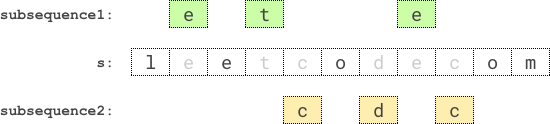

## 题目

给你一个字符串 s ，请你找到 s 中两个 不相交回文子序列 ，使得它们长度的 乘积最大 。两个子序列在原字符串中如果没有任何相同下标的字符，则它们是 不相交 的。

请你返回两个回文子序列长度可以达到的 最大乘积 。

子序列 指的是从原字符串中删除若干个字符（可以一个也不删除）后，剩余字符不改变顺序而得到的结果。如果一个字符串从前往后读和从后往前读一模一样，那么这个字符串是一个 回文字符串 。


示例 1：

example-1
    
    输入：s = "leetcodecom"
    输出：9
    解释：最优方案是选择 "ete" 作为第一个子序列，"cdc" 作为第二个子序列。
    它们的乘积为 3 * 3 = 9 。
示例 2：
    
    输入：s = "bb"
    输出：1
    解释：最优方案为选择 "b" （第一个字符）作为第一个子序列，"b" （第二个字符）作为第二个子序列。
    它们的乘积为 1 * 1 = 1 。
示例 3：

    输入：s = "accbcaxxcxx"
    输出：25
    解释：最优方案为选择 "accca" 作为第一个子序列，"xxcxx" 作为第二个子序列。
    它们的乘积为 5 * 5 = 25 。


提示：

* 2 <= s.length <= 12
* s 只含有小写英文字母。

## 思路

    //转化为求解最长回文子序列问题

## 解法
```java
class Solution {
//转化为求解最长回文子序列问题
public int maxProduct(String s) {
        char[] cs = s.toCharArray();
        int n = s.length(), max = (1<<n) - 1, ans = 0;
        for (int mask = 1; mask < max; ++mask) {
            ans = Math.max(ans, longestPalindromeSubSeq(cs, mask) * longestPalindromeSubSeq(cs, mask ^ max));
        }
        return ans;
    }

    int longestPalindromeSubSeq(char[] cs, int mask) {
        int n = cs.length;
        int[][] f = new int[n][n];
        for (int len = 1; len <= n; ++len) {
            for (int l = 0; l + len <= n; ++l) {
                int r = l + len - 1;
                if ((mask & (1 << l)) == 0 || (mask & (1 << r)) == 0) {
                    if (len == 2) {
                        f[l][r] = (mask & (1 << l)) != 0 || (mask & (1 << r)) != 0 ? 1 : 0;
                    } else if (len >2) {
                        f[l][r] = Math.max(f[l + 1][r], f[l][r - 1]);
                    }
                    continue;
                }
                if (len == 1) {
                    f[l][r] = 1;
                } else if (len == 2) {
                    f[l][r] = cs[l] == cs[r] ? 2 : 1;
                } else {
                    f[l][r] = Math.max(f[l + 1][r], f[l][r - 1]);
                    f[l][r] = Math.max(f[l][r], f[l + 1][r - 1] + (cs[l] == cs[r] ? 2 : 0));
                }
            }
        }
        return f[0][n - 1];
    }
}

```

## 总结

- 分析出几种情况，然后分别对各个情况实现 
