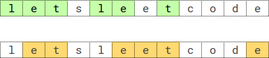

## 题目

给你一个长度为 `n` 的字符串 `s`，和一个整数 `k`。请你找出字符串 `s` 中 **重复 k 次的最长子序列**。

**子序列**是由其他字符串删除某些（或不删除）字符派生而来的一个字符串。

如果 `seq * k` 是 `s` 的一个子序列，其中 `seq * k` 表示一个由 `seq` 串联 k 次构造的字符串，那么就称 `seq` 是字符串 `s` 中一个 **重复 k 次**的子序列。

举个例子，`"bba"` 是字符串 `"bababcba"` 中的一个重复 2 次的子序列，因为字符串 `"bbabba"` 是由 `"bba"` 串联 2 次构造的，而 `"bbabba"` 是字符串 `"bababcba"` 的一个子序列。

返回字符串 `s` 中 **重复 k 次的最长子序列**。如果存在多个满足的子序列，则返回 **字典序最大** 的那个。如果不存在这样的子序列，返回一个 **空字符串**。

### 示例 1



- **输入**：`s = "letsleetcode"`, `k = 2`
- **输出**：`"let"`
- **解释**：存在两个最长子序列重复 2 次：`"let"` 和 `"ete"`。`"let"` 是其中字典序最大的一个。

### 示例 2

- **输入**：`s = "bb"`, `k = 2`
- **输出**：`"b"`
- **解释**：重复 2 次的最长子序列是 `"b"`。

### 示例 3

- **输入**：`s = "ab"`, `k = 2`
- **输出**：`""`
- **解释**：不存在重复 2 次的最长子序列。返回空字符串。

### 提示

- `n == s.length`
- `2 <= k <= 2000`
- `2 <= n < min(2001, k * 8)`
- `s` 由小写英文字母组成

## 思路

目标是在所有满足条件的 `seq` 中选出答案：条件为将 `seq` 连续重复 `k` 次得到的串，必须是 `s` 的子序列。答案优先最长；若长度相同则取字典序最大。暴力枚举子序列不可行，采用逐位扩展加深搜：从空前缀出发，每次只在末尾尝试追加一个字母，能继续扩展则递归，最后在合法结果里取更优者。

可行性判断：当前候选串记为 `next`，需判断将 `next` 重复 `k` 次拼成的串是否为 `s` 的子序列。实现上不必真的拼出长串，只需对 `s` 从左到右用单指针扫描：外层循环 `k` 轮，每轮按 `next` 中字符顺序依次匹配，某步匹配不到则返回 `false`。单次检验的时间与 `s` 的长度成正比。

字典序最大：在搜索的每一层，从字符 `z` 到 `a` 依次尝试（代码里用单引号包裹的字符字面量），先尝试较大字母；与“取最优”时的比较规则配合（更长优先，等长时再按 `compareTo` 比较），可得到字典序最大的最长串。

频率剪枝：若 `seq` 中某字符 `c` 出现 `m` 次，则在“`seq` 重复 `k` 次”所得串里，该字符共出现 `m` 与 `k` 的乘积次，因此 `s` 里 `c` 的个数必须够用。用长度为 26 的数组记录各字母剩余可用次数；每在答案末尾多写一个 `c`，相当于在 `k` 轮匹配里各多消耗一个 `c`，故从对应计数中减去 `k`。若某字母剩余次数小于 `k`，本层不能再选该字母。

递归含义：`dfs` 返回从当前前缀继续扩展能得到的最优串（更长优先，等长则字典序更大）。对每个合法的下一字母递归，并按上述规则更新返回值。

## 解法
```java
class Solution {

    public String longestSubsequenceRepeatedK(String s, int k) {
        int[] cnt = new int[26];
        for (int i = 0; i < s.length(); i++) {
            cnt[s.charAt(i) - 'a']++;
        }
        return dfs(s, k, "", cnt);
    }

    private String dfs(String s, int k, String cur, int[] cnt) {
        String best = cur;
        for (char c = 'z'; c >= 'a'; c--) {
            if (cnt[c - 'a'] < k) {
                continue;
            }
            cnt[c - 'a'] -= k;
            String next = cur + c;
            if (isKRepeatSubseq(s, next, k)) {
                String got = dfs(s, k, next, cnt);
                if (got.length() > best.length()
                        || (got.length() == best.length() && got.compareTo(best) > 0)) {
                    best = got;
                }
            }
            cnt[c - 'a'] += k;
        }
        return best;
    }

    private boolean isKRepeatSubseq(String s, String seq, int k) {
        int i = 0, n = s.length();
        for (int rep = 0; rep < k; rep++) {
            for (int j = 0; j < seq.length(); j++) {
                char need = seq.charAt(j);
                while (i < n && s.charAt(i) != need) {
                    i++;
                }
                if (i >= n) {
                    return false;
                }
                i++;
            }
        }
        return true;
    }
}

```

## 总结

- 目标是在所有满足条件的 `seq` 中选出答案：条件为将 `seq` 连续重复 `k` 次得到的串，必须是 `s` 的子序列。
- 答案优先最长；若长度相同则取字典序最大。
- 暴力枚举子序列不可行，采用逐位扩展加深搜：从空前缀出发，每次只在末尾尝试追加一个字母，能继续扩展则递归，最后在合法结果里取更优者。
- 可行性判断：当前候选串记为 `next`，需判断将 `next` 重复 `k` 次拼成的串是否为 `s` 的子序列。
- 实现上不必真的拼出长串，只需对 `s` 从左到右用单指针扫描：外层循环 `k` 轮，每轮按 `next` 中字符顺序依次匹配，某步匹配不到则返回 `false`。
