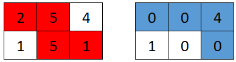
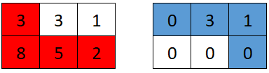
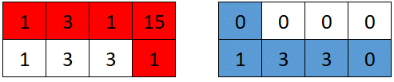

## 题目

### 描述

给你一个下标从 **0** 开始的二维数组 `grid`，大小为 `2` 行、`n` 列，其中 `grid[r][c]` 表示位置 `(r, c)` 上的点数。两个机器人都在参与一场游戏。

两个机器人初始都在 `(0, 0)`，目标都是 `(1, n - 1)`。每一步只能 **向右**（从 `(r, c)` 到 `(r, c + 1)`）或 **向下**（从 `(r, c)` 到 `(r + 1, c)`）。

游戏流程如下：

1. **第一个**机器人从 `(0, 0)` 走到 `(1, n - 1)`，收集路径上所有格子的点数。路径经过后，这些格子的值变为 `0`。
2. **第二个**机器人再从 `(0, 0)` 走到 `(1, n - 1)`，同样收集路径上剩余的点数。两条路径可以相交。

第一个机器人希望让第二个机器人收集到的总点数 **尽可能小**；第二个机器人则希望自己收集到的点数 **尽可能大**。在双方均采取最优策略的前提下，请你返回第二个机器人最终能收集到的点数。

### 示例 1

| 项目 | 内容 |
| --- | --- |
| **输入** | `grid = [[2,5,4],[1,5,1]]` |
| **输出** | `4` |
| **解释** | 第一个机器人的最佳路径与第二个机器人的最佳路径如题面图示。第一个经过的格子会变为 `0`，第二个收集到的点数为 `0 + 0 + 4 + 0 = 4`。 |

### 示例 2

| 项目 | 内容 |
| --- | --- |
| **输入** | `grid = [[3,3,1],[8,5,2]]` |
| **输出** | `4` |
| **解释** | 第一个路径经过的格子归零后，第二个最优可得 `4`。 |

### 示例 3

| 项目 | 内容 |
| --- | --- |
| **输入** | `grid = [[1,3,1,15],[1,3,3,1]]` |
| **输出** | `7` |
| **解释** | 第二个收集 `0 + 1 + 3 + 3 + 0 = 7`。 |

### 提示

- `grid.length == 2`
- `n == grid[r].length`
- `1 <= n <= 5 * 10^4`
- `1 <= grid[r][c] <= 10^5`

## 思路

在 `2` 行 `n` 列的网格里，从 `(0, 0)` 只向右、下走到 `(1, n - 1)` 的路径，一定是在**某一列**从第一行向下走到第二行一次，然后其余步要么是顶行向右、要么是底行向右。设第一个机器人在列下标 `k` 处执行这一次“向下”（即从 `(0, k)` 到 `(1, k)`），则它清空的路径包括：顶行从列 `0` 到列 `k`，以及底行从列 `k` 到列 `n - 1`。

清空之后，仍未被清空的格子只有两块互不相邻的区域：**顶行**从列 `k + 1` 到列 `n - 1`，以及 **底行**从列 `0` 到列 `k - 1`。第二个机器人的任意合法路径要么主要取走顶行这一段、要么主要取走底行这一段（中间会经过已为零的起点一格等），在双方最优的前提下，第二个能达到的上界就是这两段各自数值和的较大者。记顶行后缀和为 `topRight`（列号从 `k + 1` 到 `n - 1`），底行前缀和为 `bottomLeft`（列号从 `0` 到 `k - 1`），则对固定的 `k`，第二个的得分是 `max(topRight, bottomLeft)`。

第一个机器人会选择列 `k`，使得上述 `max(topRight, bottomLeft)` 尽量小。枚举 `k` 从 `0` 到 `n - 1`，用一次扫描维护 `topRight` 与 `bottomLeft`：初始时 `topRight` 为顶行第 `1` 列到第 `n - 1` 列之和，`bottomLeft` 为 `0`；每向后移动一个 `k`，从 `topRight` 里减去顶行下一列，并向 `bottomLeft` 里加入底行当前列。答案为所有 `k` 上该最大值的最小值。累加和可能超过 `int` 范围，中间量用 `long`。

说明：思路里的“列下标从某到某”均用文字和反引号写清边界，避免出现易被页面解析误吞的尖括号写法。

## 解法

```java
class Solution {
    public long gridGame(int[][] grid) {
        int n = grid[0].length;
        long topRight = 0;
        for (int i = 1; i < n; i++) {
            topRight += grid[0][i];
        }
        long bottomLeft = 0;
        long ans = Long.MAX_VALUE;
        for (int k = 0; k < n; k++) {
            ans = Math.min(ans, Math.max(topRight, bottomLeft));
            if (k < n - 1) {
                topRight -= grid[0][k + 1];
            }
            bottomLeft += grid[1][k];
        }
        return ans;
    }
}
```

## 总结

- 在 `2` 行 `n` 列的网格里，从 `(0, 0)` 只向右、下走到 `(1, n - 1)` 的路径，一定是在**某一列**从第一行向下走到第二行一次，然后其余步要么是顶行向右、要么是底行向右。
- 设第一个机器人在列下标 `k` 处执行这一次“向下”（即从 `(0, k)` 到 `(1, k)`），则它清空的路径包括：顶行从列 `0` 到列 `k`，以及底行从列 `k` 到列 `n - 1`。
- 清空之后，仍未被清空的格子只有两块互不相邻的区域：**顶行**从列 `k + 1` 到列 `n - 1`，以及 **底行**从列 `0` 到列 `k - 1`。
- 第二个机器人的任意合法路径要么主要取走顶行这一段、要么主要取走底行这一段（中间会经过已为零的起点一格等），在双方最优的前提下，第二个能达到的上界就是这两段各自数值和的较大者。
- 记顶行后缀和为 `topRight`（列号从 `k + 1` 到 `n - 1`），底行前缀和为 `bottomLeft`（列号从 `0` 到 `k - 1`），则对固定的 `k`，第二个的得分是 `max(topRight, bottomLeft)`。
