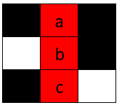
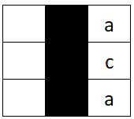
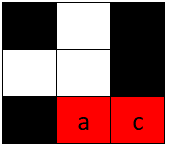

## 题目

### 描述

给你一个 `m x n` 的矩阵 `board`，它代表一个填字游戏 **当前** 的状态。填字游戏格子中包含小写英文字母（已填入的单词），表示空格的字符 ` `（空格）和表示障碍格子的字符 `#`。

如果满足以下条件，那么可以 **水平**（从左到右 **或者** 从右到左）或 **竖直**（从上到下 **或者** 从下到上）填入一个单词：

- 该单词不占据任何 `#` 对应的格子。
- 每个字母对应的格子要么是 ` `（空格）要么与 `board` 中已有字母 **匹配**。
- 若单词 **水平** 放置，则该单词 **左侧与右侧** 的相邻格子不能为 ` ` 或小写英文字母（与填字游戏中「词段两端需被挡住」的规则一致）。
- 若单词 **竖直** 放置，则该单词 **上侧与下侧** 的相邻格子不能为 ` ` 或小写英文字母。

给你一个字符串 `word`，若 `word` 可以被放入 `board` 中，请返回 `true`，否则返回 `false`。

### 示例 1



| 项目 | 内容 |
| --- | --- |
| **输入** | `board = [["#", " ", "#"], [" ", " ", "#"], ["#", "c", " "]]`，`word = "abc"` |
| **输出** | `true` |
| **解释** | 单词 `abc` 可以按上图放置（从上到下）。 |

### 示例 2



| 项目 | 内容 |
| --- | --- |
| **输入** | `board = [[" ", "#", "a"], [" ", "#", "c"], [" ", "#", "a"]]`，`word = "ac"` |
| **输出** | `false` |
| **解释** | 无法放置该单词，放置后会在上侧或下侧相邻位置出现空格等，不满足规则。 |

### 示例 3



| 项目 | 内容 |
| --- | --- |
| **输入** | `board = [["#", " ", "#"], [" ", " ", "#"], ["#", " ", "c"]]`，`word = "ca"` |
| **输出** | `true` |
| **解释** | 单词 `ca` 可以按上图放置（从右到左）。 |

### 提示

- `m == board.length`
- `n == board[i].length`
- `1 <= m * n <= 2 * 10^5`
- `board[i][j]` 可能为 ` `、`#` 或一个小写英文字母
- `1 <= word.length <= max(m, n)`
- `word` 只包含小写英文字母

## 思路

解法可以概括为「枚举起点与四个方向」，再用一个 `check` 函数判断沿某一方向整段放置是否合法。

**起点一侧必须贴着边界或障碍：** 例如从左向右填时，起点 `(i, j)` 的左侧一格必须是矩阵左边界，或是 `#`，表示词段从这里开始，左侧不会与空格或字母相接。从右向左、从上向下、从下向上同理，分别在另一侧做对称判断。

**终点一侧也必须被挡住：** 设单词长度为 `len`，沿方向 `(da, db)` 走时，最后一个字符落在第 `len` 个格子上，紧邻其外侧的格坐标为 `(i + da * len, j + db * len)`。若该格仍在矩阵内且不是 `#`，则说明词段还能向外延伸或与空格、字母相邻，不符合题意；只有越界或是 `#` 才合法。

**中间逐字匹配：** 从起点沿方向走 `len` 步，每一步当前格要么是空格，要么等于 `word` 中对应字符，否则失败。

这样在整张盘上双重循环枚举每个格子作为起点，最多尝试四个方向，单格常数工作量；总时间复杂度与格子数线性相关，额外空间为常数级。

说明：下文用自然语言与行内代码描述不等式与下标范围，避免使用尖括号类符号，防止静态页面解析出错。

## 解法

```java
class Solution {
    private int m;
    private int n;
    private char[][] board;
    private String word;
    private int len;

    public boolean placeWordInCrossword(char[][] board, String word) {
        m = board.length;
        n = board[0].length;
        this.board = board;
        this.word = word;
        len = word.length();
        for (int i = 0; i < m; i++) {
            for (int j = 0; j < n; j++) {
                boolean leftToRight = (j == 0 || board[i][j - 1] == '#') && check(i, j, 0, 1);
                boolean rightToLeft = (j == n - 1 || board[i][j + 1] == '#') && check(i, j, 0, -1);
                boolean upToDown = (i == 0 || board[i - 1][j] == '#') && check(i, j, 1, 0);
                boolean downToUp = (i == m - 1 || board[i + 1][j] == '#') && check(i, j, -1, 0);
                if (leftToRight || rightToLeft || upToDown || downToUp) {
                    return true;
                }
            }
        }
        return false;
    }

    /** 从 (i, j) 沿 (da, db) 方向能否完整放下 word，且外侧一端已被边界或 # 挡住 */
    private boolean check(int i, int j, int da, int db) {
        int x = i + da * len;
        int y = j + db * len;
        if (x >= 0 && x < m && y >= 0 && y < n && board[x][y] != '#') {
            return false;
        }
        for (int p = 0; p < len; p++) {
            if (i < 0 || i >= m || j < 0 || j >= n
                    || (board[i][j] != ' ' && board[i][j] != word.charAt(p))) {
                return false;
            }
            i += da;
            j += db;
        }
        return true;
    }
}
```

## 总结

- 填字规则落在实现上就是「起点一侧贴边或 `#`」与「词段末端外侧一格越界或为 `#`」，再叠加逐格字符匹配；枚举所有起点与四方向即可。
