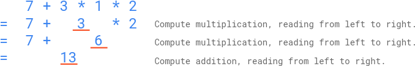

## 题目

给你一个字符串 `s`，它**只**包含数字 `0-9`、加法运算符 `'+'` 和乘法运算符 `'*'`，这个字符串表示一个**合法**的只含有**个位数数字**的数学表达式（比方说 `3+5*2`）。有 `n` 位小学生将计算这个数学表达式，并遵循如下**运算顺序**：

1. 按照**从左到右**的顺序计算**乘法**，然后
2. 按照**从左到右**的顺序计算**加法**。

给你一个长度为 `n` 的整数数组 `answers`，表示每位学生提交的答案。你的任务是给 `answers` 数组按照如下**规则**打分：

- 如果一位学生的答案**等于**表达式的正确结果，这位学生将得到 `5` 分。
- 否则，如果答案由**一处或多处错误的运算顺序**计算得到，那么这位学生能得到 `2` 分。
- 否则，这位学生将得到 `0` 分。

请你返回所有学生的分数和。

### 示例 1



| 项目 | 内容 |
| --- | --- |
| **输入** | `s = "7+3*1*2"`，`answers = [20,13,42]` |
| **输出** | `7` |
| **解释** | 如上图所示，正确答案为 `13`，因此有一位学生得分为 5 分：`[20,13,42]` 中的 `13`。一位学生可能通过错误的运算顺序得到结果 `20`：`7+3=10`，`10*1=10`，`10*2=20`。所以这位学生得分为 2 分：`[20,13,42]` 中的 `20`。所有学生得分分别为：`[2,5,0]`。所有得分之和为 `2+5+0=7`。 |

### 示例 2

| 项目 | 内容 |
| --- | --- |
| **输入** | `s = "3+5*2"`，`answers = [13,0,10,13,13,16,16]` |
| **输出** | `19` |
| **解释** | 表达式的正确结果为 `13`，所以有 3 位学生得到 5 分。学生可能通过错误的运算顺序得到结果 `16`：`3+5=8`，`8*2=16`。所以两位学生得到 2 分。所有学生得分分别为：`[5,0,0,5,5,2,2]`。所有得分之和为 `5+0+0+5+5+2+2=19`。 |

### 示例 3

| 项目 | 内容 |
| --- | --- |
| **输入** | `s = "6+0*1"`，`answers = [12,9,6,4,8,6]` |
| **输出** | `10` |
| **解释** | 表达式的正确结果为 `6`。如果一位学生通过错误的运算顺序计算该表达式，结果仍为 `6`。根据打分规则，运算顺序错误的学生也将得到 5 分（因为他们仍然得到了正确的结果），而不是 2 分。所有学生得分分别为：`[0,0,5,0,0,5]`。所有得分之和为 10 分。 |

### 提示

- `3 <= s.length <= 31`
- `s` 表示一个只包含 `0-9`，`'+'` 和 `'*'` 的合法表达式。
- 表达式中所有整数运算数字都在闭区间 `0` 到 `9` 以内。
- `1 <=` 数学表达式中所有运算符数目（`'+'` 和 `'*'`）`<= 15`
- 测试数据保证正确表达式结果在范围 `0` 到 `1000` 以内。
- 测试用例保证乘法中间步骤中的值永远不会超过 10 的 9 次方。
- `n == answers.length`
- `1 <= n <= 10^4`
- `0 <= answers[i] <= 1000`

## 思路

题目中的「正确结果」按题意是指：小学生规则下从左到右先做完所有乘法、再从左到右做完加法。可以用一次从左到右扫描合并：遇到乘号就合并相邻两个数，乘号处理完后剩下若干个数用加法相加。

「错误运算顺序但运算过程合法」对应于：把同一式子按**任意加括号方式**做二元运算（即任意一棵完全括号化二叉树），能得到的所有整数值。这与力扣 241 题「为运算表达式设计优先级」同类，用**区间动态规划**：`dp[i][j]` 表示下标 `i` 到下标 `j` 这一段数字通过不同结合顺序能得到的值集合；枚举最后一个执行的运算符位置，左右区间结果两两组合。中间结果若超过 1000 可丢弃，题目保证最终与答案上界在可控范围内，用于剪枝。

打分逻辑：先把「规定顺序」下的正确值算出来记为 `correct`。对每个学生的答案 `ans`，若 `ans` 等于 `correct`，得 5 分；否则若 `ans` 落在上述「任意括号化」能得到的集合里，得 2 分；其余得 0 分。注意示例 3：若错误顺序仍能算到与 `correct` 相同的结果，优先按第一条判 5 分。

说明：下文用自然语言描述数值范围与比较关系，避免使用尖括号等易与 HTML 或模板语法混淆的符号，便于静态页面解析。

## 解法

```java
import java.util.*;

class Solution {

    private static final int CAP = 1000;

    /** 小学生顺序：从左到右先乘后加 */
    private int evalStudentOrder(List<Integer> nums, List<Character> ops) {
        List<Integer> n = new ArrayList<>(nums);
        List<Character> o = new ArrayList<>(ops);
        int i = 0;
        while (i < o.size()) {
            if (o.get(i) == '*') {
                int v = n.get(i) * n.get(i + 1);
                n.set(i, v);
                n.remove(i + 1);
                o.remove(i);
            } else {
                i++;
            }
        }
        int sum = n.get(0);
        for (int j = 1; j < n.size(); j++) {
            sum += n.get(j);
        }
        return sum;
    }

    public int scoreOfStudents(String s, int[] answers) {
        List<Integer> nums = new ArrayList<>();
        List<Character> ops = new ArrayList<>();
        for (int p = 0; p < s.length(); p++) {
            char c = s.charAt(p);
            if (c >= '0' && c <= '9') {
                nums.add(c - '0');
            } else {
                ops.add(c);
            }
        }
        int n = nums.size();
        int correct = evalStudentOrder(nums, ops);

        Set<Integer>[][] dp = new Set[n][n];
        for (int i = 0; i < n; i++) {
            dp[i][i] = new HashSet<>();
            dp[i][i].add(nums.get(i));
        }
        for (int len = 2; len <= n; len++) {
            for (int i = 0; i + len - 1 < n; i++) {
                int j = i + len - 1;
                dp[i][j] = new HashSet<>();
                for (int k = i; k < j; k++) {
                    char op = ops.get(k);
                    for (int a : dp[i][k]) {
                        for (int b : dp[k + 1][j]) {
                            int v = op == '+' ? a + b : a * b;
                            if (v <= CAP) {
                                dp[i][j].add(v);
                            }
                        }
                    }
                }
            }
        }
        Set<Integer> allOrders = dp[0][n - 1];

        int total = 0;
        for (int ans : answers) {
            if (ans == correct) {
                total += 5;
            } else if (allOrders.contains(ans)) {
                total += 2;
            }
        }
        return total;
    }
}
```

## 总结

- 规定顺序下的值用一次线性合并乘法再求和即可；非常规顺序对应所有二元结合方式的值，用区间 DP 枚举并与答案数组逐条记分。
- 中间结果用 1000 上界剪枝，与题目保证一致，可避免集合过大。
