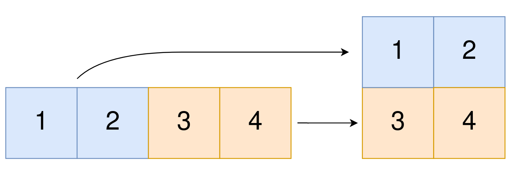

## 题目

### 描述

给你一个下标从 **0** 开始的一维整数数组 `original` 和两个整数 `m` 和 `n` 。你需要使用 `original` 中 **所有** 元素创建一个 `m` 行 `n` 列的二维数组。

`original` 中下标从 `0` 到 `n - 1` （都 **包含**）的元素构成二维数组的第一行，下标从 `n` 到 `2 * n - 1` （都 **包含**）的元素构成二维数组的第二行，依此类推。

请你根据上述过程返回一个 `m` 行 `n` 列的二维数组。如果无法构成这样的二维数组，请你返回一个空的二维数组。

### 示例 1



| 项目 | 内容 |
| --- | --- |
| **输入** | `original = [1,2,3,4], m = 2, n = 2` |
| **输出** | `[[1,2],[3,4]]` |
| **解释** | 构造出的二维数组应该包含 2 行 2 列。`original` 中第一个 `n=2` 的部分为 `[1,2]` ，构成二维数组的第一行。`original` 中第二个 `n=2` 的部分为 `[3,4]` ，构成二维数组的第二行。 |

### 示例 2

| 项目 | 内容 |
| --- | --- |
| **输入** | `original = [1,2,3], m = 1, n = 3` |
| **输出** | `[[1,2,3]]` |
| **解释** | 构造出的二维数组应该包含 1 行 3 列。将 `original` 中所有三个元素放入第一行中，构成要求的二维数组。 |

### 示例 3

| 项目 | 内容 |
| --- | --- |
| **输入** | `original = [1,2], m = 1, n = 1` |
| **输出** | `[]` |
| **解释** | `original` 中有 2 个元素。无法将 2 个元素放入到一个 1 乘 1 的二维数组中，所以返回一个空的二维数组。 |

### 示例 4

| 项目 | 内容 |
| --- | --- |
| **输入** | `original = [3], m = 1, n = 2` |
| **输出** | `[]` |
| **解释** | `original` 中只有 1 个元素。无法将 1 个元素放满一个 1 乘 2 的二维数组，所以返回一个空的二维数组。 |

### 提示

- `1 <= original.length <= 5 * 10^4`
- `1 <= original[i] <= 10^5`
- `1 <= m, n <= 4 * 10^4`

## 思路

目标是把一维数组按**行优先**切开：第 `0` 行用开头的 `n` 个元素，第 `1` 行用接下来的 `n` 个元素，直到第 `m - 1` 行。全部元素都要用完，因此一维长度必须等于「行数乘以列数」。判断时用长整型计算 `m` 与 `n` 的乘积，再与 `original.length` 比较，避免整型相乘溢出。

若长度匹配，则分配 `m` 行、每行 `n` 列的数组。第 `r` 行对应一维里从下标 `r` 乘以 `n` 起的连续一段；可二重循环逐个赋值，也可对每一行用系统提供的数组拷贝，把该段一次性拷到 `ans[r]`。

若长度不匹配，返回空二维数组；在 Java 中习惯写成 `new int[0][0]`。

## 解法

```java
class Solution {
    public int[][] construct2DArray(int[] original, int m, int n) {
        if ((long) m * n != original.length) {
            return new int[0][0];
        }
        int[][] ans = new int[m][n];
        for (int r = 0; r < m; r++) {
            System.arraycopy(original, r * n, ans[r], 0, n);
        }
        return ans;
    }
}
```

## 总结

- 目标是把一维数组按**行优先**切开：第 `0` 行用开头的 `n` 个元素，第 `1` 行用接下来的 `n` 个元素，直到第 `m - 1` 行。
- 全部元素都要用完，因此一维长度必须等于「行数乘以列数」。
- 判断时用长整型计算 `m` 与 `n` 的乘积，再与 `original.length` 比较，避免整型相乘溢出。
- 若长度匹配，则分配 `m` 行、每行 `n` 列的数组。
- 第 `r` 行对应一维里从下标 `r` 乘以 `n` 起的连续一段；可二重循环逐个赋值，也可对每一行用系统提供的数组拷贝，把该段一次性拷到 `ans[r]`。
