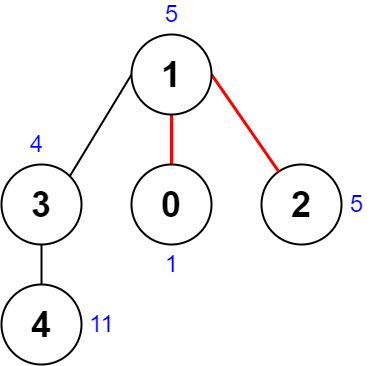
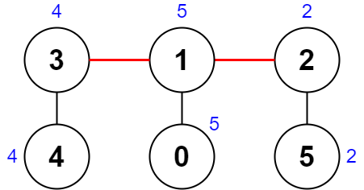

## 题目

存在一棵无向连通树，树中有编号从 0 到 n - 1 的 n 个节点， 以及 n - 1 条边。

给你一个下标从 0 开始的整数数组 nums ，长度为 n ，其中 nums[i] 表示第 i 个节点的值。另给你一个二维整数数组 edges ，长度为 n - 1 ，其中 edges[i] = [ai, bi] 表示树中存在一条位于节点 ai 和 bi 之间的边。

删除树中两条 不同 的边以形成三个连通组件。对于一种删除边方案，定义如下步骤以计算其分数：

* 分别获取三个组件 每个 组件中所有节点值的异或值。
* 最大 异或值和 最小 异或值的 差值 就是这一种删除边方案的分数。
* 例如，三个组件的节点值分别是：[4,5,7]、[1,9] 和 [3,3,3] 。三个异或值分别是 4 ^ 5 ^ 7 = 6、1 ^ 9 = 8 和 3 ^ 3 ^ 3 = 3 。最大异或值是 8 ，最小异或值是 3 ，分数是 8 - 3 = 5 。
返回在给定树上执行任意删除边方案可能的 最小 分数。


示例 1：



    输入：nums = [1,5,5,4,11], edges = [[0,1],[1,2],[1,3],[3,4]]
    输出：9
    解释：上图展示了一种删除边方案。
    - 第 1 个组件的节点是 [1,3,4] ，值是 [5,4,11] 。异或值是 5 ^ 4 ^ 11 = 10 。
    - 第 2 个组件的节点是 [0] ，值是 [1] 。异或值是 1 = 1 。
    - 第 3 个组件的节点是 [2] ，值是 [5] 。异或值是 5 = 5 。
    分数是最大异或值和最小异或值的差值，10 - 1 = 9 。
    可以证明不存在分数比 9 小的删除边方案。

示例 2：



    输入：nums = [5,5,2,4,4,2], edges = [[0,1],[1,2],[5,2],[4,3],[1,3]]
    输出：0
    解释：上图展示了一种删除边方案。
    - 第 1 个组件的节点是 [3,4] ，值是 [4,4] 。异或值是 4 ^ 4 = 0 。
    - 第 2 个组件的节点是 [1,0] ，值是 [5,5] 。异或值是 5 ^ 5 = 0 。
    - 第 3 个组件的节点是 [2,5] ，值是 [2,2] 。异或值是 2 ^ 2 = 0 。
    分数是最大异或值和最小异或值的差值，0 - 0 = 0 。
    无法获得比 0 更小的分数 0 。


提示：

* n == nums.length
* 3 <= n <= 1000
* 1 <= nums[i] <= 10<sup>8</sup>
* edges.length == n - 1
* edges[i].length == 2
* 0 <= ai, bi < n
* ai != bi
* edges 表示一棵有效的树

## 思路

化为线性关系，在通过时间戳判断是否属于一个集合中

## 解法
```java
class Solution {
    int res = Integer.MAX_VALUE;
    int[] dp;
    int[] account;
    List<Integer> arr = new ArrayList<>();
    Map<Integer, List<Integer>> m = new HashMap<>();
    public int minimumScore(int[] nums, int[][] edges) {
        for (int[] edge : edges) {
            int x = edge[0],y =edge[1];
            buildTree(x, y);
            buildTree(y, x);//建树
        }
        int n = nums.length;
        dp = new int[n];account = new int[n];
        for (int i = 0; i < n; i++) {
            dp[i] = Integer.MAX_VALUE;
            account[i] = Integer.MAX_VALUE;
        }
        boolean[] flag = new boolean[n];
        int xor = getXor(0, flag, nums);//计算每个节点为跟的情况下的异或值
        getNum(0,flag);//计算每个节点的数目，并线性化关系
        dfs(0,xor,0,-1,0);
        return res;
    }
    private void dfs(int i,int xor, int xor2, int index, int cout) {
        if(i>=arr.size())
            return;
        dfs(i+1,xor,xor2,index,cout);
        if(i!=0){
            int next = dp[arr.get(i)];
            if(cout==1){
                Integer integer = arr.get(index);
                int i1 = account[integer];
                int v = next,u = xor^v, w = xor2;
                if(i-index<i1){
                    u = xor;w = xor2^v;//判断与之前的是不是一个树的
                }
                int max = Math.max(u,Math.max(v,w));
                int min = Math.min(u,Math.min(v,w));
                res = Math.min(res,max-min);
            }else {
                dfs(i+1,xor^next,next,i,cout+1);
            }
        }
    }

    private int getNum(int i, boolean[] flag) {
        if(flag[i])return 0;
        arr.add(i);
        if(account[i]!=Integer.MAX_VALUE)
            return account[i];
        flag[i] = true;
        List<Integer> integers = m.get(i);
        int res = 1;
        for (Integer integer : integers) {
           res+=getNum(integer,flag);
        }
        flag[i] = false;
        account[i] = res;
        return res;
    }


    private int getXor(int i, boolean[] flag, int[] nums) {
        if(flag[i])return 0;
        if(dp[i]!=Integer.MAX_VALUE)
            return dp[i];
        flag[i] = true;
        List<Integer> integers = m.get(i);
        int x = 0;
        for (Integer integer : integers) {
            x^=getXor(integer,flag,nums);
        }
        x^=nums[i];
        flag[i] = false;
        dp[i] = x;
        return x;
    }

    private  void buildTree(int x, int y) {
        List<Integer> map = m.get(x);
        if(map ==null)
            map = new ArrayList<>();
        map.add(y);
        m.put(x,map);
    }
}
```

## 总结

- 分析出几种情况，然后分别对各个情况实现 
