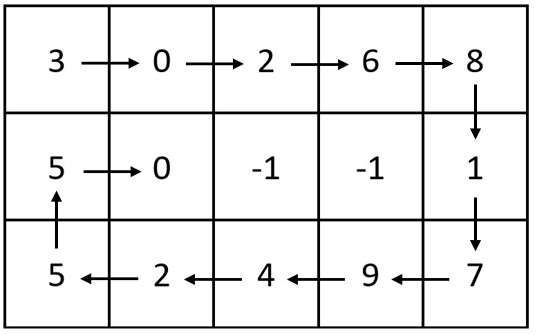
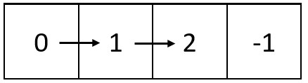

## 题目

给你两个整数：m 和 n ，表示矩阵的维数。

另给你一个整数链表的头节点 head 。

请你生成一个大小为 m x n 的螺旋矩阵，矩阵包含链表中的所有整数。

链表中的整数从矩阵 左上角 开始、顺时针 按 螺旋 顺序填充。如果还存在剩余的空格，则用 -1 填充。

返回生成的矩阵。

 

示例 1：



    输入：m = 3, n = 5, head = [3,0,2,6,8,1,7,9,4,2,5,5,0]
    输出：[[3,0,2,6,8],[5,0,-1,-1,1],[5,2,4,9,7]]
    解释：上图展示了链表中的整数在矩阵中是如何排布的。
    注意，矩阵中剩下的空格用 -1 填充。
示例 2：



    输入：m = 1, n = 4, head = [0,1,2]
    输出：[[0,1,2,-1]]
    解释：上图展示了链表中的整数在矩阵中是如何从左到右排布的。 
    注意，矩阵中剩下的空格用 -1 填充。
 

提示：

- 1 <= m, n <= 10<sup>5</sup>
- 1 <= m * n <= 10<sup>5</sup>
- 链表中节点数目在范围 [1, m * n] 内
- 0 <= Node.val <= 1000


## 思路


## 解法
```java

/**
 * Definition for singly-linked list.
 * public class ListNode {
 *     int val;
 *     ListNode next;
 *     ListNode() {}
 *     ListNode(int val) { this.val = val; }
 *     ListNode(int val, ListNode next) { this.val = val; this.next = next; }
 * }
 */
class Solution {
    public int[][] spiralMatrix(int m, int n, ListNode head) {
        /*
        一个模拟的万能转向trick(参考灵神)
         */
        int[][] res = new int[m][n];
        for (int i = 0; i < m; i++) {
            Arrays.fill(res[i], -1);
        }
        ListNode cur = head;
        // 上右下左四个进给方向
        int[][] dirs = {{0, 1}, {1, 0}, {0, -1}, {-1, 0}};
        // idx为进给方向,x与y是遍历指针
        int idx = 0, x = 0, y = -1; // 为了进给第一步向右走了之后才赋值,初始化(x,y)=(0.-1)
        // 链表还没走完就继续循环
        while (cur != null) {
            int newX = x + dirs[idx][0], newY = y + dirs[idx][1];
            // 越界或者碰到已经覆盖过的->转向
            if (newX < 0 || newX >= m || newY < 0 || newY >= n || res[newX][newY] != -1) idx = (idx + 1) % 4;
            x += dirs[idx][0];
            y += dirs[idx][1];
            res[x][y] = cur.val;
            cur = cur.next;
        }
        return res;
    }
}
```

## 总结

- 分析出几种情况，然后分别对各个情况实现 
