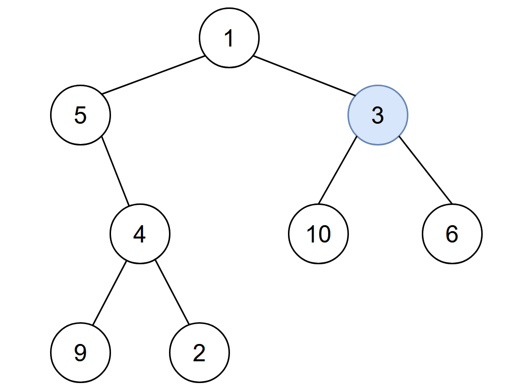

---
categories:
  - algorithm
  - leetcode
tags:
  - 
author: 
  name: JavaInterview.cn
  link: https://JavaInterview.cn
titleTag: Java
---


## 题目

给你一棵二叉树的根节点 root ，二叉树中节点的值 互不相同 。另给你一个整数 start 。在第 0 分钟，感染 将会从值为 start 的节点开始爆发。

每分钟，如果节点满足以下全部条件，就会被感染：

* 节点此前还没有感染。
* 节点与一个已感染节点相邻。
返回感染整棵树需要的分钟数。


示例 1：


    输入：root = [1,5,3,null,4,10,6,9,2], start = 3
    输出：4
    解释：节点按以下过程被感染：
    - 第 0 分钟：节点 3
    - 第 1 分钟：节点 1、10、6
    - 第 2 分钟：节点5
    - 第 3 分钟：节点 4
    - 第 4 分钟：节点 9 和 2
    感染整棵树需要 4 分钟，所以返回 4 。

示例 2：



    输入：root = [1], start = 1
    输出：0
    解释：第 0 分钟，树中唯一一个节点处于感染状态，返回 0 。


提示：

* 树中节点的数目在范围 [1, 10<sup>5</sup>] 内
* 1 <= Node.val <= 10<sup>5</sup>
* 每个节点的值 互不相同
* 树中必定存在值为 start 的节点


## 思路

新建包含父节点的二叉树，然后常规层序遍历


## 解法
```java

/**
 * Definition for a binary tree node.
 * public class TreeNode {
 *     int val;
 *     TreeNode left;
 *     TreeNode right;
 *     TreeNode() {}
 *     TreeNode(int val) { this.val = val; }
 *     TreeNode(int val, TreeNode left, TreeNode right) {
 *         this.val = val;
 *         this.left = left;
 *         this.right = right;
 *     }
 * }
 */
class Solution {
    class Node {
        int val;
        Node left;
        Node right;
        Node parent;
        Node() {}
        Node(int val) { this.val = val; }
    }
    Node startNode = null;
    public int amountOfTime(TreeNode root, int start) {
        build(root,start);
        LinkedList<Node> queue = new LinkedList<>();
        queue.offer(startNode);
        int cnt =0;
        int[] f = new int[100010];
        f[startNode.val]= 1;
        while(!queue.isEmpty()){
            cnt++;
            int size = queue.size();
            for(int i=0;i<size;i++){
                Node node = queue.poll();
                if(node.left!=null&&f[node.left.val]==0){
                    f[node.left.val]= 1;
                    queue.offer(node.left);
                }
                if(node.right!=null&&f[node.right.val]==0){
                    f[node.right.val]= 1;
                    queue.offer(node.right);
                }
                if(node.parent!=null&&f[node.parent.val]==0){
                    f[node.parent.val]= 1;
                    queue.offer(node.parent);
                }
            }
        }
        return cnt-1;
    }

    private Node build(TreeNode root,int start){
        if(root==null) return null;
        Node node = new Node(root.val);
        if(node.val==start){
            startNode = node;
        }
        node.left = build(root.left,start);
        node.right = build(root.right,start);
        if(node.left!=null){
            node.left.parent = node;
        }
        if(node.right!=null){
            node.right.parent = node;
        }
        return node;
    }
}
```

## 总结

- 分析出几种情况，然后分别对各个情况实现 
