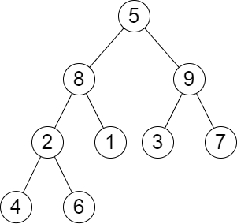

## 题目

给你一棵 二叉树 的根节点 root ，树中有 n 个节点。每个节点都可以被分配一个从 1 到 n 且互不相同的值。另给你一个长度为 m 的数组 queries 。

你必须在树上执行 m 个 独立 的查询，其中第 i 个查询你需要执行以下操作：

* 从树中 移除 以 queries[i] 的值作为根节点的子树。题目所用测试用例保证 queries[i] 不 等于根节点的值。
返回一个长度为 m 的数组 answer ，其中 answer[i] 是执行第 i 个查询后树的高度。

注意：

* 查询之间是独立的，所以在每个查询执行后，树会回到其 初始 状态。
* 树的高度是从根到树中某个节点的 最长简单路径中的边数 。


示例 1：


    输入：root = [1,3,4,2,null,6,5,null,null,null,null,null,7], queries = [4]
    输出：[2]
    解释：上图展示了从树中移除以 4 为根节点的子树。
    树的高度是 2（路径为 1 -> 3 -> 2）。
示例 2：



    输入：root = [5,8,9,2,1,3,7,4,6], queries = [3,2,4,8]
    输出：[3,2,3,2]
    解释：执行下述查询：
    - 移除以 3 为根节点的子树。树的高度变为 3（路径为 5 -> 8 -> 2 -> 4）。
    - 移除以 2 为根节点的子树。树的高度变为 2（路径为 5 -> 8 -> 1）。
    - 移除以 4 为根节点的子树。树的高度变为 3（路径为 5 -> 8 -> 2 -> 6）。
    - 移除以 8 为根节点的子树。树的高度变为 2（路径为 5 -> 9 -> 3）。


提示：

* 树中节点的数目是 n
* 2 <= n <= 10<sup>5</sup>
* 1 <= Node.val <= n
* 树中的所有值 互不相同
* m == queries.length
* 1 <= m <= min(n, 10<sup>4</sup>)
* 1 <= queries[i] <= n
* queries[i] != root.val

## 思路
用集合存下树的层次结构，在要删除的节点的那层找到高度最大的节点，如果就是要删除的选第二高的结点的高度加上这一层的层数减一，如果不是要删除的就选最高的加上这一层的层数减一

## 解法
```java

/**
 * Definition for a binary tree node.
 * public class TreeNode {
 *     int val;
 *     TreeNode left;
 *     TreeNode right;
 *     TreeNode() {}
 *     TreeNode(int val) { this.val = val; }
 *     TreeNode(int val, TreeNode left, TreeNode right) {
 *         this.val = val;
 *         this.left = left;
 *         this.right = right;
 *     }
 * }
 */
class Solution {
    public int[] treeQueries(TreeNode root, int[] queries) {
        List<List<Integer>> levels = new ArrayList<>();
        Map<Integer,Integer> height = new HashMap<>();
        Map<Integer, Integer> level = new HashMap<>();
        dfs(root, 0, height, level, levels);
        for(List<Integer> list : levels) Collections.sort(list, (o1, o2) -> o2-o1);
        int n = queries.length;
        int[] ans = new int[n];
        for(int i = 0; i < n; i++){
            int l = level.get(queries[i]);
            int h = height.get(queries[i]);
            List<Integer> list = levels.get(l);
            if(list.get(0) != h) ans[i] = list.get(0) + l - 1;
            else{
                if(list.size() == 1) ans[i] = l - 1;
                else ans[i] = list.get(1) + l - 1;
            }
        }
        return ans;
    }

    public int dfs(TreeNode root, int l, Map<Integer,Integer> height, Map<Integer, Integer> level, List<List<Integer>> levels){
        if(root == null) return 0;
        level.put(root.val, l);
        if(levels.size() <= l) levels.add(new ArrayList<>());
        int max = Math.max(dfs(root.left, l + 1, height, level, levels), dfs(root.right, l + 1, height, level, levels)) + 1;
        height.put(root.val, max);
        levels.get(l).add(max);
        return max;
    }
}

```

## 总结

- 分析出几种情况，然后分别对各个情况实现 
