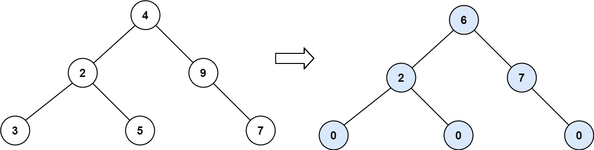

## 题目
给你一个二叉树的根节点 root ，计算并返回 整个树 的坡度 。

一个树的 节点的坡度 定义即为，该节点左子树的节点之和和右子树节点之和的 差的绝对值 。如果没有左子树的话，左子树的节点之和为 0 ；没有右子树的话也是一样。空结点的坡度是 0 。

整个树 的坡度就是其所有节点的坡度之和。

示例 1：


    输入：root = [1,2,3]
    输出：1
    解释：
    节点 2 的坡度：|0-0| = 0（没有子节点）
    节点 3 的坡度：|0-0| = 0（没有子节点）
    节点 1 的坡度：|2-3| = 1（左子树就是左子节点，所以和是 2 ；右子树就是右子节点，所以和是 3 ）
    坡度总和：0 + 0 + 1 = 1
    

示例 2：


    输入：root = [4,2,9,3,5,null,7]
    输出：15
    解释：
    节点 3 的坡度：|0-0| = 0（没有子节点）
    节点 5 的坡度：|0-0| = 0（没有子节点）
    节点 7 的坡度：|0-0| = 0（没有子节点）
    节点 2 的坡度：|3-5| = 2（左子树就是左子节点，所以和是 3 ；右子树就是右子节点，所以和是 5 ）
    节点 9 的坡度：|0-7| = 7（没有左子树，所以和是 0 ；右子树正好是右子节点，所以和是 7 ）
    节点 4 的坡度：|(3+5+2)-(9+7)| = |10-16| = 6（左子树值为 3、5 和 2 ，和是 10 ；右子树值为 9 和 7 ，和是 16 ）
    坡度总和：0 + 0 + 0 + 2 + 7 + 6 = 15
    

示例 3：


    输入：root = [21,7,14,1,1,2,2,3,3]
    输出：9

提示：
::: warning
树中节点数目的范围在 [0, 10<sup>4</sup>] 内\
-1000 <= Node.val <= 1000
:::

## 思路
递归：抽象出两个方法，一个求出当前节点的sum值，一个返回Math.abs(sum(root.left)-sum(root.right))+findTilt(root.left)+findTilt(root.right)。

## 解法
```java
/**
 * Definition for a binary tree node.
 * public class TreeNode {
 *     int val;
 *     TreeNode left;
 *     TreeNode right;
 *     TreeNode() {}
 *     TreeNode(int val) { this.val = val; }
 *     TreeNode(int val, TreeNode left, TreeNode right) {
 *         this.val = val;
 *         this.left = left;
 *         this.right = right;
 *     }
 * }
 */
class Solution {
    public int findTilt(TreeNode root) {
        if(root==null){
            return 0;
        }
        return Math.abs(sum(root.left)-sum(root.right))+findTilt(root.left)+findTilt(root.right);
    }

    public int sum(TreeNode root){
        if(root==null){
            return 0;
        }
        return root.val+sum(root.left)+sum(root.right);

    }


}

```