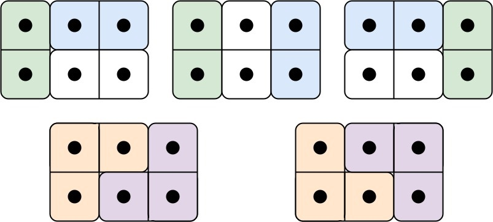

## 题目

有两种形状的瓷砖：一种是 2 x 1 的多米诺形，另一种是形如 "L" 的托米诺形。两种形状都可以旋转。


给定整数 n ，返回可以平铺 2 x n 的面板的方法的数量。返回对 109 + 7 取模 的值。

平铺指的是每个正方形都必须有瓷砖覆盖。两个平铺不同，当且仅当面板上有四个方向上的相邻单元中的两个，使得恰好有一个平铺有一个瓷砖占据两个正方形。

 

示例 1:



    输入: n = 3
    输出: 5
    解释: 五种不同的方法如上所示。
示例 2:

    输入: n = 1
    输出: 1
 

提示：

- 1 <= n <= 1000


## 思路

    // 递推式：f(n) = 2 * f(n-1) + f(n-3)

## 解法
```java

class Solution {
    // 递推式：f(n) = 2 * f(n-1) + f(n-3)
    public int numTilings(int N) {
        if(N == 1)
            return 1;
        if(N == 2)
            return 2;
        if(N == 3)
            return 5;
        int n_3 = 1;
        int n_2 = 2;
        int n_1 = 5;
        int temp = 0;
        for (int i = 4; i <= N; i++) {
            temp = (2 * n_1) % 1000000007  + n_3 % 1000000007 ;
            n_3 = n_2;
            n_2 = n_1; 
            n_1 = temp % 1000000007 ;
        }
        
        return n_1;
    }
}
```

## 总结

- 分析出几种情况，然后分别对各个情况实现 
