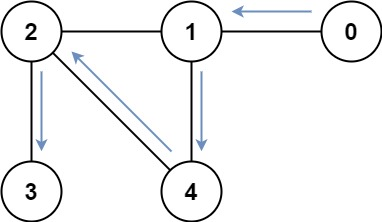

## 题目

存在一个由 n 个节点组成的无向连通图，图中的节点按从 0 到 n - 1 编号。

给你一个数组 graph 表示这个图。其中，graph[i] 是一个列表，由所有与节点 i 直接相连的节点组成。

返回能够访问所有节点的最短路径的长度。你可以在任一节点开始和停止，也可以多次重访节点，并且可以重用边。


示例 1：


    输入：graph = [[1,2,3],[0],[0],[0]]
    输出：4
    解释：一种可能的路径为 [1,0,2,0,3]
示例 2：



    输入：graph = [[1],[0,2,4],[1,3,4],[2],[1,2]]
    输出：4
    解释：一种可能的路径为 [0,1,4,2,3]


提示：

* n == graph.length
* 1 <= n <= 12
* 0 <= graph[i].length < n
* graph[i] 不包含 i
* 如果 graph[a] 包含 b ，那么 graph[b] 也包含 a
* 输入的图总是连通图

## 思路

Queue<int[]> queue = new LinkedList<int[]>();

## 解法
```java

class Solution {
    public int shortestPathLength(int[][] graph) {
        int n = graph.length;
        int ans = 0;
        Queue<int[]> queue = new LinkedList<int[]>();
        /*
        因为题目规定节点可以重复经过，以前常使用的visited[i]就不能在这里使用，visited[i]: 表示i节点是否被遍历过。
        seen[i][j]: 表示i节点在其他节点已经被访问的情况下是否已经被访问过了。
        举个例子：seen[1][1100]=true（列号用二进制表示）：表示编号为3和2的节点已经被遍历的情况下，节点
    1是否已经被遍历了。
        */
        boolean[][] seen = new boolean[n][1<<n];
        for(int i=0; i<n; i++){
            queue.offer(new int[]{i, 1<<i, 0});
            seen[i][1<<i] = true;
        }

        while(!queue.isEmpty()){
            int[] cur = queue.poll();
            int val = cur[0];
            int mask = cur[1];
            int dst = cur[2];
            if(mask==(1<<n)-1){ //全部节点已经遍历过，返回答案
                ans = dst;
                break;
            }

            //搜索相邻的节点
            for(int next: graph[val]){
                //将mask的第next位置为1
                int maskNext = mask|(1<<next);
                //避免在图中绕圈
                if(!seen[next][maskNext]){
                    queue.offer(new int[]{next, maskNext, dst+1});
                    seen[next][maskNext] = true;
                }
            }
        }
        return ans;
    }
}

```

## 总结

- 分析出几种情况，然后分别对各个情况实现 
