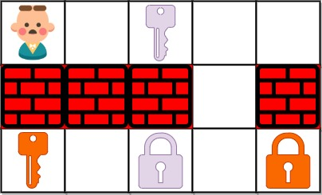

## 题目

给定一个二维网格 grid ，其中：

* '.' 代表一个空房间
* '#' 代表一堵墙
* '@' 是起点
* 小写字母代表钥匙
* 大写字母代表锁
我们从起点开始出发，一次移动是指向四个基本方向之一行走一个单位空间。我们不能在网格外面行走，也无法穿过一堵墙。如果途经一个钥匙，我们就把它捡起来。除非我们手里有对应的钥匙，否则无法通过锁。

假设 k 为 钥匙/锁 的个数，且满足 1 <= k <= 6，字母表中的前 k 个字母在网格中都有自己对应的一个小写和一个大写字母。换言之，每个锁有唯一对应的钥匙，每个钥匙也有唯一对应的锁。另外，代表钥匙和锁的字母互为大小写并按字母顺序排列。

返回获取所有钥匙所需要的移动的最少次数。如果无法获取所有钥匙，返回 -1 。


示例 1：




    输入：grid = ["@.a..","###.#","b.A.B"]
    输出：8
    解释：目标是获得所有钥匙，而不是打开所有锁。
示例 2：


    输入：grid = ["@..aA","..B#.","....b"]
    输出：6
示例 3:


    输入: grid = ["@Aa"]
    输出: -1


提示：

* m == grid.length
* n == grid[i].length
* 1 <= m, n <= 30
* grid[i][j] 只含有 '.', '#', '@', 'a'-'f' 以及 'A'-'F'
* 钥匙的数目范围是 [1, 6]
* 每个钥匙都对应一个 不同 的字母
* 每个钥匙正好打开一个对应的锁

## 思路

Deque

## 解法
```java

class Solution {
    public int shortestPathAllKeys(String[] grid) {
        //四个方向
        int[] dirs = {-1, 0, 1, 0, -1};
        int m = grid.length, n = grid[0].length();
        int keyCount = 0, x = 0, y = 0, res = 0;
        //遍历字符串数组，查找钥匙数
        for (int i = 0; i < m; i++) {
            for (int j = 0; j < n; j++) {
                char c = grid[i].charAt(j);
                //任务钥匙数量统计
                if (Character.isLowerCase(c)) keyCount++;
                else if (c == '@') {
                    //出发点坐标
                    x = i;
                    y = j;
                }
            }
        }
        //GPS!存储要走的路！
        Deque<int[]> deque = new LinkedList<>();
        //先把出发点放进去
        deque.offer(new int[]{x, y, 0});
        boolean[][][] flag = new boolean[m][n][1 << keyCount];
        flag[x][y][0] = true;
        while (!deque.isEmpty()) {
            for (int num = deque.size(); num > 0; num--) {
                int[] cur = deque.poll();
                int i = cur[0], j = cur[1], state = cur[2];
                //哎嘿！找到钥匙了！
                if (state == (1 << keyCount) - 1) return res;
                //woc!少了几把！接着找！
                for (int k = 0; k < 4; k++) {
                    int xDir = i + dirs[k], yDir = j + dirs[k + 1];
                    //别越界了！
                    if (xDir >= 0 && xDir < m && yDir >= 0 && yDir < n) {
                        char c = grid[xDir].charAt(yDir);
                        //撞墙了！锁门了！
                        if (c == '#' || (Character.isUpperCase(c) && ((state >> (c - 'A') & 1) == 0))) continue;
                        int temp = state;
                        //woc!key！
                        if (Character.isLowerCase(c))
                            //揣兜里！
                            temp |= (1 << (c - 'a'));
                        //啊！这里没来过！加入我的gps数据
                        if (!flag[xDir][yDir][temp]) {
                            flag[xDir][yDir][temp] = true;
                            deque.offer(new int[]{xDir, yDir, temp});
                        }
                    }
                }
            }
            res++;
        }
        //西八！没找全！
        return -1;
    }
}
```

## 总结

- 分析出几种情况，然后分别对各个情况实现 
