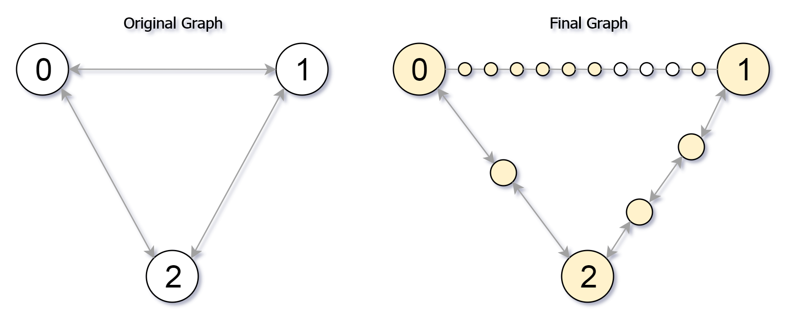

---
categories:
  - algorithm
  - leetcode
tags:
  - 
author: 
  name: JavaInterview.cn
  link: https://JavaInterview.cn
titleTag: Java
feed:
  enable: true
description: 882. 细分图中的可到达节点

---

## 题目

给你一个无向图（原始图），图中有 n 个节点，编号从 0 到 n - 1 。你决定将图中的每条边 细分 为一条节点链，每条边之间的新节点数各不相同。

图用由边组成的二维数组 edges 表示，其中 edges[i] = [ui, vi, cnti] 表示原始图中节点 ui 和 vi 之间存在一条边，cnti 是将边 细分 后的新节点总数。注意，cnti == 0 表示边不可细分。

要 细分 边 [ui, vi] ，需要将其替换为 (cnti + 1) 条新边，和 cnti 个新节点。新节点为 x1, x2, ..., xcnti ，新边为 [ui, x1], [x1, x2], [x2, x3], ..., [xcnti-1, xcnti], [xcnti, vi] 。

现在得到一个 新的细分图 ，请你计算从节点 0 出发，可以到达多少个节点？如果节点间距离是 maxMoves 或更少，则视为 可以到达 。

给你原始图和 maxMoves ，返回 新的细分图中从节点 0 出发 可到达的节点数 。


示例 1：


    输入：edges = [[0,1,10],[0,2,1],[1,2,2]], maxMoves = 6, n = 3
    输出：13
    解释：边的细分情况如上图所示。
    可以到达的节点已经用黄色标注出来。
示例 2：

    输入：edges = [[0,1,4],[1,2,6],[0,2,8],[1,3,1]], maxMoves = 10, n = 4
    输出：23
示例 3：

    输入：edges = [[1,2,4],[1,4,5],[1,3,1],[2,3,4],[3,4,5]], maxMoves = 17, n = 5
    输出：1
    解释：节点 0 与图的其余部分没有连通，所以只有节点 0 可以到达。


提示：

* 0 <= edges.length <= min(n * (n - 1) / 2, 10<sup>4</sup>)
* edges[i].length == 3
* 0 <= ui < vi < n
* 图中 不存在平行边
* 0 <= cnti <= 10<sup>4</sup>
* 0 <= maxMoves <= 10<sup>9</sup>
* 1 <= n <= 3000


## 思路

dist[]可以看作原点到每个大点最多剩余多少步，小点可以根据这个直接更新

## 解法
```java

class Solution {
    public int reachableNodes(int[][] edges, int maxMoves, int n) {
        List<int[]>[] g = new List[n];
        for (int i = 0; i < n; i++) {
            g[i] = new ArrayList<>();
        }
        for (int[] edge : edges) {
            g[edge[0]].add(new int[]{edge[1], edge[2]});
            g[edge[1]].add(new int[]{edge[0], edge[2]});
        }
        PriorityQueue<int[]> queue = new PriorityQueue<>(new Comparator<int[]>() {
            @Override
            public int compare(int[] o1, int[] o2) {
                return o2[1] - o1[1];
            }
        });
        queue.add(new int[]{0, maxMoves});
        // 代表0到该位置，最多剩多少步
        int[] dist = new int[n];
        Arrays.fill(dist, 0);
        dist[0] = maxMoves;
        boolean[] visited = new boolean[n];
        int ret = 0;
        while (!queue.isEmpty()) {
            int[] poll = queue.poll();
            int x = poll[0], left = poll[1];
            if (visited[x] || dist[x] > left) {
                continue;
            }
            visited[x] = true;
            ret++;
            List<int[]> _edges = g[x];
            if (_edges.size() == 0) {
                continue;
            }
            for (int[] edge : _edges) {
                // update distance
                if (dist[x] > edge[1]) {
                    int max = Math.max(dist[x] - edge[1] - 1, dist[edge[0]]);
                    dist[edge[0]] = max;
                    queue.add(new int[]{edge[0], max});
                }
            }
        }
        // sum all small nodes
        for (int[] edge : edges) {
            ret += Math.min(dist[edge[0]] + dist[edge[1]], edge[2]);
        }
        return ret;
    }
}

```

## 总结

- 分析出几种情况，然后分别对各个情况实现 
