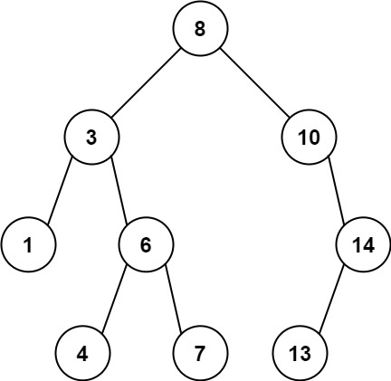

## 题目

给定二叉树的根节点 root，找出存在于 不同 节点 A 和 B 之间的最大值 V，其中 V = |A.val - B.val|，且 A 是 B 的祖先。

（如果 A 的任何子节点之一为 B，或者 A 的任何子节点是 B 的祖先，那么我们认为 A 是 B 的祖先）

 

示例 1：



    
    输入：root = [8,3,10,1,6,null,14,null,null,4,7,13]
    输出：7
    解释： 
    我们有大量的节点与其祖先的差值，其中一些如下：
    |8 - 3| = 5
    |3 - 7| = 4
    |8 - 1| = 7
    |10 - 13| = 3
    在所有可能的差值中，最大值 7 由 |8 - 1| = 7 得出。
示例 2：


    输入：root = [1,null,2,null,0,3]
    输出：3
 

提示：

- 树中的节点数在 2 到 5000 之间。
- 0 <= Node.val <= 10<sup>5</sup>

## 思路

递归

## 解法
```java

/**
 * Definition for a binary tree node.
 * public class TreeNode {
 *     int val;
 *     TreeNode left;
 *     TreeNode right;
 *     TreeNode() {}
 *     TreeNode(int val) { this.val = val; }
 *     TreeNode(int val, TreeNode left, TreeNode right) {
 *         this.val = val;
 *         this.left = left;
 *         this.right = right;
 *     }
 * }
 */
class Solution {
    public int maxAncestorDiff(TreeNode root) {
        int left = maxAncestorDiff(root.left, root.val, root.val);
        int right = maxAncestorDiff(root.right, root.val, root.val);
        return left > right ? left : right;
    }
    
    public int maxAncestorDiff(TreeNode root, int max, int min){
        if(root == null){
            return 0;
        }
        if(root.val > max){
            max = root.val;
        }
        else if(root.val < min){
            min = root.val;
        }
        if(root.left == null && root.right == null){
            return max - min;
        }
        int left = maxAncestorDiff(root.left, max, min);
        int right = maxAncestorDiff(root.right, max, min);
        return left > right ? left : right;
    }
}
```

## 总结

- 分析出几种情况，然后分别对各个情况实现 
