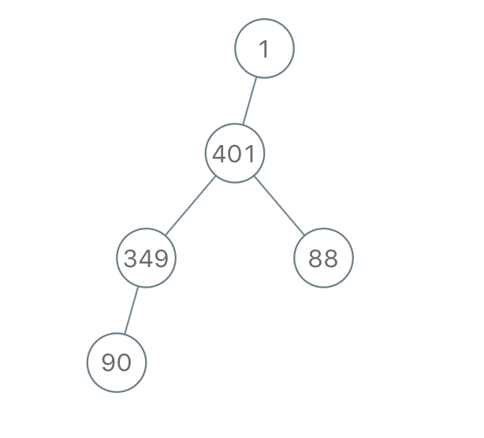

## 题目

我们从二叉树的根节点 root 开始进行深度优先搜索。

在遍历中的每个节点处，我们输出 D 条短划线（其中 D 是该节点的深度），然后输出该节点的值。（如果节点的深度为 D，则其直接子节点的深度为 D + 1。根节点的深度为 0）。

如果节点只有一个子节点，那么保证该子节点为左子节点。

给出遍历输出 S，还原树并返回其根节点 root。

 

示例 1：


    输入："1-2--3--4-5--6--7"
    输出：[1,2,5,3,4,6,7]
示例 2：


    输入："1-2--3---4-5--6---7"
    输出：[1,2,5,3,null,6,null,4,null,7]
示例 3：




    输入："1-401--349---90--88"
    输出：[1,401,null,349,88,90]
     

提示：

- 原始树中的节点数介于 1 和 1000 之间。
- 每个节点的值介于 1 和 10 ^ 9 之间。


## 思路

计算所有的大于等于当前结点val的所有结点val之和并替换，体现在BST中就是：该结点val+右子树val之和——>该结点val

那么要计算右子树，且是一个累计的过程，所以我们可以从最右下开始
一个合理的计算顺序：右->根->左

## 解法
```java

/**
 * Definition for a binary tree node.
 * public class TreeNode {
 *     int val;
 *     TreeNode left;
 *     TreeNode right;
 *     TreeNode() {}
 *     TreeNode(int val) { this.val = val; }
 *     TreeNode(int val, TreeNode left, TreeNode right) {
 *         this.val = val;
 *         this.left = left;
 *         this.right = right;
 *     }
 * }
 * 
 */
class Solution {
    
    //inorder: right - root - left
    private int pre = 0;
    public TreeNode bstToGst(TreeNode root) {
        if (root == null){
            return null;
        }
        bstToGst(root.right);
        pre += root.val;
        root.val = pre;
        bstToGst(root.left);
        return root;
    }
}
```