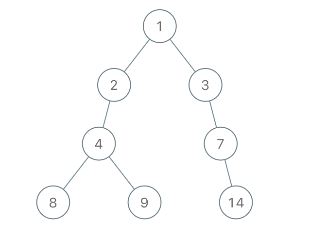
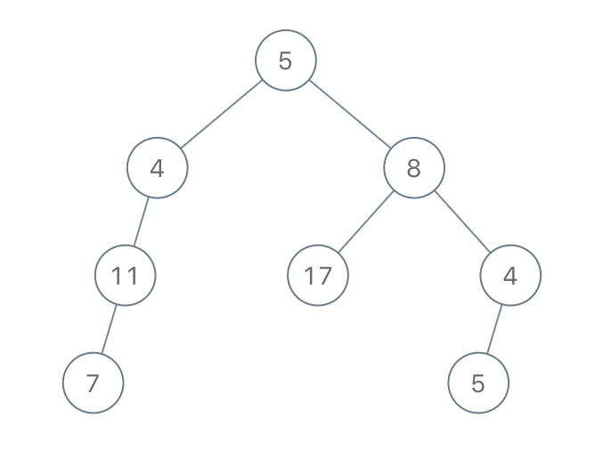
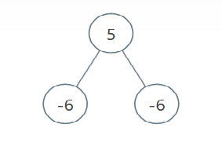

    


## 题目
给定一棵二叉树的根 root，请你考虑它所有 从根到叶的路径：从根到任何叶的路径。（所谓一个叶子节点，就是一个没有子节点的节点）

假如通过节点 node 的每种可能的 “根-叶” 路径上值的总和全都小于给定的 limit，则该节点被称之为「不足节点」，需要被删除。

请你删除所有不足节点，并返回生成的二叉树的根。

 

示例 1：


    输入：root = [1,2,3,4,-99,-99,7,8,9,-99,-99,12,13,-99,14], limit = 1


    输出：[1,2,3,4,null,null,7,8,9,null,14]
示例 2：


    输入：root = [5,4,8,11,null,17,4,7,1,null,null,5,3], limit = 22


    输出：[5,4,8,11,null,17,4,7,null,null,null,5]
示例 3：



    输入：root = [5,-6,-6], limit = 0
    输出：[]
 

提示：

- 给定的树有 1 到 5000 个节点
- -10^5 <= node.val <= 10^5
- -10^9 <= limit <= 10^9


## 思路

    如果是叶子节点，直接返回
    非叶子节点，递归计算左右子节点
    如果左右子节点被删，当前节点也不要，直接返回null

## 解法
```java

/**
 * Definition for a binary tree node.
 * public class TreeNode {
 *     int val;
 *     TreeNode left;
 *     TreeNode right;
 *     TreeNode() {}
 *     TreeNode(int val) { this.val = val; }
 *     TreeNode(int val, TreeNode left, TreeNode right) {
 *         this.val = val;
 *         this.left = left;
 *         this.right = right;
 *     }
 * }
 */
// 如果是叶子节点，直接返回
// 非叶子节点，递归计算左右子节点
// 如果左右子节点被删，当前节点也不要，直接返回null
class Solution {
    public TreeNode sufficientSubset(TreeNode root, int limit) {
        if(root==null){
            return null;
        }

        if(root.left == null && root.right == null){
            return root.val<limit?null:root;
        }

        root.left = sufficientSubset(root.left,limit-root.val);
        root.right = sufficientSubset(root.right,limit-root.val);
        return root.left == null && root.right == null?null:root;


    }
}
```