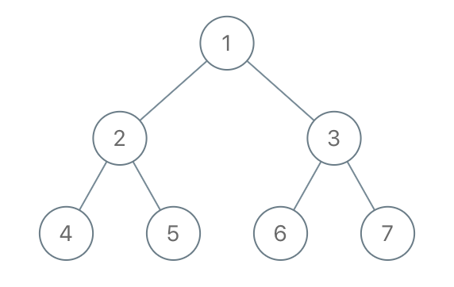

## 题目
给出二叉树的根节点 root，树上每个节点都有一个不同的值。

如果节点值在 to_delete 中出现，我们就把该节点从树上删去，最后得到一个森林（一些不相交的树构成的集合）。

返回森林中的每棵树。你可以按任意顺序组织答案。

 

示例 1：




    输入：root = [1,2,3,4,5,6,7], to_delete = [3,5]
    输出：[[1,2,null,4],[6],[7]]
示例 2：
    
    输入：root = [1,2,4,null,3], to_delete = [3]
    输出：[[1,2,4]]
 

提示：

- 树中的节点数最大为 1000。
- 每个节点都有一个介于 1 到 1000 之间的值，且各不相同。
- to_delete.length <= 1000
- to_delete 包含一些从 1 到 1000、各不相同的值。


## 思路

java 后序遍历（把需要删的点置空这样递归的时候就指向了空，同时把它的左右孩子加到list中，要判断下根节点需不需要删除）

## 解法
```java
/**
 * Definition for a binary tree node.
 * public class TreeNode {
 *     int val;
 *     TreeNode left;
 *     TreeNode right;
 *     TreeNode() {}
 *     TreeNode(int val) { this.val = val; }
 *     TreeNode(int val, TreeNode left, TreeNode right) {
 *         this.val = val;
 *         this.left = left;
 *         this.right = right;
 *     }
 * }
 */
class Solution {
//    java 后序遍历（把需要删的点置空这样递归的时候就指向了空，同时把它的左右孩子加到list中，要判断下根节点需不需要删除）


    Set<Integer> set = new HashSet<>();
    List<TreeNode> ans = new ArrayList<>();
    public List<TreeNode> delNodes(TreeNode root, int[] to_delete) {
        for(int d : to_delete){
            set.add(d);

        }   
        if(!set.contains(root.val)){
            ans.add(root);
        }
        dfs(root);
        return ans;
    }


    public TreeNode dfs(TreeNode root){
        if(root==null){
            return null;
        }
        root.left = dfs(root.left);
        root.right = dfs(root.right);

        if(set.contains(root.val)){
            if(root.left!=null){
                ans.add(root.left);
            }

            if(root.right!=null){
                ans.add(root.right);
            }

            root = null;

        }
        return root;

    }
}
```