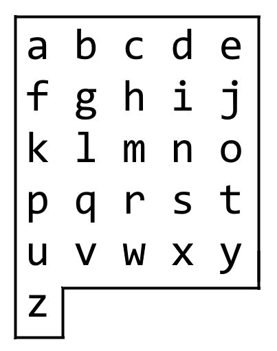

## 题目

我们从一块字母板上的位置 (0, 0) 出发，该坐标对应的字符为 board[0][0]。

在本题里，字母板为board = ["abcde", "fghij", "klmno", "pqrst", "uvwxy", "z"]，如下所示。




我们可以按下面的指令规则行动：

- 如果方格存在，'U' 意味着将我们的位置上移一行；
- 如果方格存在，'D' 意味着将我们的位置下移一行；
- 如果方格存在，'L' 意味着将我们的位置左移一列；
- 如果方格存在，'R' 意味着将我们的位置右移一列；
- '!' 会把在我们当前位置 (r, c) 的字符 board[r][c] 添加到答案中。

（注意，字母板上只存在有字母的位置。）

返回指令序列，用最小的行动次数让答案和目标 target 相同。你可以返回任何达成目标的路径。

 

示例 1：


    输入：target = "leet"
    输出："DDR!UURRR!!DDD!"
示例 2：

    输入：target = "code"
    输出："RR!DDRR!UUL!R!"
 

提示：

- 1 <= target.length <= 100
- target 仅含有小写英文字母。


## 思路

        /*
        ! 表示获取当前位置的字母
        我们记录每个字母的位置
        */

## 解法
```java

class Solution {
    public String alphabetBoardPath(String target) {
        /*
        ! 表示获取当前位置的字母
        我们记录每个字母的位置
        */
        Map<Character, int[]> map = new HashMap<>();
        char[][] chs = {"abcde".toCharArray(), "fghij".toCharArray(), "klmno".toCharArray(),
         "pqrst".toCharArray(), "uvwxy".toCharArray(), {'z'}};
        for(int i = 0; i < chs.length; i++){
            for(int j = 0; j < chs[i].length; j++){
                map.put(chs[i][j], new int[]{i, j});
            }
        }
        StringBuilder sb = new StringBuilder();

        int x = 0;
        int y = 0;
        for (char s : target.toCharArray()) {
            int[] p = map.get(s);
            //避免进入 z 的空白区域，先左再下，先上再右
            while(y > p[1]){
                y--;
                sb.append("L");
            }
            while(x < p[0]){
                x++;
                sb.append("D");
            }
            while(x > p[0]){
                x--;
                sb.append("U");
            }
            while(y < p[1]){
                y++;
                sb.append("R");
            }
            
            sb.append("!");
        }
        return sb.toString();
    }
}
```

## 总结

- 分析出几种情况，然后分别对各个情况实现 
