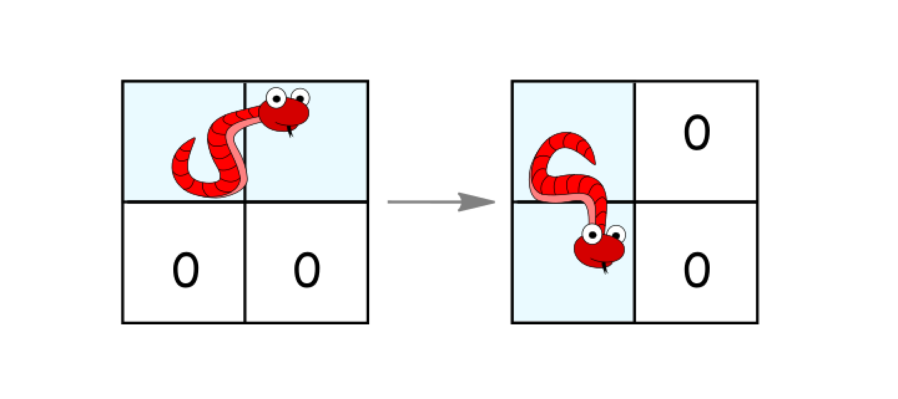

## 题目

你还记得那条风靡全球的贪吃蛇吗？

我们在一个 n*n 的网格上构建了新的迷宫地图，蛇的长度为 2，也就是说它会占去两个单元格。蛇会从左上角（(0, 0) 和 (0, 1)）开始移动。我们用 0 表示空单元格，用 1 表示障碍物。蛇需要移动到迷宫的右下角（(n-1, n-2) 和 (n-1, n-1)）。

每次移动，蛇可以这样走：

- 如果没有障碍，则向右移动一个单元格。并仍然保持身体的水平／竖直状态。

- 如果没有障碍，则向下移动一个单元格。并仍然保持身体的水平／竖直状态。
- 如果它处于水平状态并且其下面的两个单元都是空的，就顺时针旋转 90 度。蛇从（(r, c)、(r, c+1)）移动到 （(r, c)、(r+1, c)）。


- 如果它处于竖直状态并且其右面的两个单元都是空的，就逆时针旋转 90 度。蛇从（(r, c)、(r+1, c)）移动到（(r, c)、(r, c+1)）。


返回蛇抵达目的地所需的最少移动次数。

如果无法到达目的地，请返回 -1。

 

示例 1：


    输入：grid = [[0,0,0,0,0,1],
                   [1,1,0,0,1,0],
                   [0,0,0,0,1,1],
                   [0,0,1,0,1,0],
                   [0,1,1,0,0,0],
                   [0,1,1,0,0,0]]
    输出：11
    解释：
    一种可能的解决方案是 [右, 右, 顺时针旋转, 右, 下, 下, 下, 下, 逆时针旋转, 右, 下]。
示例 2：

    输入：grid = [[0,0,1,1,1,1],
                   [0,0,0,0,1,1],
                   [1,1,0,0,0,1],
                   [1,1,1,0,0,1],
                   [1,1,1,0,0,1],
                   [1,1,1,0,0,0]]
    输出：9
 

提示：

- 2 <= n <= 100
- 0 <= grid[i][j] <= 1
- 蛇保证从空单元格开始出发。


## 思路

// 广度优先遍历 Java实现 目测是评论区if-else写的最少的版本

## 解法
```java

class Solution {
    // 广度优先遍历 Java实现 目测是评论区if-else写的最少的版本


    //三元数组分别表示：向下移动、向右移动、进行旋转
    private static final int[][] dirs = {{1, 0, 0}, {0, 1, 0}, {0, 0, 1}};

    public int minimumMoves(int[][] grid) {
        int n = grid.length;
        boolean[][][] isVisited = new boolean[n][n][2];
        isVisited[0][0][0] = true;
        Queue<int[]> queue = new LinkedList<>();
        queue.offer(new int[]{0, 0, 0});//加入初始蛇尾位置
        int step = 1;//记录移动步数
        while(!queue.isEmpty()){
            int len = queue.size();//BFS每一层的长度
            while(len > 0){
                int[] arr = queue.poll();
                for(int[] dir : dirs){//对每个位置遍历三种操作
                    int x1 = arr[0] + dir[0], y1 = arr[1] + dir[1], z1 = arr[2] ^ dir[2];//蛇尾变动后位置
                    int x2 = x1 + z1, y2 = y1 + (z1 ^ 1);//蛇头变动后位置
                    //应当满足的条件：1.移动后蛇身不能出界 2.此状态没遍历过 
                    //3.移动后蛇身不能在障碍物上 4.若为旋转操作，则(x1 + 1, y1 + 1)位置不能有障碍物
                    if(x2 < n && y2 < n && !isVisited[x1][y1][z1] && grid[x1][y1] == 0 && grid[x2][y2] == 0 
                    && (dir[2] == 0 || grid[x1 + 1][y1 + 1] == 0)){
                        if(x1 == n - 1 && y1 == n - 2) return step;//蛇尾达到最终位置
                        isVisited[x1][y1][z1] = true;
                        queue.offer(new int[]{x1, y1, z1});
                    }
                }
                len--;
            }
            step++;
        }
        return -1;//无法到达最终位置的情况

    }
}
```

## 总结

- 分析出几种情况，然后分别对各个情况实现 
