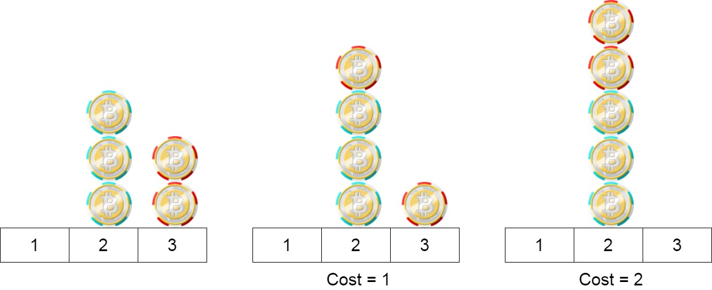

## 题目

有 n 个筹码。第 i 个筹码的位置是 position[i] 。

我们需要把所有筹码移到同一个位置。在一步中，我们可以将第 i 个筹码的位置从 position[i] 改变为:

- position[i] + 2 或 position[i] - 2 ，此时 cost = 0
- position[i] + 1 或 position[i] - 1 ，此时 cost = 1

返回将所有筹码移动到同一位置上所需要的 最小代价 。

 

示例 1：


    输入：position = [1,2,3]
    输出：1
    解释：第一步:将位置3的筹码移动到位置1，成本为0。
    第二步:将位置2的筹码移动到位置1，成本= 1。
    总成本是1。
示例 2：



    输入：position = [2,2,2,3,3]
    输出：2
    解释：我们可以把位置3的两个筹码移到位置2。每一步的成本为1。总成本= 2。
示例 3:

    输入：position = [1,1000000000]
    输出：1
 

提示：

- 1 <= position.length <= 100
- 1 <= position[i] <= 10^9

## 思路

因为移动2个位置不需要代价，那么奇数位置移到奇数位置不用代价，偶数位置移到偶数位置不用代价，那就分别统计奇数位置和偶数位置的个数，相当于把所有奇数放一起，所有偶数的放一起，然后比较奇数的少还是偶数的少，将少的个数移到多的个数位置上去就可以了

## 解法
```java

class Solution {
    // 因为移动2个位置不需要代价，那么奇数位置移到奇数位置不用代价，偶数位置移到偶数位置不用代价，那就分别统计奇数位置和偶数位置的个数，相当于把所有奇数放一起，所有偶数的放一起，然后比较奇数的少还是偶数的少，将少的个数移到多的个数位置上去就可以了
    public int minCostToMoveChips(int[] chips) {
        int odd = 0, even = 0;
        for (int i = 0; i < chips.length; i++) {
            if (chips[i] % 2 == 0) {
                even++;
            } else if (chips[i] % 2 != 0) {
                odd++;
            }
        }
        return Math.min(even, odd);  
    }
}
```

## 总结

- 分析出几种情况，然后分别对各个情况实现 
