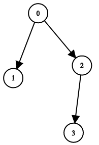

## 题目
二叉树上有 n 个节点，按从 0 到 n - 1 编号，其中节点 i 的两个子节点分别是 leftChild[i] 和 rightChild[i]。

只有 所有 节点能够形成且 只 形成 一颗 有效的二叉树时，返回 true；否则返回 false。

如果节点 i 没有左子节点，那么 leftChild[i] 就等于 -1。右子节点也符合该规则。

注意：节点没有值，本问题中仅仅使用节点编号。

 

示例 1：



    输入：n = 4, leftChild = [1,-1,3,-1], rightChild = [2,-1,-1,-1]
    输出：true
示例 2：


    输入：n = 4, leftChild = [1,-1,3,-1], rightChild = [2,3,-1,-1]
    输出：false
示例 3：


    输入：n = 2, leftChild = [1,0], rightChild = [-1,-1]
    输出：false
示例 4：


    输入：n = 6, leftChild = [1,-1,-1,4,-1,-1], rightChild = [2,-1,-1,5,-1,-1]
    输出：false
 

提示：

- 1 <= n <= 10^4
- leftChild.length == rightChild.length == n
- -1 <= leftChild[i], rightChild[i] <= n - 1


## 思路

1、有且只有一个节点没有父节点；2、一个节点不会既是left又是right；3、不能有反向边；4、必须是连通图

## 解法
```java


class Solution {
    public boolean validateBinaryTreeNodes(int n, int[] leftChild, int[] rightChild) {
        //1、有且只有一个节点没有父节点；2、一个节点不会既是left又是right；3、不能有反向边；4、必须是连通图
        boolean hasParent[]=new boolean[n];
        int child[]=new int[n];//0左1右
        Arrays.fill(child,-1);
        //如果一个点既是左又是右，那么false：
        for(int i=0;i<n;i++){
            if(leftChild[i]!=-1){
                if(child[leftChild[i]]!=-1){return false;}
                child[leftChild[i]]=0;
                hasParent[leftChild[i]]=true;
            }
            if(rightChild[i]!=-1){
                if(child[rightChild[i]]!=-1){return false;}
                child[rightChild[i]]=1;
                hasParent[rightChild[i]]=true;
            }
        }
        //验证根节点的的独一性：
        int count=0,root=-1;
        for(int i=0;i<hasParent.length;i++){
            if(!hasParent[i]){
                count++;
                root=i;
            }
        }
        if(count!=1){return false;}
        //验证无反向边、连通
        boolean used[]=new boolean[n];
        count=0;
        Queue<Integer> q=new LinkedList<>();
        q.add(root);
        used[root]=true;
        while(q.size()>0){
            int a=q.poll();
            count++;
            if(leftChild[a]!=-1){
                if(used[leftChild[a]]){return false;}
                used[leftChild[a]]=true;
                q.add(leftChild[a]);
            }
            if(rightChild[a]!=-1){
                if(used[rightChild[a]]){return false;}
                used[rightChild[a]]=true;
                q.add(rightChild[a]);
            }
        }
        return count==n;
    }
}
```