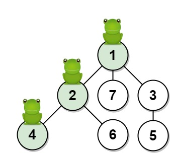

## 题目

给你一棵由 n 个顶点组成的无向树，顶点编号从 1 到 n。青蛙从 顶点 1 开始起跳。规则如下：

    在一秒内，青蛙从它所在的当前顶点跳到另一个 未访问 过的顶点（如果它们直接相连）。
    青蛙无法跳回已经访问过的顶点。
    如果青蛙可以跳到多个不同顶点，那么它跳到其中任意一个顶点上的机率都相同。
    如果青蛙不能跳到任何未访问过的顶点上，那么它每次跳跃都会停留在原地。
    无向树的边用数组 edges 描述，其中 edges[i] = [fromi, toi] 意味着存在一条直接连通 fromi 和 toi 两个顶点的边。

返回青蛙在 t 秒后位于目标顶点 target 上的概率。

 

示例 1：




    输入：n = 7, edges = [[1,2],[1,3],[1,7],[2,4],[2,6],[3,5]], t = 2, target = 4
    输出：0.16666666666666666 
    解释：上图显示了青蛙的跳跃路径。青蛙从顶点 1 起跳，第 1 秒 有 1/3 的概率跳到顶点 2 ，然后第 2 秒 有 1/2 的概率跳到顶点 4，因此青蛙在 2 秒后位于顶点 4 的概率是 1/3 * 1/2 = 1/6 = 0.16666666666666666 。 
示例 2：


    输入：n = 7, edges = [[1,2],[1,3],[1,7],[2,4],[2,6],[3,5]], t = 1, target = 7
    输出：0.3333333333333333
    解释：上图显示了青蛙的跳跃路径。青蛙从顶点 1 起跳，有 1/3 = 0.3333333333333333 的概率能够 1 秒 后跳到顶点 7 。 
 

 

提示：

- 1 <= n <= 100
- edges.length == n - 1
- edges[i].length == 2
- 1 <= ai, bi <= n
- 1 <= t <= 50
- 1 <= target <= n


## 思路

dfs

## 解法
```java

class Solution {
    public double frogPosition(int n, int[][] edges, int t, int target) {

            boolean[] visited = new boolean[n + 1];
        Map<Integer, List<Integer>> map = new HashMap<>();
        for (int[] e: edges) {
            map.putIfAbsent(e[0], new LinkedList<>());
            map.get(e[0]).add(e[1]);
            map.putIfAbsent(e[1], new LinkedList<>());
            map.get(e[1]).add(e[0]);
        }
        return dfs(map, visited, t, target, 1, 1);
    }

    public double dfs(Map<Integer, List<Integer>> map, boolean[] visited, int t, int target, int cur, double p) {
        if (t < 0) {
            return 0;
        }
        List<Integer> next = map.getOrDefault(cur, Collections.emptyList()).stream().filter(i -> !visited[i]).collect(Collectors.toList());
        if (t == 0 || next.size() == 0) {
            return cur == target ? p : 0;
        }
        double res = 0;
        p /= next.size();
        visited[cur] = true;
        for (Integer n: next) {
            if ((res = dfs(map, visited, t - 1, target, n, p)) > 0) {
                return res;
            }
        }
        visited[cur] = false;
        return 0;
    }
}
```

## 总结

- 分析出几种情况，然后分别对各个情况实现 
