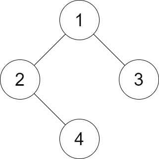

## 题目

给你二叉树的根节点 root 和一个整数 distance 。

如果二叉树中两个 叶 节点之间的 最短路径长度 小于或者等于 distance ，那它们就可以构成一组 好叶子节点对 。

返回树中 好叶子节点对的数量 。

 

示例 1：

 



    输入：root = [1,2,3,null,4], distance = 3
    输出：1
    解释：树的叶节点是 3 和 4 ，它们之间的最短路径的长度是 3 。这是唯一的好叶子节点对。
示例 2：


    输入：root = [1,2,3,4,5,6,7], distance = 3
    输出：2
    解释：好叶子节点对为 [4,5] 和 [6,7] ，最短路径长度都是 2 。但是叶子节点对 [4,6] 不满足要求，因为它们之间的最短路径长度为 4 。
示例 3：

    输入：root = [7,1,4,6,null,5,3,null,null,null,null,null,2], distance = 3
    输出：1
    解释：唯一的好叶子节点对是 [2,5] 。
示例 4：

    输入：root = [100], distance = 1
    输出：0
示例 5：

    输入：root = [1,1,1], distance = 2
    输出：1
 

提示：

- tree 的节点数在 [1, 2^10] 范围内。
- 每个节点的值都在 [1, 100] 之间。
- 1 <= distance <= 10


## 思路


       求每一个节点，左右子树里，叶子节点之间距离<=distance的组合数目，接着递归向上
       不会重复，因为每个节点的左右子组合都是不一样的，所以让左的数目*右的数目求出组合数
 

## 解法
```java

/**
 * Definition for a binary tree node.
 * public class TreeNode {
 *     int val;
 *     TreeNode left;
 *     TreeNode right;
 *     TreeNode() {}
 *     TreeNode(int val) { this.val = val; }
 *     TreeNode(int val, TreeNode left, TreeNode right) {
 *         this.val = val;
 *         this.left = left;
 *         this.right = right;
 *     }
 * }
 */
 /*
 *   求每一个节点，左右子树里，叶子节点之间距离<=distance的组合数目，接着递归向上
 *   不会重复，因为每个节点的左右子组合都是不一样的，所以让左的数目*右的数目求出组合数
 */
class Solution {
    private int ans = 0;
    public int countPairs(TreeNode root, int distance) {
        dfs(root, distance);
        return ans;
    }
    //自底向上的递归，用count数组统计和当前节点的距离为 i 的叶子节点数目，
    //多于distance的不用考虑
    public int[] dfs(TreeNode root, int distance){
        if(root == null){
            return new int[distance+1];
        }
        int[] count = new int[distance+1];
        if(root.left==null && root.right==null){
            count[1] = 1;
            return count;
        }
        int[] leftCount = dfs(root.left, distance);
        int[] rightCount = dfs(root.right, distance);
        //计算组合数
        for(int i=1; i<=distance; i++){
            for(int j=1; j<=distance-i; j++){
                ans += leftCount[i]*rightCount[j];
            }
        }
        //向上层返回，距离+1
        for(int i=2; i<=distance; i++){
            count[i] = leftCount[i-1]+rightCount[i-1];
        }
        return count;
    }
}
```

## 总结

- 分析出几种情况，然后分别对各个情况实现 
