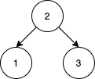
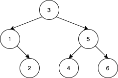

## 题目

给你一个数组 nums 表示 1 到 n 的一个排列。我们按照元素在 nums 中的顺序依次插入一个初始为空的二叉查找树（BST）。请你统计将 nums 重新排序后，统计满足如下条件的方案数：重排后得到的二叉查找树与 nums 原本数字顺序得到的二叉查找树相同。

比方说，给你 nums = [2,1,3]，我们得到一棵 2 为根，1 为左孩子，3 为右孩子的树。数组 [2,3,1] 也能得到相同的 BST，但 [3,2,1] 会得到一棵不同的 BST 。

请你返回重排 nums 后，与原数组 nums 得到相同二叉查找树的方案数。

由于答案可能会很大，请将结果对 10^9 + 7 取余数。

 

示例 1：




    输入：nums = [2,1,3]
    输出：1
    解释：我们将 nums 重排， [2,3,1] 能得到相同的 BST 。没有其他得到相同 BST 的方案了。
示例 2：


    输入：nums = [3,4,5,1,2]
    输出：5
    解释：下面 5 个数组会得到相同的 BST：
    [3,1,2,4,5]
    [3,1,4,2,5]
    [3,1,4,5,2]
    [3,4,1,2,5]
    [3,4,1,5,2]
示例 3：


    输入：nums = [1,2,3]
    输出：0
    解释：没有别的排列顺序能得到相同的 BST 。
示例 4：



    输入：nums = [3,1,2,5,4,6]
    输出：19
示例  5：

    输入：nums = [9,4,2,1,3,6,5,7,8,14,11,10,12,13,16,15,17,18]
    输出：216212978
    解释：得到相同 BST 的方案数是 3216212999。将它对 10^9 + 7 取余后得到 216212978。
 

提示：

- 1 <= nums.length <= 1000
- 1 <= nums[i] <= nums.length
- nums 中所有数 互不相同 。


## 思路

取模

## 解法
```java


class Solution {
    
    int mod = 1000000007;

    public int numOfWays(int[] nums) {
        return numOfWays(Arrays.stream(nums).boxed().collect(Collectors.toList())) - 1;
    }

    public int numOfWays(List<Integer> arr) {
        if (arr.size() <= 2) return 1;

        int root = arr.get(0);
        List<Integer> l = new ArrayList<>();
        List<Integer> r = new ArrayList<>();

        for (int k : arr) {
            if (k == root) continue;

            if (k < root) {
                l.add(k);
            } else {
                r.add(k);
            }
        }

        long res = nCr(arr.size() - 1, Math.min(l.size(), r.size()));
        res = (res * numOfWays(l)) % mod;
        res = (res * numOfWays(r)) % mod;
        return (int) res;
    }

    public int nCr(int n, int r) {
        long res = 1;
        for (int i = 0; i < r; ++ i) {
            res = (res * (n - i)) % mod;
            res = (res * pow(i + 1, mod - 2)) % mod;
        }
        return (int) (res % mod);
    }

    public int pow(int x, int p) {
        long res = 1, tmp = x;
        while (p > 0) {
            if ((p & 1) == 1) res = (res * tmp) % mod;
            tmp = (tmp * tmp) % mod;
            p >>= 1;
        }
        return (int) (res % mod);
    }
}
```

## 总结

- 分析出几种情况，然后分别对各个情况实现 
