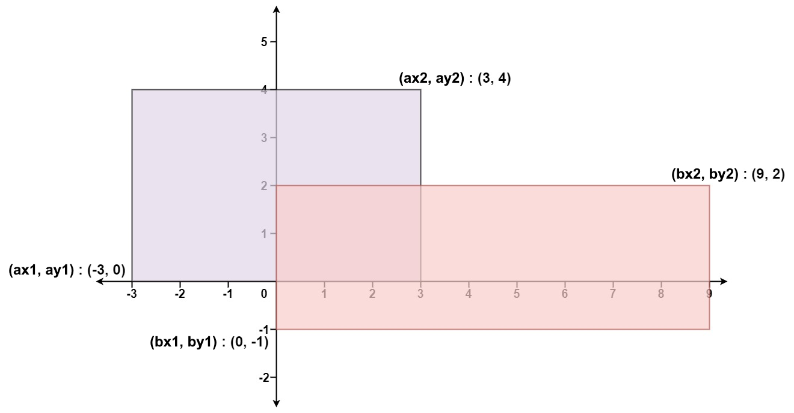

## 题目
给你 **二维** 平面上两个 **由直线构成且边与坐标轴平行/垂直** 的矩形，请你计算并返回两个矩形覆盖的总面积。

每个矩形由其 **左下** 顶点和 **右上** 顶点坐标表示：

- 第一个矩形由其左下顶点 (ax1, ay1) 和右上顶点 (ax2, ay2) 定义。
- 第二个矩形由其左下顶点 (bx1, by1) 和右上顶点 (bx2, by2) 定义。


示例 1：



    输入：ax1 = -3, ay1 = 0, ax2 = 3, ay2 = 4, bx1 = 0, by1 = -1, bx2 = 9, by2 = 2
    输出：45
示例 2：

    输入：ax1 = -2, ay1 = -2, ax2 = 2, ay2 = 2, bx1 = -2, by1 = -2, bx2 = 2, by2 = 2
    输出：16
 

提示：

    -104 <= ax1, ay1, ax2, ay2, bx1, by1, bx2, by2 <= 10<sup>4</sup>


## 思路

【笔记】总面积=单个面积1+单个面积2-重叠面积。

但是，我们应该写成：（先做减法）

总面积 = 单个面积1 - 重叠面积 + 单个面积2

这样，才不会溢出。

```java


```

    假设左边是 a, 右边是 b
    ┌--------┓
    |        |
    |    ┌---╋-----┓ 
    |    |   |     |
    ┗----╋---┘     |
         |         |
         ┗---------┘

    ┗、┓是已知的坐标
    求两个 ╋ 的坐标就好啦
    左下角: [x1, y1] = [max(ax1, bx1), max(ay1, ay2)]
    右上角: [x2, y2] = [min(ax2, bx2), min(ay2, by2)]
    所以, 重叠部分面积就是 (x2 - x1) * (y2 - y1)
    当然, 这是假设有重叠部分的前提下得出的结论
    如若没有重叠部分, 如下:
    ┌--------┓
    |        |
    |        |  ┌---------┓ 
    |        |  |         |
    ┗--------┘  |         |
                |         |
                ┗---------┘
    那么 x1 = bx1, x2 = ax2 (用上述方式), 即 x2 - x1 < 0
    所以严谨的说, 重叠部分面积应该是:
    max(0, x2 - x1) * max(0, y2 - y1)


## 解法
```java

class Solution {
    public int computeArea(int ax1, int ay1, int ax2, int ay2, int bx1, int by1, int bx2, int by2) {

        int x1=Math.max(ax1,bx1);
        int y1=Math.max(ay1,by1);
        int x2=Math.min(ax2,bx2);
        int y2=Math.min(ay2,by2);
        if(x1>=x2||y1>=y2)
            return ((ax2-ax1)*(ay2-ay1)+(bx2-bx1)*(by2-by1));
        else
            return ((ax2-ax1)*(ay2-ay1)-(x2-x1)*(y2-y1)+(bx2-bx1)*(by2-by1));
    
    }
}

```

## 总结

- 分析出几种情况，然后分别对各个情况实现 
