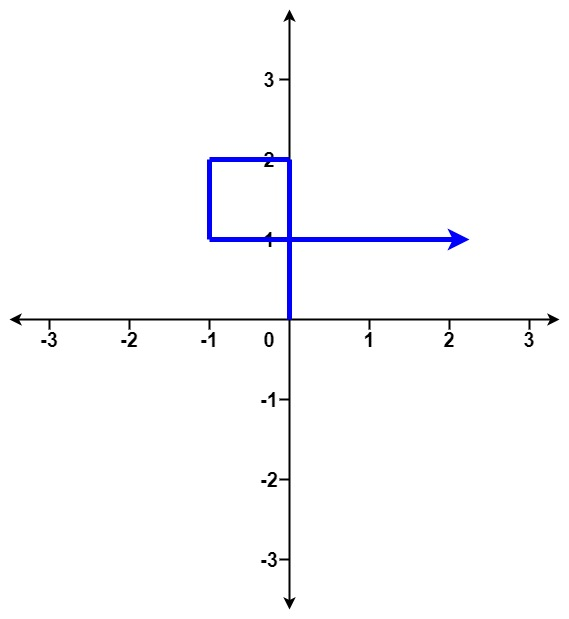
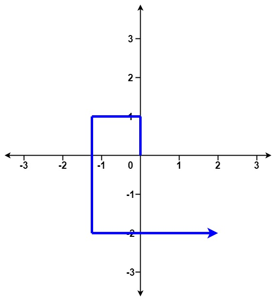
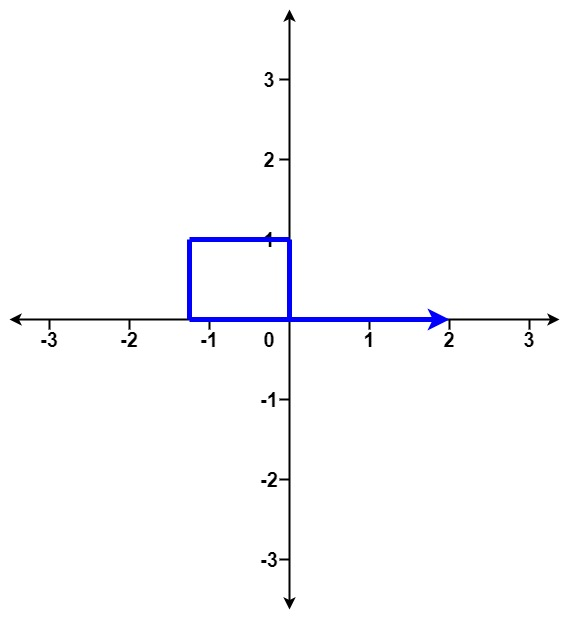

## 题目

给你一个整数数组 distance 。

从 X-Y 平面上的点 (0,0) 开始，先向北移动 distance[0] 米，然后向西移动 distance[1] 米，向南移动 distance[2] 米，向东移动 distance[3] 米，持续移动。也就是说，每次移动后你的方位会发生逆时针变化。

判断你所经过的路径是否相交。如果相交，返回 true ；否则，返回 false 。

 

示例 1：



    输入：distance = [2,1,1,2]
    输出：true
示例 2：



    输入：distance = [1,2,3,4]
    输出：false
示例 3：



    输入：distance = [1,1,1,1]
    输出：true
 

提示：

- 1 <= distance.length <= 10<sup>5</sup>
- 1 <= distance[i] <= 10<sup>5</sup>


## 思路

    /**
    参考的这篇https://leetcode-cn.com/problems/self-crossing/solution/c3ge-bu-zou-miao-jie-ci-ti-by-xiaohu9527-96n6/
    考虑绕圈情况，绕圈有两种：从内向外和从外向内。通过分析可以确定，不相交的只有3种情况：
    1. 从distance[0]开始从外向内绕圈，直到结束。
    2. 从distance[0]开始从内向外绕圈，直到结束。
    3. 从distance[0]开始从内向外绕圈，直到某个时刻开始从外向内绕圈，直到结束。这种情况两次绕圈的最外层不能相交。
    从内向外绕圈是distance[i]>distance[i-2]，从外向内绕圈则是distance[i]<distance[i-2]。
    */

## 解法
```java

class Solution {
    /**
参考的这篇https://leetcode-cn.com/problems/self-crossing/solution/c3ge-bu-zou-miao-jie-ci-ti-by-xiaohu9527-96n6/
考虑绕圈情况，绕圈有两种：从内向外和从外向内。通过分析可以确定，不相交的只有3种情况：
1. 从distance[0]开始从外向内绕圈，直到结束。
2. 从distance[0]开始从内向外绕圈，直到结束。
3. 从distance[0]开始从内向外绕圈，直到某个时刻开始从外向内绕圈，直到结束。这种情况两次绕圈的最外层不能相交。
从内向外绕圈是distance[i]>distance[i-2]，从外向内绕圈则是distance[i]<distance[i-2]。
 */
    public boolean isSelfCrossing(int[] distance) {

        int n = distance.length;
        if (n < 4) return false;
        int step = 2;
        // 第一种情况
        if (distance[step] < distance[step-2]){
            while (step < n){
                if (distance[step] >= distance[step-2]) return true;
                ++step;
            }
            return false;
        }

        // 从distance[0]开始从内向外绕圈
        while (step < n){
            if (distance[step] <= distance[step-2]) break;
            ++step;
        }
        // 第二种情况
        if (step >= n) return false;
        // 第三种情况
        boolean flag1 = distance[step]+(step >= 4 ? distance[step-4] : 0) >= distance[step-2];
        boolean flag2 = (step <=n-2 ? distance[step+1] : 0)+(step >= 3 ? distance[step-3] : 0) >= distance[step-1];
        if (flag1 && flag2) return true; // 两次绕圈的最外层相交
        ++step;
        while (step < n){
            if (distance[step] >= distance[step-2]) return true;
            ++step;
        }
        return false;
    }
}
```

## 总结

- 分析出几种情况，然后分别对各个情况实现 
