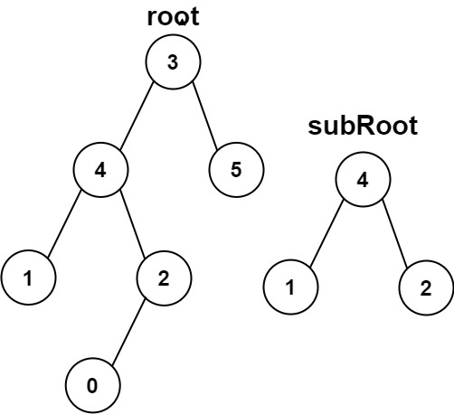

## 题目
给你两棵二叉树 root 和 subRoot 。检验 root 中是否包含和 subRoot 具有相同结构和节点值的子树。如果存在，返回 true ；否则，返回 false 。

二叉树 tree 的一棵子树包括 tree 的某个节点和这个节点的所有后代节点。tree 也可以看做它自身的一棵子树。

 

示例 1：


    输入：root = [3,4,5,1,2], subRoot = [4,1,2]
    输出：true

示例 2：


    输入：root = [3,4,5,1,2,null,null,null,null,0], subRoot = [4,1,2]
    输出：false
 

提示：

    root 树上的节点数量范围是 [1, 2000]
    subRoot 树上的节点数量范围是 [1, 1000]
    -10<sup>4</sup> <= root.val <= 10<sup>4</sup>
    -10<sup>4</sup> <= subRoot.val <= 10<sup>4</sup>

## 思路
相等时向下递归，不相等时递归判断左节点和子节点，或不相等时递归判断右节点和子节点

## 解法
```java
/**
 * Definition for a binary tree node.
 * public class TreeNode {
 *     int val;
 *     TreeNode left;
 *     TreeNode right;
 *     TreeNode() {}
 *     TreeNode(int val) { this.val = val; }
 *     TreeNode(int val, TreeNode left, TreeNode right) {
 *         this.val = val;
 *         this.left = left;
 *         this.right = right;
 *     }
 * }
 */
class Solution {
        public boolean isSameTree(TreeNode s,TreeNode t){
            // 同时为空 说明树一起到底，两树相同
            if (s==null && t == null){
                return true;
            }
            // 如果上面没有返回值，说明必有一个没有为空（有可能两个都不为空）
            if (s == null || t == null){
                return false;
            }
            // 如果判断到了这一步，说明两个都不为空
            // 先序遍历 自己--左 -- 右
            if (s.val != t.val){
                return false;
            }
            return isSameTree(s.left,t.left) && isSameTree(s.right,t.right);
        }
        public boolean isSubtree(TreeNode s, TreeNode t) {
            // 我s都遍历完了。你居然还没匹配上。那就返回false
            if (s==null){
                return false;
            }
            // 短路运算符，有一个为真，返回真
            return isSameTree(s,t) || isSubtree(s.left,t) || isSubtree(s.right,t);
        }

    
}
```