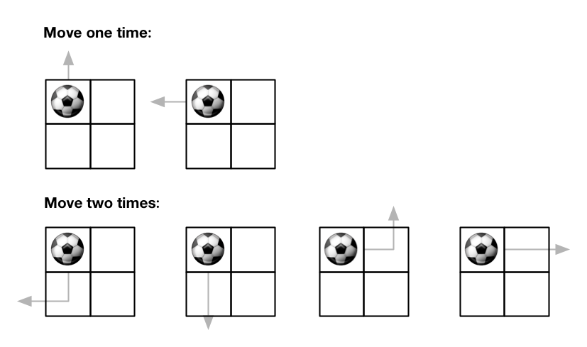

## 题目


给你一个大小为 m x n 的网格和一个球。球的起始坐标为 [startRow, startColumn] 。你可以将球移到在四个方向上相邻的单元格内（可以穿过网格边界到达网格之外）。你 最多 可以移动 maxMove 次球。

给你五个整数 m、n、maxMove、startRow 以及 startColumn
，找出并返回可以将球移出边界的路径数量。因为答案可能非常大，
返回对 10<sup>9</sup>
\+ 7 取余 后的结果。


来源：力扣（LeetCode）
链接：https://leetcode.cn/problems/out-of-boundary-paths
著作权归领扣网络所有。商业转载请联系官方授权，非商业转载请注明出处。
示例 1：



    输入：m = 2, n = 2, maxMove = 2, startRow = 0, startColumn = 0
    输出：6
示例 2：


    输入：m = 1, n = 3, maxMove = 3, startRow = 0, startColumn = 1
    输出：12
 

提示：

- 1 <= m, n <= 50
- 0 <= maxMove <= 50
- 0 <= startRow < m
- 0 <= startColumn < n


## 思路

        /*
        动态规划:
        出界是指内部的格子再移动一格后就不是内部的格子，因此可以统计出起点到边缘格子的路径数总和
        但是移出界还要多一次，因此移动到边界最多maxMove-1次
        1.状态定义:f[i][j][k]表示从[startRow,startCol]移动k次到[i,j]的路径数
        2.状态转移:显然f[i][j][k]要依赖于f[?][?][k-1]
            遍历所有f[i][j][k-1]的状态，若是有效值(不为0)则可以向上下左右4个方向移动
            f[newI][newJ][k]+=f[i][j][k-1]
        3.初始化:初值覆盖0，表示没有路径到达该格子，并且f[startRow][startCol][0]=1
        4.遍历顺序:先k正序，后i与j任意
        5.返回形式:∑f[0][j][<maxMove]+∑f[m-1][j][<maxMove]+∑f[i][0][<maxMove]+∑f[i][n-1][<maxMove] 其中i∈[0,m-1]，j∈[0,n-1]
        时间复杂度:O(m*n*maxRove) 空间复杂度:O(m*n*maxMove)
         */

## 解法
```java
class Solution {
        public int findPaths(int m, int n, int maxMove, int startRow, int startCol) {
        /*
        动态规划:
        出界是指内部的格子再移动一格后就不是内部的格子，因此可以统计出起点到边缘格子的路径数总和
        但是移出界还要多一次，因此移动到边界最多maxMove-1次
        1.状态定义:f[i][j][k]表示从[startRow,startCol]移动k次到[i,j]的路径数
        2.状态转移:显然f[i][j][k]要依赖于f[?][?][k-1]
            遍历所有f[i][j][k-1]的状态，若是有效值(不为0)则可以向上下左右4个方向移动
            f[newI][newJ][k]+=f[i][j][k-1]
        3.初始化:初值覆盖0，表示没有路径到达该格子，并且f[startRow][startCol][0]=1
        4.遍历顺序:先k正序，后i与j任意
        5.返回形式:∑f[0][j][<maxMove]+∑f[m-1][j][<maxMove]+∑f[i][0][<maxMove]+∑f[i][n-1][<maxMove] 其中i∈[0,m-1]，j∈[0,n-1]
        时间复杂度:O(m*n*maxRove) 空间复杂度:O(m*n*maxMove)
         */
        if (maxMove == 0) return 0; // 无法移动就出界不了
        int MOD = (int) 1e9 + 7;
        int[][] dirs = {{0, 1}, {0, -1}, {1, 0}, {-1, 0}};
        long[][][] f = new long[m][n][maxMove];
        f[startRow][startCol][0] = 1L;
        for (int k = 1; k < maxMove; k++) {
            for (int i = 0; i < m; i++) {
                for (int j = 0; j < n; j++) {
                    for (int[] dir : dirs) {
                        int newI = i + dir[0], newJ = j + dir[1];
                        // 前面的格子在区域内且有效才进行转移
                        if (newI >= 0 && newI <= m - 1 && newJ >= 0 && newJ <= n - 1 && f[i][j][k - 1] != 0) {
                            f[newI][newJ][k] = (f[newI][newJ][k] + f[i][j][k - 1]) % MOD;
                        }
                    }
                }
            }
        }
        // System.out.println(Arrays.deepToString(f));
        long res = 0;
        for (int k = 0; k < maxMove; k++) {
            for (int i = 0; i < m; i++) {
                res = (res + f[i][0][k]) % MOD;
                res = (res + f[i][n - 1][k]) % MOD;
            }
            for (int j = 0; j < n; j++) {
                res = (res + f[0][j][k]) % MOD;
                res = (res + f[m - 1][j][k]) % MOD;
            }
        }
        return (int) res;
}}
```

## 总结

- 分析出几种情况，然后分别对各个情况实现 
