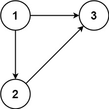
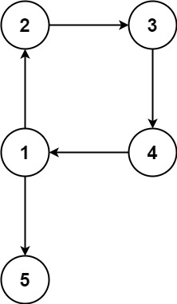

## 题目

在本问题中，有根树指满足以下条件的 有向 图。该树只有一个根节点，所有其他节点都是该根节点的后继。该树除了根节点之外的每一个节点都有且只有一个父节点，而根节点没有父节点。

输入一个有向图，该图由一个有着 n 个节点（节点值不重复，从 1 到 n）的树及一条附加的有向边构成。附加的边包含在 1 到 n 中的两个不同顶点间，这条附加的边不属于树中已存在的边。

结果图是一个以边组成的二维数组 edges 。 每个元素是一对 [ui, vi]，用以表示 有向 图中连接顶点 ui 和顶点 vi 的边，其中 ui 是 vi 的一个父节点。

返回一条能删除的边，使得剩下的图是有 n 个节点的有根树。若有多个答案，返回最后出现在给定二维数组的答案。

 

示例 1：



输入：edges = [[1,2],[1,3],[2,3]]
输出：[2,3]
示例 2：



输入：edges = [[1,2],[2,3],[3,4],[4,1],[1,5]]
输出：[4,1]
 

提示：

- n == edges.length
- 3 <= n <= 1000
- edges[i].length == 2
- 1 <= ui, vi <= n


## 思路

觉得思路很乱的时候拿起纸笔走一走样例，模拟模拟流程，会清晰许多。 题目说了只需要去除一条边，就能变成一个根树（有向），反过来说一定存在（可以存在很多）某个根树加了一条边变成了现在的图。 这条多余的边，会分为以下情况：

这条边从任意一个节点出发，指向树根。

!image 这种情况下，树不合法的原因是，树没了根，因为所有点的入度都为1。显而易见的是在环上的任意一条边都可以删除，删除之后就可以得到一个合法的根树。 **即这条橙色的多余的边，只是我们上面提到的存在的可能性的某一种，如你所见，其实环上的每一条边都可以是“多余边”，请理解这句话**，既然每一条都可以删除，那按照题目要求删掉环中最后出现的那条边就好。

这条边从任意节点出发，指向祖先链上任意一个非根节点。领扣 !image 这种情况下，树不合法的原因是出现了一个有两个入度的节点，**并且其中一个入度来自环中的一条边**。可以观察到，这两个入度里，只能删除来自环里的那条边。

这条边从任意节点出发，指向非祖先链上任意一个节点。


这种情况下，树不合法的原因也是出现了一个有两个入度的节点，**但两个入度都在环上**。可以观察到，这两个入度都能删掉，所以按照题目要求删掉排序在后面的那条。

**以上提到的环，都是指无向环，即假装这个图是个无向图的环**

情况分析清楚了，怎么做呢。我们可以从前到后，并查集合并每一条边，对于情况2、3，我们会在这个过程中碰到一条边导致某个点的入度从1变为2，也就是那个有两个入度的点的排在后面的那个入度。我们先把这两条边edge1，edge2记下来，**如果我们跳过并查集合并edge2**，那么对于情况2、3会出现不同的结果。

情况3会发现合并到最后一路畅通，什么事情都不会发生，**因此跳过这条edge2就是答案**。

情况2中，**如果跳过的这条edge2是在环里的那条边，则也会一路畅通，那答案就是 edge2**, 如果跳过的这条edge2是不在环里的那条边，**那么接下来并查集合并的时候一定会碰到环！那么答案就是 edge1。

**如果合并的过程中压根没碰到过一条边会导致双入度点，那么就是情况1，这种情况下，**合并过程中会碰到一条边导致环的出现，（一个环，在最后一条边出现之前都不是个环）因此的这条边就是情况1的答案。**

## 解法
```java

class Solution {
 
    int[] anc;//并查集
    int[] parent;// record the father of every node to find the one with 2 fathers,记录每个点的父亲，为了找到双入度点
    public int[] findRedundantDirectedConnection(int[][] edges) {
        anc=new int[edges.length+1];
        parent=new int[edges.length+1];
        int[] edge1=null;
        int[] edge2=null;
        int[] lastEdgeCauseCircle=null;
        for (int[] pair:edges){
            int u=pair[0];
            int v=pair[1];
            
            if(anc[u]==0) anc[u]=u;
            if(anc[v]==0) anc[v]=v;//init the union-find set  初始化并查集
                
            if (parent[v]!=0){// node v already has a father, so we just skip the union of this edge and check if there will be a circle ，跳过 edge2,并记下 edge1,edge2
                edge1=new int[]{parent[v],v};
                edge2=pair;
            } else {
                parent[v]=u;
                int ancU=find(u);
                int ancV=find(v);
                if(ancU!=ancV){
                    anc[ancV]=ancU;
                } else { //meet a circle , 碰到了环
                    lastEdgeCauseCircle=pair;
                }
            }
        }
        if (edge1!=null&&edge2!=null) return lastEdgeCauseCircle==null?edge2:edge1; //如果是情况2、3，则根据有没有碰到环返回 edge1 或 edge2
        else return lastEdgeCauseCircle; //否则就是情况1，返回那个导致环的最后出现的边。
    }
     
    private int find(int node){
        if (anc[node]==node) return node;
        anc[node]=find(anc[node]);
        return anc[node];
    }
}
```

## 总结

- 分析出几种情况，然后分别对各个情况实现 
