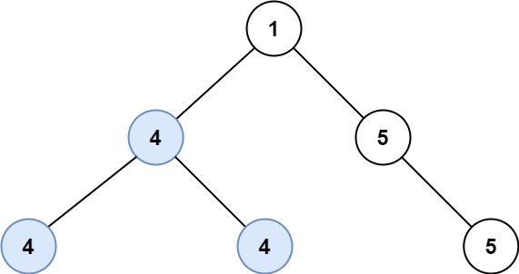

## 题目
给定一个二叉树的 root ，返回 最长的路径的长度 ，这个路径中的 每个节点具有相同值 。 这条路径可以经过也可以不经过根节点。

两个节点之间的路径长度 由它们之间的边数表示。

 

示例 1:


    输入：root = [5,4,5,1,1,5]
    输出：2
示例 2:




    输入：root = [1,4,5,4,4,5]
    输出：2
 

提示:

- 树的节点数的范围是 [0, 10<sup>4</sup>]
- -1000 <= Node.val <= 1000
- 树的深度将不超过 1000 


## 思路
对于任意一个节点, 如果最长同值路径包含该节点, 那么只可能是两种情况:
1. 其左右子树中加上该节点后所构成的同值路径中较长的那个继续向父节点回溯构成最长同值路径
2. 左右子树加上该节点都在最长同值路径中, 构成了最终的最长同值路径
        

## 解法
```java

/**
 * Definition for a binary tree node.
 * public class TreeNode {
 *     int val;
 *     TreeNode left;
 *     TreeNode right;
 *     TreeNode() {}
 *     TreeNode(int val) { this.val = val; }
 *     TreeNode(int val, TreeNode left, TreeNode right) {
 *         this.val = val;
 *         this.left = left;
 *         this.right = right;
 *     }
 * }
 */
class Solution {
    
    private int maxL = 0;
    
    public int longestUnivaluePath(TreeNode root) {
        /**
        解题思路类似于124题, 对于任意一个节点, 如果最长同值路径包含该节点, 那么只可能是两种情况:
        1. 其左右子树中加上该节点后所构成的同值路径中较长的那个继续向父节点回溯构成最长同值路径
        2. 左右子树加上该节点都在最长同值路径中, 构成了最终的最长同值路径
        需要注意因为要求同值, 所以在判断左右子树能构成的同值路径时要加入当前节点的值作为判断依据
        **/
        if(root == null) return 0;
        getMaxL(root, root.val);
        return maxL;
    }
    
    private int getMaxL(TreeNode r, int val) {
        if(r == null) return 0;
        int left = getMaxL(r.left, r.val);
        int right = getMaxL(r.right, r.val);
        maxL = Math.max(maxL, left+right); // 路径长度为节点数减1所以此处不加1
        if(r.val == val) // 和父节点值相同才返回以当前节点所能构成的最长通知路径长度, 否则返回0
            return Math.max(left, right) + 1;
        return 0;
    }
}

```