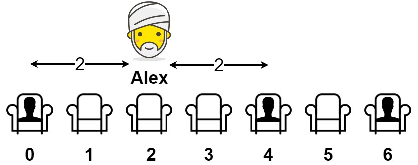

## 题目

给你一个数组 seats 表示一排座位，其中 seats[i] = 1 代表有人坐在第 i 个座位上，seats[i] = 0 代表座位 i 上是空的（下标从 0 开始）。

至少有一个空座位，且至少有一人已经坐在座位上。

亚历克斯希望坐在一个能够使他与离他最近的人之间的距离达到最大化的座位上。

返回他到离他最近的人的最大距离。

 

示例 1：



    输入：seats = [1,0,0,0,1,0,1]
    输出：2
    解释：
    如果亚历克斯坐在第二个空位（seats[2]）上，他到离他最近的人的距离为 2 。
    如果亚历克斯坐在其它任何一个空位上，他到离他最近的人的距离为 1 。
    因此，他到离他最近的人的最大距离是 2 。 
示例 2：

    输入：seats = [1,0,0,0]
    输出：3
    解释：
    如果亚历克斯坐在最后一个座位上，他离最近的人有 3 个座位远。
    这是可能的最大距离，所以答案是 3 。
示例 3：

    输入：seats = [0,1]
    输出：1
 

提示：

- 2 <= seats.length <= 2 * 10<sup>4</sup>
- seats[i] 为 0 或 1
- 至少有一个 空座位
- 至少有一个 座位上有人


## 思路

        // 找规律：10001，中间有三个0，其距离为（3-1）/2+1(自己的座位可以算上)
        // 100001,4个0，距离为（4-1）/2+1;
        // 故只需要一次遍历，常数级空间便可

## 解法
```java
class Solution {
    public int maxDistToClosest(int[] seats) {
        // 找规律：10001，中间有三个0，其距离为（3-1）/2+1(自己的座位可以算上)
        // 100001,4个0，距离为（4-1）/2+1;
        // 故只需要一次遍历，常数级空间便可
        int len=seats.length;
        int ans = 1, preOne = -1;
	for(int i = 0; i < seats.length; i++){
	    if(seats[i] == 1){
		if(preOne == -1){
		    ans = Math.max(ans, i);
		}else{
		    ans = Math.max(ans, (i-preOne)/2);
		}
	        preOne = i;
	    }
        }
        return Math.max(ans, seats.length-1-preOne);
    }
}
```

## 总结

- 分析出几种情况，然后分别对各个情况实现 
