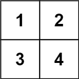
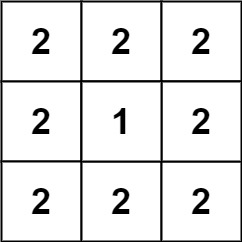

## 题目

给你一个 n * n 的网格 grid ，上面放置着一些 1 x 1 x 1 的正方体。每个值 v = grid[i][j] 表示 v 个正方体叠放在对应单元格 (i, j) 上。

放置好正方体后，任何直接相邻的正方体都会互相粘在一起，形成一些不规则的三维形体。

请你返回最终这些形体的总表面积。

注意：每个形体的底面也需要计入表面积中。

 

示例 1：



    输入：grid = [[1,2],[3,4]]
    输出：34
示例 2：


    输入：grid = [[1,1,1],[1,0,1],[1,1,1]]
    输出：32
示例 3：


    输入：grid = [[2,2,2],[2,1,2],[2,2,2]]
    输出：46
 

提示：

- n == grid.length
- n == grid[i].length
- 1 <= n <= 50
- 0 <= grid[i][j] <= 50


## 思路

// 首先，一个柱体一个柱体的看，每个柱体是由：2个底面（上表面/下表面）+ 所有的正方体都贡献了4个侧表面积。

// 然后，把柱体贴合在一起之后，我们需要把贴合的表面积给减掉，两个柱体贴合的表面积就是 两个柱体高的最小值*2。


## 解法
```java

class Solution {
// 首先，一个柱体一个柱体的看，每个柱体是由：2个底面（上表面/下表面）+ 所有的正方体都贡献了4个侧表面积。

// 然后，把柱体贴合在一起之后，我们需要把贴合的表面积给减掉，两个柱体贴合的表面积就是 两个柱体高的最小值*2。


    public int surfaceArea(int[][] grid) {
        int n = grid.length, area = 0;
        for (int i = 0; i < n; i++) {
            for (int j = 0; j < n; j++) {
                // 先把grid[i][j]赋值给level，省掉了bound check，可以略微略微略微优化一下耗时...
                int level = grid[i][j];
                if (level > 0) {
                    // 一个柱体中：2个底面 + 所有的正方体都贡献了4个侧表面积 
                    area += (level << 2) + 2;
                    // 减掉 i 与 i-1 相贴的两份表面积
                    area -= i > 0? Math.min(level, grid[i - 1][j]) << 1: 0; 
                    // 减掉 j 与 j-1 相贴的两份表面积
                    area -= j > 0? Math.min(level, grid[i][j - 1]) << 1: 0;
                }  
            }
        }
        return area;
    }
}
```

## 总结

- 分析出几种情况，然后分别对各个情况实现 
