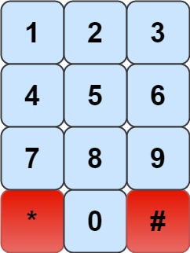

## 题目

象棋骑士有一个独特的移动方式，它可以垂直移动两个方格，水平移动一个方格，或者水平移动两个方格，垂直移动一个方格(两者都形成一个 L 的形状)。

象棋骑士可能的移动方式如下图所示:


我们有一个象棋骑士和一个电话垫，如下所示，骑士只能站在一个数字单元格上(即蓝色单元格)。




给定一个整数 n，返回我们可以拨多少个长度为 n 的不同电话号码。

你可以将骑士放置在任何数字单元格上，然后你应该执行 n - 1 次移动来获得长度为 n 的号码。所有的跳跃应该是有效的骑士跳跃。

因为答案可能很大，所以输出答案模 109 + 7.

 

示例 1：

    输入：n = 1
    输出：10
    解释：我们需要拨一个长度为1的数字，所以把骑士放在10个单元格中的任何一个数字单元格上都能满足条件。
示例 2：

    输入：n = 2
    输出：20
    解释：我们可以拨打的所有有效号码为[04, 06, 16, 18, 27, 29, 34, 38, 40, 43, 49, 60, 61, 67, 72, 76, 81, 83, 92, 94]
示例 3：

    输入：n = 3131
    输出：136006598
    解释：注意取模
 

提示：

- 1 <= n <= 5000


## 思路

求和

## 解法
```java

class Solution {
    public int knightDialer(int n) {

    
        if(n == 1) return 10;
        long [] help = {2,2,2,2,3,0,3,2,2,2};
        long [] cur = Arrays.copyOf(help,help.length);
        for (int i = 2;i<n;i++) {
            cur[0] = help[4]+help[6];
            cur[1] = help[6]+help[8];
            cur[2] = help[7]+help[9];
            cur[3] = help[4]+help[8];
            cur[4] = help[3]+help[9]+help[0];
            cur[5] = 0;
            cur[6] = help[1]+help[7]+help[0];
            cur[7] = help[2]+help[6];
            cur[8] = help[1]+help[3];
            cur[9] = help[2]+help[4];
            for (int j=0;j<10;j++){
                help[j] = cur[j]%(1000000007);
            }
        }
        long res =0 ;
        for (int i=0;i<10;i++){
            res+=cur[i];
            res = res%(1000000007);
        }
        return (int)res;
    }
}
```

## 总结

- 分析出几种情况，然后分别对各个情况实现 
