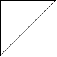
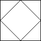

## 题目

在由 1 x 1 方格组成的 n x n 网格 grid 中，每个 1 x 1 方块由 '/'、'\' 或空格构成。这些字符会将方块划分为一些共边的区域。

给定网格 grid 表示为一个字符串数组，返回 区域的数量 。

请注意，反斜杠字符是转义的，因此 '\' 用 '\\' 表示。

 

示例 1：




    输入：grid = [" /","/ "]
    输出：2
示例 2：


    输入：grid = [" /","  "]
    输出：1
示例 3：




    输入：grid = ["/\\","\\/"]
    输出：5
    解释：回想一下，因为 \ 字符是转义的，所以 "/\\" 表示 /\，而 "\\/" 表示 \/。
 

提示：

- n == grid.length == grid[i].length
- 1 <= n <= 30
- grid[i][j] 是 '/'、'\'、或 ' '


## 思路

    区域连接求数量的问题用并查集解决
    大方块由N * N的个小方块组成
    将小方块按照双线划分顺时针分为0,1,2,3 共4个区域
    并且小方块之间是两两连接的 ，左方块的 1区域 与 右方块的 3区域连接，上方块的 2区域 与 下方块的 0 区域连接
    当‘/’时，小方块的 0,3 区域连接， 1,2区域连接
    当‘\\’时 ，小方块的 0,1区域连接，2,3区域连接
    当‘ ’时，小方块4个区域连接
    求区域个数实际是求有多少颗树

## 解法
```java

class Solution {
    
	private class UnionFind {
		int[] parent;

		public UnionFind(int size) {
			parent = new int[size];
			for (int i = 0; i < parent.length; i++)
				parent[i] = i;
		}

		public int find(int index) {
			while (index != parent[index])
				index = parent[index];
			return index;
		}

		public void merge(int p, int q) {
			int pRoot = find(p);
			int qRoot = find(q);
			parent[pRoot] = qRoot;
		}
		
	}

	public int regionsBySlashes(String[] grid) {
		int len = grid.length;
		// 总共有 4n * n 个 小区域块
		UnionFind uf = new UnionFind(4 * len * len);
		for (int i = 0; i < len; i++) {
			for (int j = 0; j < len; j++) {
				int start = 4 * (i * len + j);
				switch (grid[i].charAt(j)) {
				case ' ':
					uf.merge(start, start + 1);
					uf.merge(start + 2, start + 3);
					uf.merge(start, start + 2);
					break;
				case '/':
					uf.merge(start, start + 3);
					uf.merge(start + 1, start + 2);
					break;
				case '\\':
					uf.merge(start, start + 1);
					uf.merge(start + 2, start + 3);
					break;
				}
				if(i > 0){
					uf.merge(start, start - 4 * len + 2);
				}
				if(j > 0){
					uf.merge(start + 3, start - 3);
				}
			}
		}
		
		// 此时取出index = parent[index] 的节点即可 即算出有多少颗树就是有多少个区域
		int count = 0;
		for (int i = 0; i < uf.parent.length; i++) {
			if( i == uf.parent[i])
				count++;
		}
		return count;

    }
}
```

## 总结

- 分析出几种情况，然后分别对各个情况实现 
