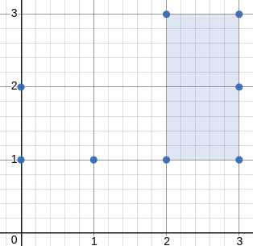

## 题目

给定在 xy 平面上的一组点，确定由这些点组成的任何矩形的最小面积，其中矩形的边不一定平行于 x 轴和 y 轴。

如果没有任何矩形，就返回 0。

 

示例 1：


    输入：[[1,2],[2,1],[1,0],[0,1]]
    输出：2.00000
    解释：最小面积的矩形出现在 [1,2],[2,1],[1,0],[0,1] 处，面积为 2。
示例 2：

.png)


    输入：[[0,1],[2,1],[1,1],[1,0],[2,0]]
    输出：1.00000
    解释：最小面积的矩形出现在 [1,0],[1,1],[2,1],[2,0] 处，面积为 1。
示例 3：


    输入：[[0,3],[1,2],[3,1],[1,3],[2,1]]
    输出：0
    解释：没法从这些点中组成任何矩形。
示例 4：




    输入：[[3,1],[1,1],[0,1],[2,1],[3,3],[3,2],[0,2],[2,3]]
    输出：2.00000
    解释：最小面积的矩形出现在 [2,1],[2,3],[3,3],[3,1] 处，面积为 2。
 

提示：

- 1 <= points.length <= 50
- 0 <= points[i][0] <= 40000
- 0 <= points[i][1] <= 40000
- 所有的点都是不同的。
- 与真实值误差不超过 10^-5 的答案将视为正确结果。

## 思路

- 遍历每两个点的组合，记录他俩 对角线的长度 和 中点坐标，拼成字符串存进map的key，把其中一个点的坐标存进value(方便以后计算面积面积)。
- 之后再遇到 长度和中点 相同的一组点，就获取key对应的value(们)， 分别算出面积，取最小的返回，再把当前的一个点坐标和value拼起来覆盖原value


## 解法
```java

class Solution {
// 遍历每两个点的组合，记录他俩 对角线的长度 和 中点坐标，拼成字符串存进map的key，把其中一个点的坐标存进value(方便以后计算面积面积)。
// 之后再遇到 长度和中点 相同的一组点，就获取key对应的value(们)， 分别算出面积，取最小的返回，再把当前的一个点坐标和value拼起来覆盖原value
    public double minAreaFreeRect(int[][] polongs) {
	Map<String,String> state= new HashMap<String,String>();
	double S = Long.MAX_VALUE;
	for(int i=0;i<polongs.length;++i) {
		for(int j=i;j<polongs.length;++j) {
			long x1 = polongs[i][0];
			long y1 = polongs[i][1];
			long x2 = polongs[j][0];
			long y2 = polongs[j][1];
			long x = x1-x2;
			long y = y1-y2;
			double l = Math.pow(x*x+y*y, 0.5);
			double midx = (x1+x2)/2.0;
			double midy = (y1+y2)/2.0;
			String st = l+","+midx+","+midy;
			if(state.containsKey(st)) {
				String temp = state.get(st);
				double s = check(temp,x1,x2,y1,y2);
				state.put(st, temp+x1+","+y1+";");
				if(s<S) S=s;
			}else
				state.put(st, x1+","+y1+";");
		}
	}
	if(S==Long.MAX_VALUE) S=0;
	return S;
		
}
	
public double check(String ss,long x1,long x2,long y1,long y2) {
	String[]strs = ss.split(";");
	double min = Long.MAX_VALUE;
	for(String str : strs) {
		String[]strr = str.split(",");
		long sx = Long.parseLong(strr[0]);
		long sy = Long.parseLong(strr[1]);
		double c = Math.pow((x1-sx)*(x1-sx)+(y1-sy)*(y1-sy), 0.5);
		double k = Math.pow((x2-sx)*(x2-sx)+(y2-sy)*(y2-sy), 0.5);
		double S =  c*k;
		if(S<min) min = S;
	}
	return min;
    }
}
```

## 总结

- 分析出几种情况，然后分别对各个情况实现 
