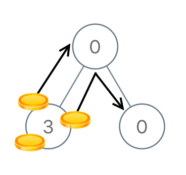

## 题目

给定一个有 N 个结点的二叉树的根结点 root，树中的每个结点上都对应有 node.val 枚硬币，并且总共有 N 枚硬币。

在一次移动中，我们可以选择两个相邻的结点，然后将一枚硬币从其中一个结点移动到另一个结点。(移动可以是从父结点到子结点，或者从子结点移动到父结点。)。

返回使每个结点上只有一枚硬币所需的移动次数。

 

示例 1：


    输入：[3,0,0]
    输出：2
    解释：从树的根结点开始，我们将一枚硬币移到它的左子结点上，一枚硬币移到它的右子结点上。
示例 2：




    输入：[0,3,0]
    输出：3
    解释：从根结点的左子结点开始，我们将两枚硬币移到根结点上 [移动两次]。然后，我们把一枚硬币从根结点移到右子结点上。
示例 3：


    输入：[1,0,2]
    输出：2    
示例 4：


    输入：[1,0,0,null,3]
    输出：4
 

提示：

- 1<= N <= 100
- 0 <= node.val <= N

## 思路

    /**
     * 从后序遍历的第一个叶子节点开始，假设自己有x个金币，剩余x-1个金币都还给父节点，x-1可能为负数、0、正数
     * x-1 < 0说明不够金币，需要从父节点获得，因此子节点有|x-1|个入方向的操作，次数加上|x-1|
     * x-1 == 0说明刚好，无需与父节点有金币的交换，次数加0
     * x-1 > 0 说明有多余的金币，需要交给父节点，因此子节点有x-1个出方向的操作，次数加上|x-1|
     */


## 解法
```java

/**
 * Definition for a binary tree node.
 * public class TreeNode {
 *     int val;
 *     TreeNode left;
 *     TreeNode right;
 *     TreeNode() {}
 *     TreeNode(int val) { this.val = val; }
 *     TreeNode(int val, TreeNode left, TreeNode right) {
 *         this.val = val;
 *         this.left = left;
 *         this.right = right;
 *     }
 * }
 */
class Solution {
    /**
     * 从后序遍历的第一个叶子节点开始，假设自己有x个金币，剩余x-1个金币都还给父节点，x-1可能为负数、0、正数
     * x-1 < 0说明不够金币，需要从父节点获得，因此子节点有|x-1|个入方向的操作，次数加上|x-1|
     * x-1 == 0说明刚好，无需与父节点有金币的交换，次数加0
     * x-1 > 0 说明有多余的金币，需要交给父节点，因此子节点有x-1个出方向的操作，次数加上|x-1|
     */
    private int ans = 0;// 移动次数
    public int distributeCoins(TreeNode root) {
        lrd(root);
        return ans;
    }
    public int lrd(TreeNode root){
        if(root == null){
            return 0;
        }
        if(root.left != null){
            root.val += lrd(root.left);
        }
        if(root.right != null){
            root.val += lrd(root.right);
        }
        ans += Math.abs(root.val - 1);
        return root.val - 1;
    }}
```

## 总结

- 分析出几种情况，然后分别对各个情况实现 
