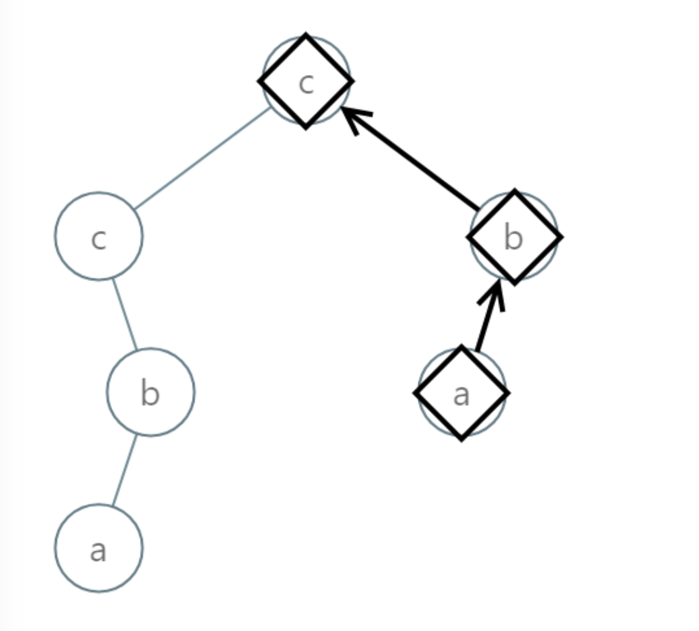

## 题目
给定一颗根结点为 root 的二叉树，树中的每一个结点都有一个 [0, 25] 范围内的值，分别代表字母 'a' 到 'z'。

返回 按字典序最小 的字符串，该字符串从这棵树的一个叶结点开始，到根结点结束。

注：字符串中任何较短的前缀在 字典序上 都是 较小 的：

- 例如，在字典序上 "ab" 比 "aba" 要小。叶结点是指没有子结点的结点。 
- 节点的叶节点是没有子节点的节点。

 

示例 1：


    输入：root = [0,1,2,3,4,3,4]
    输出："dba"
示例 2：


    输入：root = [25,1,3,1,3,0,2]
    输出："adz"
示例 3：



    输入：root = [2,2,1,null,1,0,null,0]
    输出："abc"
 

提示：

- 给定树的结点数在 [1, 8500] 范围内
- 0 <= Node.val <= 25


## 思路

    // 思路
    // 1、虽然题目要求从叶子节点到根节点，但是其实我们可以保存所有根节点到叶子节点的所有路径。
    // 2、然后再翻转从根节点到叶子节点的所有路径。
    // 3、最后比较反转之后的所有路径字典序
    // 4、取字典序最小的那个路径

## 解法
```java
/**
 * Definition for a binary tree node.
 * public class TreeNode {
 *     int val;
 *     TreeNode left;
 *     TreeNode right;
 *     TreeNode() {}
 *     TreeNode(int val) { this.val = val; }
 *     TreeNode(int val, TreeNode left, TreeNode right) {
 *         this.val = val;
 *         this.left = left;
 *         this.right = right;
 *     }
 * }
 */
class Solution {
    public String smallestFromLeaf(TreeNode root) {
        List<String> allPath = new ArrayList<>();
        backTracking(root,allPath,new ArrayList<>());
        return allPath.stream().sorted().collect(Collectors.toList()).get(0);
    }


    private void backTracking(TreeNode node,List<String> allPath,ArrayList<Character> path){
        if(node == null){
            path.add(' ');
            return;
        }


        path.add((char)(node.val+'a'));

        if(node.left==null && node.right==null){
            allPath.add(getString(new ArrayList<>(path)));
            return;
        }

        backTracking(node.left,allPath,path);
        path.remove(path.size()-1);
        backTracking(node.right,allPath,path);
        path.remove(path.size()-1);


    }

    private String getString(ArrayList<Character> path){
        Collections.reverse(path);
        StringBuilder sb = new StringBuilder();
        for(Character ch : path){
            sb.append(ch);
        }
        return sb.toString();

    }
}
```