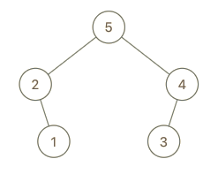

## 题目
最大树 定义：一棵树，并满足：其中每个节点的值都大于其子树中的任何其他值。

给你最大树的根节点 root 和一个整数 val 。

就像 之前的问题 那样，给定的树是利用 Construct(a) 例程从列表 a（root = Construct(a)）递归地构建的：

    如果 a 为空，返回 null 。
    否则，令 a[i] 作为 a 的最大元素。创建一个值为 a[i] 的根节点 root 。
    root 的左子树将被构建为 Construct([a[0], a[1], ..., a[i - 1]]) 。
    root 的右子树将被构建为 Construct([a[i + 1], a[i + 2], ..., a[a.length - 1]]) 。
    返回 root 。
请注意，题目没有直接给出 a ，只是给出一个根节点 root = Construct(a) 。

假设 b 是 a 的副本，并在末尾附加值 val。题目数据保证 b 中的值互不相同。

返回 Construct(b) 。

 

示例 1：


    输入：root = [4,1,3,null,null,2], val = 5
    输出：[5,4,null,1,3,null,null,2]
    解释：a = [1,4,2,3], b = [1,4,2,3,5]
示例 2：


    输入：root = [5,2,4,null,1], val = 3
    输出：[5,2,4,null,1,null,3]
    解释：a = [2,1,5,4], b = [2,1,5,4,3]
示例 3：



    输入：root = [5,2,3,null,1], val = 4
    输出：[5,2,4,null,1,3]
    解释：a = [2,1,5,3], b = [2,1,5,3,4]
 

提示：

- 树中节点数目在范围 [1, 100] 内
- 1 <= Node.val <= 100
- 树中的所有值 互不相同
- 1 <= val <= 100


## 思路

题目的意思是本来构造最大数的数组是A，在A中找出最大的值当做根，最大值左边的值为左子树，右边的数组为右子树。

而现在向A的后面插入了val，如果val是最大的，那么根节点的值就要是val，val前面的数（也就是前面的整棵树）做为val的左子树。如果val不是最大的，那么就把val往右子树上面插（val的位置是最后，肯定在最大值右边）。

所以也就是向最大树root中添加一值为val的节点，如果val大于root的值，那么就把root当做值为val节点左孩子，否则，就把val插入到右孩子的相应位置。

就是向最大树root中添加一值为val的节点，如果val大于root的值，那么就把root当做值为val节点左孩子，否则，就把val插入到右孩子的相应位置。
## 解法
```java

/**
 * Definition for a binary tree node.
 * public class TreeNode {
 *     int val;
 *     TreeNode left;
 *     TreeNode right;
 *     TreeNode() {}
 *     TreeNode(int val) { this.val = val; }
 *     TreeNode(int val, TreeNode left, TreeNode right) {
 *         this.val = val;
 *         this.left = left;
 *         this.right = right;
 *     }
 * }
 */

//  题目的意思是本来构造最大数的数组是A，在A中找出最大的值当做根，最大值左边的值为左子树，右边的数组为右子树。

// 而现在向A的后面插入了val，如果val是最大的，那么根节点的值就要是val，val前面的数（也就是前面的整棵树）做为val的左子树。如果val不是最大的，那么就把val往右子树上面插（val的位置是最后，肯定在最大值右边）。

// 所以也就是向最大树root中添加一值为val的节点，如果val大于root的值，那么就把root当做值为val节点左孩子，否则，就把val插入到右孩子的相应位置。
class Solution {
    public TreeNode insertIntoMaxTree(TreeNode root, int val) {

        if(root==null){
            return new TreeNode(val);
        }
        if(root.val<val){
            TreeNode p = new TreeNode(val);
            p.left = root;
            return p;
        }else{
            root.right = insertIntoMaxTree(root.right,val);
            return root;
        }
    }
}
```