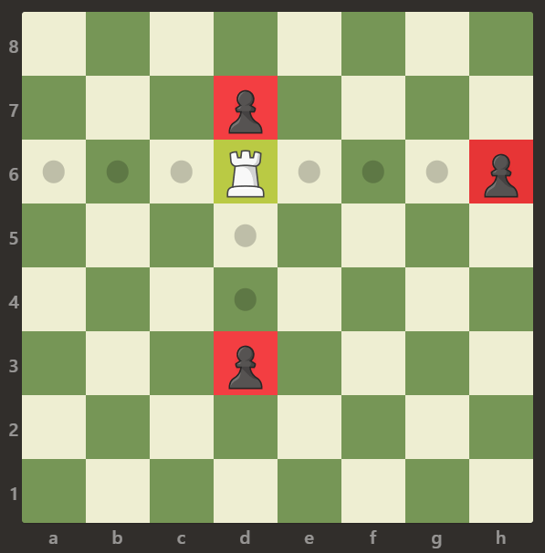

## 题目

在一个 8 x 8 的棋盘上，有一个白色的车（Rook），用字符 'R' 表示。棋盘上还可能存在空方块，白色的象（Bishop）以及黑色的卒（pawn），分别用字符 '.'，'B' 和 'p' 表示。不难看出，大写字符表示的是白棋，小写字符表示的是黑棋。

车按国际象棋中的规则移动。东，西，南，北四个基本方向任选其一，然后一直向选定的方向移动，直到满足下列四个条件之一：

- 棋手选择主动停下来。
- 棋子因到达棋盘的边缘而停下。
- 棋子移动到某一方格来捕获位于该方格上敌方（黑色）的卒，停在该方格内。
- 车不能进入/越过已经放有其他友方棋子（白色的象）的方格，停在友方棋子前。

你现在可以控制车移动一次，请你统计有多少敌方的卒处于你的捕获范围内（即，可以被一步捕获的棋子数）。

 

示例 1：




    输入：[[".",".",".",".",".",".",".","."],[".",".",".","p",".",".",".","."],[".",".",".","R",".",".",".","p"],[".",".",".",".",".",".",".","."],[".",".",".",".",".",".",".","."],[".",".",".","p",".",".",".","."],[".",".",".",".",".",".",".","."],[".",".",".",".",".",".",".","."]]
    输出：3
    解释：
    在本例中，车能够捕获所有的卒。
示例 2：


    输入：[[".",".",".",".",".",".",".","."],[".","p","p","p","p","p",".","."],[".","p","p","B","p","p",".","."],[".","p","B","R","B","p",".","."],[".","p","p","B","p","p",".","."],[".","p","p","p","p","p",".","."],[".",".",".",".",".",".",".","."],[".",".",".",".",".",".",".","."]]
    输出：0
    解释：
    象阻止了车捕获任何卒。
示例 3：


    输入：[[".",".",".",".",".",".",".","."],[".",".",".","p",".",".",".","."],[".",".",".","p",".",".",".","."],["p","p",".","R",".","p","B","."],[".",".",".",".",".",".",".","."],[".",".",".","B",".",".",".","."],[".",".",".","p",".",".",".","."],[".",".",".",".",".",".",".","."]]
    输出：3
    解释： 
    车可以捕获位置 b5，d6 和 f5 的卒。
 

提示：

- board.length == board[i].length == 8
- board[i][j] 可以是 'R'，'.'，'B' 或 'p'
- 只有一个格子上存在 board[i][j] == 'R'


## 思路

        // 定义上下左右四个方向
        int[] dx = {-1, 1, 0, 0};
        int[] dy = {0, 0, -1, 1};

## 解法
```java

class Solution {
    public int numRookCaptures(char[][] board) {

        // 定义上下左右四个方向
        int[] dx = {-1, 1, 0, 0};
        int[] dy = {0, 0, -1, 1};
       
        for (int i = 0; i < 8; i++) {
            for (int j = 0; j < 8; j++) {
                // 找到白车所在的位置
                if (board[i][j] == 'R') {
                    // 分别判断白车的上、下、左、右四个方向
                    int res = 0;
                    for (int k = 0; k < 4; k++) {
                        int x = i, y = j;
                        while (true) {
                            x += dx[k];
                            y += dy[k];
                            if (x < 0 || x >= 8 || y < 0 || y >= 8 || board[x][y] == 'B') {
                                break;
                            }
                            if (board[x][y] == 'p') {
                                res++;
                                break;
                            }
                        }
                    }
                    return res;
                }
            }
        }
        return 0;
    }
}
```

## 总结

- 分析出几种情况，然后分别对各个情况实现 
