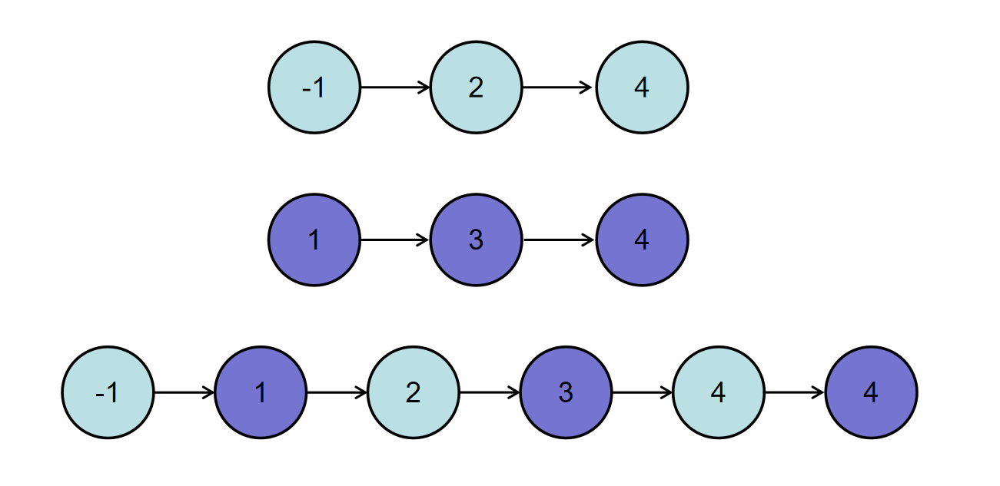

## 题目
**描述**

    输入两个递增的链表，单个链表的长度为n，合并这两个链表并使新链表中的节点仍然是递增排序的。
    数据范围： 0 =< n <= 10000，-1000 <= 节点值 <= 1000，
    要求：空间复杂度 O(1)，时间复杂度 O(n)


如输入{1,3,5},{2,4,6}时，合并后的链表为{1,2,3,4,5,6}，所以对应的输出为{1,2,3,4,5,6}，转换过程如下图所示：


或输入{-1,2,4},{1,3,4}时，合并后的链表为{-1,1,2,3,4,4}，所以对应的输出为{-1,1,2,3,4,4}，转换过程如下图所示：


示例1

    输入：
    {1,3,5},{2,4,6}
    返回值：
    {1,2,3,4,5,6}

示例2

    输入：
    {},{}
    返回值：
    {}

示例3

    输入：
    {-1,2,4},{1,3,4}
    返回值：
    {-1,1,2,3,4,4}
    

## 思路
设置虚拟头结点，同时遍历两个节点，比较两个节点值的结果，小的节点放在虚拟头节点后面，
最后再把没有遍历完的节点接在虚拟头节点的后面


## 解法
```java
public class Solution {
    public ListNode Merge(ListNode list1,ListNode list2) {
        // 伪节点(哨兵)
        ListNode fake = new ListNode(Integer.MAX_VALUE);// 静止
        ListNode pfake = fake;// 动态
        // 定义两个指针
        ListNode p1 = list1;
        ListNode p2 = list2;
        
        // 谁最小，就把谁卸下来，穿到伪节点这一串上
        while(p1!=null && p2!=null){

            if(p1.val>=p2.val){
                pfake.next = p2;
                p2=p2.next;
            }else{
                pfake.next = p1;
                p1=p1.next;
            }
            
            pfake=pfake.next;
        }
        
        // 最后肯定剩下一个null一个非空
        if(p1==null){
            pfake.next=p2;
        }else{
            pfake.next=p1;
        }
        
        return fake.next;
    }
}
```
