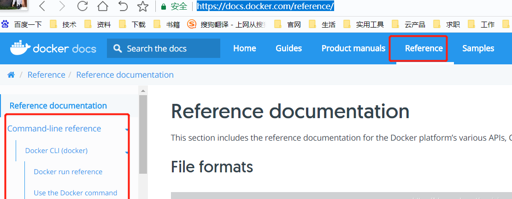
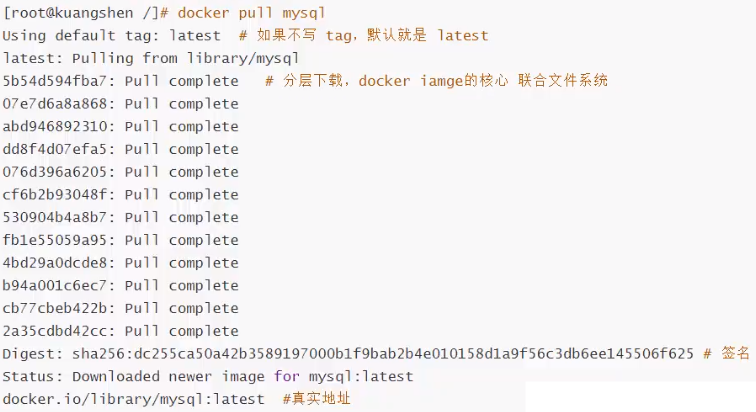
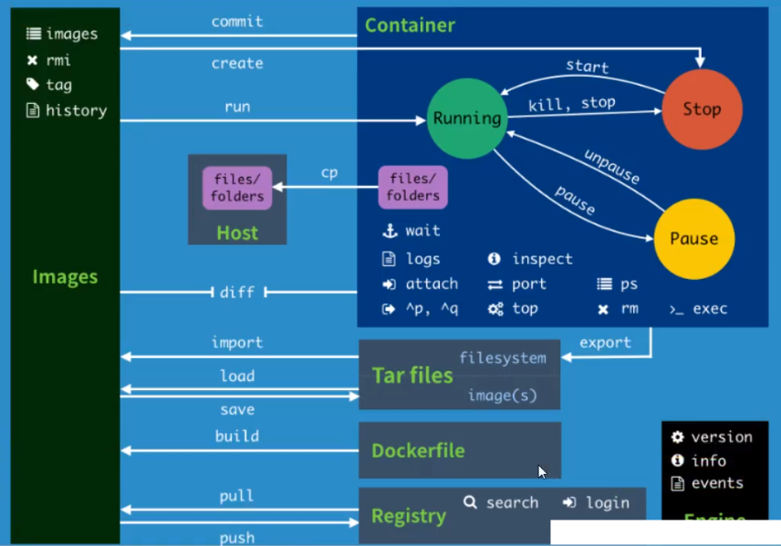

## 解答

官方文档：https://docs.docker.com/reference/

## 一、命令图谱

## 二、基本命令

    
    docker version		#显示版本信息
    docker info			#显示系统信息，包括镜像、容器数量
    docker 命令 --help	#帮助

## 三、镜像命令

**docker images**

查看本地主机上的镜像

语法：

    docker images [OPTIONS] [REPOSITORY[:TAG]]
    选项：
        -a		列出所有镜像
        -q		只打印镜像的ID
    docker images	[REPOSITORY[:TAG]]		#查看指定镜像的信息

    [root@localhost ~]# docker images
    REPOSITORY          TAG         IMAGE ID            CREATED             SIZE
    docker.io/redis     latest      739b59b96069        2 months ago        105 MB

解释：

    REPOSITORY		镜像的仓库源(名字)
    TAG				镜像的标签(版本)
    IMAGE ID		镜像的ID
    CREATED			镜像的创建时间
    SIZE			镜像的大小

**docker pull**

docker pull 镜像名[:Tag] #下载镜像到本地，不指定Tag，默认为latest

docker pull mysql等价于docker pull docker.io/mysql:latest

**docker rmi**

    docker rmi 镜像名[:Tag]	#根据名字删除镜像
    docker rmi 镜像ID		#根据镜像ID删除
    docker rmi -f 镜像ID		#强制删除镜像（如果容器已经启动则需先停止后方可删除）
    docker rmi -f $(docker images -aq)		#批量删除所有镜像
    docker rmi $(docker images -f "dangling=true" -q --no-trunc)	#删除悬浮镜像（Tag值为<none>）
    docker image prune -a --force --filter "until=48h"	#删除48小时之前的镜像
    docker image inspect --format='{{.RepoTags}} {{.Id}} {{.Parent}}' $(docker image ls -q --filter since=镜像id)	#查找镜像被哪些镜像引用了

docker 如何删除none镜像

**docker run**

**docker build**

通过Dockerfile来制作镜像

示例：

    docker build -f /opt/Dockerfile -t 镜像名:Tag /opt

解释：

    -f		#指定Dockerfile文件，不指定默认为当前路径的Dockerfile
    -t		#指定新生成的镜像名:Tag
    /opt	#代表构建镜像的上下文，通常使用点(.)表示在当前路径

最常用的方式：

    docker build -t 镜像名:Tag .

**构建时拉取最新镜像**

可以确保 Docker 在构建镜像之前拉取你的 Dockerfile 中 FROM 语句中提到的镜像的更新。

    docker build --pull -t 镜像名:Tag .

**发布镜像**

docker使用官方镜像registry搭建私有镜像仓库

docker配置从私有仓库拉取镜像

    docker login -u 用户名 -p密码 镜像仓库地址		#登录镜像仓库
    docker tag 镜像名:Tag 镜像仓库地址/镜像名:Tag	#给镜像打Tag
    docker push 镜像仓库地址/镜像名:Tag			#推送镜像到远程镜像仓库

**镜像常用命令**

    docker history 镜像ID		#查看镜像分层信息
    docker history --format {{.CreatedBy}} --no-trunc=true 镜像ID	#查看镜像完整构建命令
    docker inspect 镜像ID		#查看镜像详细信息
    docker search 镜像名			#搜索镜像，默认从官方镜像仓库搜索
    docker save 镜像名:Tag > nginx.tar	#把镜像打成一个tar包
    docker load -i nginx.tar	#导入nginx镜像
    docker system df			#查看docker磁盘使用情况
    docker system prune -f		#删除停止的容器、至少一个容器未使用的所有网络、悬浮镜像、悬浮构建缓存;-f表示强制删除
    docker system prune -a		#在上述基础上再删除没有任何容器使用的镜像、构建缓存

## 四、容器命令

**docker ps**

    [root@localhost ~]# docker ps
    CONTAINER ID    IMAGE             COMMAND                CREATED           STATUS              PORTS      NAMES
    26b152686a5a   docker.io/nginx   "/docker-entrypoin..."   32 seconds ago   Up 31 seconds       80/tcp     nginx

解释：

    CONTAINER ID		容器ID，在同一宿主机上是唯一的
    IMAGE				说明容器是用哪个镜像起的
    COMMAND				容器启动后执行的第一个shell命令
    CREATED				容器已创建了多久
    STATUS				容器在Up状态持续的时间
    PORTS				容器默认开放的端口，在Dockfile中通过EXPOSE指定
    NAMES				容器名字，具有唯一性

**docker logs**

查看容器日志

语法：docker logs [选项] 容器名

选项：

    -f		#动态查看
    -t		#显示时间戳
    --tail 20	#显示最近的20行

示例：

    docker logs -f -t --tail 20 nginx

查看指定时间后的日志，只显示最后100行：
    
    $ docker logs -f -t --since=“2018-02-08” --tail=100 CONTAINER_ID

查看最近30分钟的日志:
    
    $ docker logs --since 30m CONTAINER_ID

查看某时间之后的日志：
    
    $ docker logs -t --since=“2018-02-08T13:23:37” CONTAINER_ID

查看某时间段日志：
    
    $ docker logs -t --since=“2018-02-08T13:23:37” --until “2018-02-09T12:23:37” CONTAINER_ID

给已创建的容器增加–restart=always

    docker update --restart=always 容器名字

**容器常用命令**

    docker ps			#显示正在运行的容器
    docker ps -a		#显示所有容器
    docker ps -l		#显示最近的一个容器
    docker ps -n2		#显示最近创建的两个容器
    docker ps -q		#显示容器ID
    docker start 容器名			#启动容器
    docker restart 容器名		#重启容器
    docker stop 容器ID或容器名	#停止容器
    docker kill 容器名			#强制停止容器
    docker rm 容器ID或容器名		#删除容器
    docker rm -f 容器名			#强制删除容器，可以删除运行中的容器
    docker rm -v 容器名			#删除容器的同时也删除与之关联的volume
    docker top 容器名			#查看容器里面的进程
    docker stats 容器名			#查看容器资源使用情况(不指定容器，会查看所有容器的使用情况)
    docker inspect 容器名		#查看容器元数据
    docker exec -it 容器ID bash	#进入容器，并分配一个新的终端
    exit						#退出容器
    docker cp /etc/hosts 容器名:/opt		#拷贝宿主机的hosts文件到容器的/opt目录下
    docker cp 容器名:/opt/a.sh /tmp		#拷贝容器的a.sh文件到宿主机的/tmp路径下
    docker pause 容器名			#暂停容器
    docker unpause 容器名		#取消暂停容器
    
    docker commit -m="提交信息" -a="作者" 容器id 新镜像名:[Tag]		#基于容器生成一个镜像(不推荐)
    docker inspect -f '{{.HostConfig.LogConfig}}' 容器名	#查看容器日志策略
    docker inspect --format "{{ .State.Pid }}" 容器名		#查看容器在宿主机对应的PID
    

## 五、数据卷

**docker volume**

数据卷默认路径：/var/lib/docker/volumes/

    docker volume ls		#查看本地数据卷
    docker inspect	卷名		#查看数据卷信息

## 六、网络

    #创建docker01网络，-o指定通过ifconfig命令查看到的名字
    docker network create docker01 --subnet=10.10.10.0/24 -o com.docker.network.bridge.name=docker01	
    docker network ls				#列出docker网络
    docker network inspect 网桥名字或ID	#查看网桥的详细信息
    docker network rm 网桥名			#移除网络
    docker network connect 网桥名 容器名	#将容器与网桥关联，表现形式为一个容器多个IP

