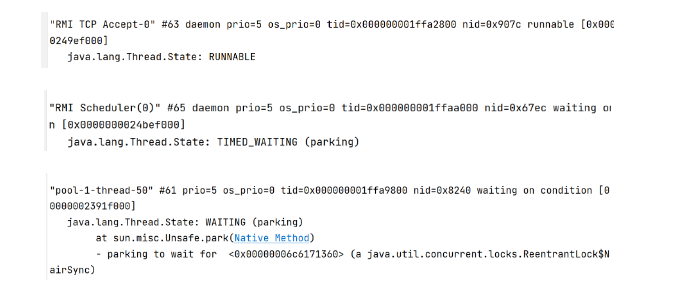
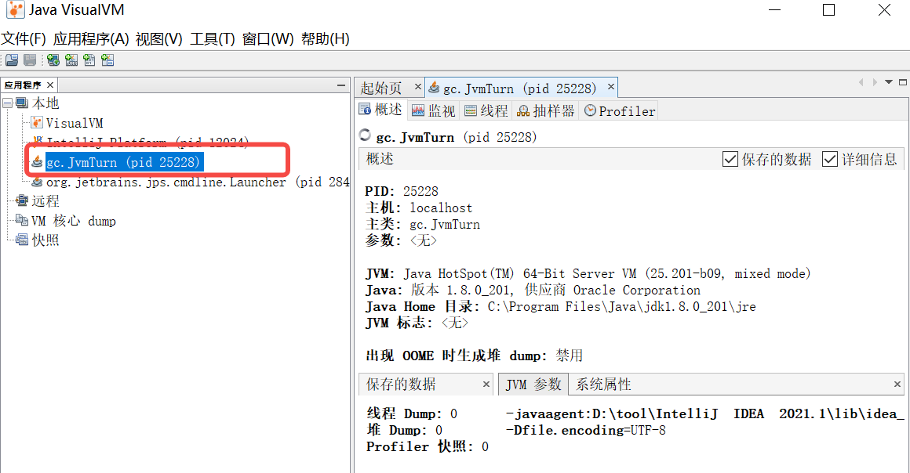
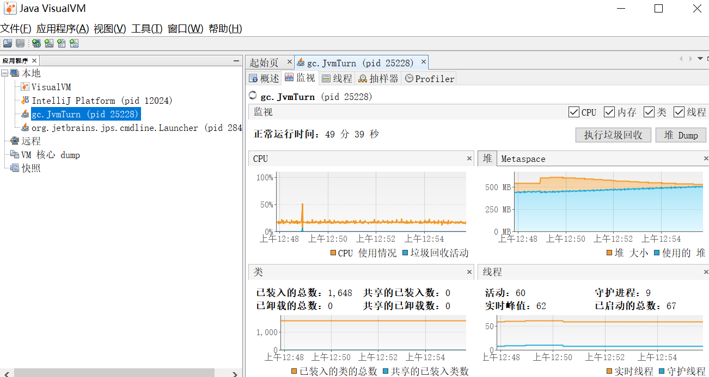
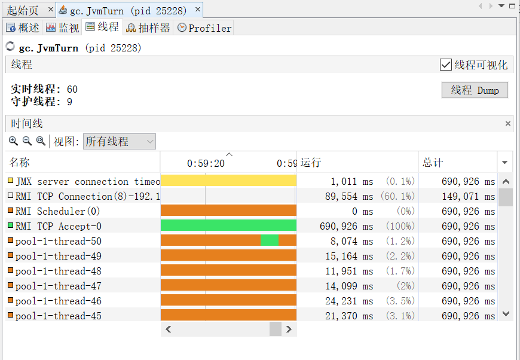

## 解答

JVM调优涉及到两个很重要的概念：**吞吐量和响应时间**。jvm调优主要是针对他们进行调整优化，达到一个理想的目标，根据业务确定目标是吞吐量优先还是响应时间优先。

- 吞吐量：用户代码执行时间/(用户代码执行时间+GC执行时间)。
- 响应时间：整个接口的响应时间(用户代码执行时间+GC执行时间)，stw时间越短，响应时间越短。
 
## 一、调优步骤

调优的前提是熟悉业务场景，先判断出当前业务场景是吞吐量优先还是响应时间优先。调优需要建立在监控之上，由压力测试来判断是否达到业务要求和性能要求。

调优的步骤大致可以分为：

1.熟悉业务场景，了解当前业务系统的要求，是吞吐量优先还是响应时间优先；

2.选择合适的垃圾回收器组合，如果是吞吐量优先，则选择ps+po组合；如果是响应时间优先，在1.8以后选择G1，在1.8之前选择ParNew+CMS组合；

3.规划内存需求，只能进行大致的规划。

4.CPU选择，在预算之内性能越高越好；

5.根据实际情况设置升级年龄，最大年龄为15；

6.设定日志参数：-Xloggc:/path/name-gc-%t.log -XX:+UseGCLogFileRotation -XX:NumberOfGCLogs=5 -XX:GCLogFileSize=20M -XX:+PrintGCDetails -XX:+PrintGCDateStamps -XX:+PrintGCCauses

- -XX:+UseGCLogFileRotation：GC文件循环使用
- -XX:NumberOfGCLogs=5：使用5个GC文件
- -XX:GCLogFileSize=20M：每个GC文件的大小

上面这三个参数放在一起代表的含义是：5个GC文件循环使用，每个GC文件20M，总共使用100M存储日志文件，当5个GC文件都使用完毕以后，覆盖第一个GC日志文件，生成新的GC文件。

## 二、CPU使用率飙高问题

当cpu经常飙升到100%的使用率，那么证明有线程长时间占用系统资源不进行释放，需要定位到具体是哪个线程在占用，定位问题的步骤如下(linux系统)：

1.使用top命令常看当前服务器中所有进程（jps命令可以查看当前服务器运行java进程）,找到当前cpu使用率最高的进程，获取到对应的pid；

2.然后使用top -Hp pid，查看该进程中的各个线程信息的cpu使用，找到占用cpu高的线程pid

3.使用jstack pid打印它的线程信息，需要注意的是，通过jstack命令打印的线程号和通过top -Hp打印的线程号进制不一样，需要进行转换才能进行匹配，jstack中的线程号为16进制，而top -Hp打印的是10进制。

使用jastack命令分析线程信息的时候需要关注线程对应的运行状态：

runnable代表当前线程正在运行，waiting代表当前线程正在等待，该状态需要进行特殊关注wait fot 后面的线程号，因为如果当前处于waiting状态的程序长时间处于等待状态，那么就需要知道它在等待哪个线程结束，也就是wait for后面的线程号(jdk版本不同，单词可能不一样，总之就是在日志中找到它等待的线程号)然后根据线程号找到对应的线程，去查看当前线程有什么问题。

## 三、内存标高问题

内存飙高一般都是堆中对象无法回收造成，因为java中的对象大部分存储在堆内存中。其实也就是常见的oom问题(Out Of Memory)。

**指令**

1.jinfo pid，可以查看当前进行虚拟机的相关信息列举出来，如下图

2.jstat -gc pid ms，多长毫秒打印一次gc信息，打印信息如下，里面包含gc测试，年轻代/老年带gc信息等：

3.jmap -histo pid | head -20，查找当前进程堆中的对象信息，加上管道符后面的信息以后，代表查询对象数量最多的20个：

jmap -dump:format=b,file=xxx pid，可以生成堆信息的文件，但是这个命令不建议在生产环境使用，因为当内存较大时，执行该命令会占用大量系统资源，甚至造成卡顿。建议在项目启动时添加下面的命令，在发生oom时自动生成堆信息文件：-XX:+HeapDumpOnOutOfMemory。如果需要在线上进行堆信息分析，如果当前服务存在多个节点，可以下线一个节点，生成堆信息，或者使用第三方工具，阿里的arthas。

**图形化界面**

jvisualvm是jdk自带的图形化分析工具，可以对运行进程的线程，堆进行详细分析。但是这种分析工具可以对本地代码或者测试环境进行监控分析，不建议在线上环境使用该工具，因为它会占用系统资源。如果必须要在线上执行，建议当前服务存在多个节点，然后下线其中一个节点进行问题分析。也可以使用第三方收费的图形分析界面jprofiler

它的位置如下图：

如果是本地程序，找到该程序双击打开：

(如果是远程服务，需要在启动服务的时候添加下面对应的命令：java -Djava.rmi.server.hostname=xxx.xx.xx.xx -Dcom sun.management.jmxremote -Dcomsun.management.jmxremote.port=11111 -sun.management.jmxremote.authenticate=false(不认证) -sun.management.jmxremote.ssl=false)

监视里面可以查看cpu使用情况，堆/metaspace使用情况，如下图：

线程的运行情况：

抽样器里面的内存信息，相当于jmap的统计信息，如下图：

## 四、jvm调优常用参数

**通用GC参数**

- -Xmn：年轻代大小   -Xms：堆初始大小  -Xmx：堆最大大小  -Xss：栈大小
- -XX:+UseTlab：使用tlab，默认打开，涉及到对象分配问题
- -XX:+PrintTlab：打印tlab使用情况
- -XX:+TlabSize：设置Tlab大小
- -XX:+DisabledExplictGC：java代码中的System.gc()不再生效，防止代码中误写，导致频繁触动GC，默认不起用。
- -XX:+PrintGC(+PrintGCDetails/+PrintGCTimeStamps)打印GC信息(打印GC详细信息/打印GC执行时间)
- -XX:+PrintHeapAtGC打印GC时的堆信息
- -XX:+PrintGCApplicationConcurrentTime 打印应用程序的时间
- -XX:+PrintGCApplicationStopedTime 打印应用程序暂停时间
- -XX:+PrintReferenceGC 打印回收多少种引用类型的引用
- -verboss:class 类加载详细过程
- -XX:+PrintVMOptions 打印JVM运行参数
- -XX:+PrintFlagsFinal(+PrintFlagsInitial)  -version | grep 查找想要了解的命令，很重要
- -X:loggc:/opt/gc/log/path  输出gc信息到文件
- -XX:MaxTenuringThreshold  设置gc升到年龄，最大值为15

**parallel常用参数**

- -XX:PreTenureSizeThreshold 多大的对象判定为大对象，直接晋升老年代
- -XX:+ParallelGCThreads 用于并发垃圾回收的线程
- -XX:+UseAdaptiveSizePolicy 自动选择各区比例

**CMS常用参数**

- -XX:+UseConcMarkSweepGC 使用CMS垃圾回收器
- -XX:parallelCMSThreads CMS线程数量
- -XX:CMSInitiatingOccupancyFraction 占用多少比例的老年代时开始CMS回收，默认值68%，如果频繁发生serial old，适当调小该比例，降低FGC频率
- -XX:+UseCMSCompactAtFullCollection 进行压缩整理
- -XX:CMSFullGCBeforeCompaction 多少次FGC以后进行压缩整理
- -XX:+CMSClassUnloadingEnabled 回收永久代
- -XX:+CMSInitiatingPermOccupancyFraction 达到什么比例时进行永久代回收
- GCTimeTatio 设置GC时间占用程序运行时间的百分比，该参数只能是尽量达到该百分比，不是肯定达到
- -XX:MaxGCPauseMills GCt停顿时间，该参数也是尽量达到，而不是肯定达到

**G1常用参数**

- -XX:+UseG1 使用G1垃圾回收器
- -XX:MaxGCPauseMills GCt停顿时间，该参数也是尽量达到，G1会调整yong区的块数来达到这个值
- -XX:+G1HeapRegionSize 分区大小，范围为1M~32M，必须是2的n次幂，size越大，GC回收间隔越大，但是GC所用时间越长
- G1NewSizePercent 新生代所占最小比例，默认5%
- G1MaxNewSizePercent 新生代所占最大比例，默认60%
- GCTimeRatio GC时间比例，此值为建议值，G1会调整堆大小来尽量达到这个值
- ConcGCThreads GC线程数量
- InitiatingHeapOccupancyPercent 启动G1的堆空间占用比例
        