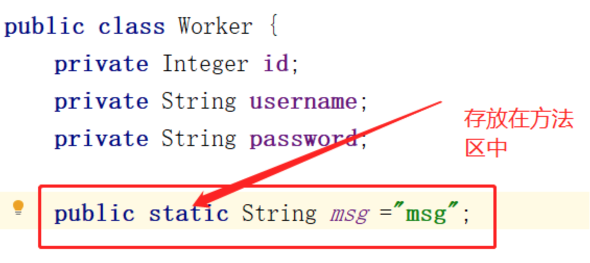
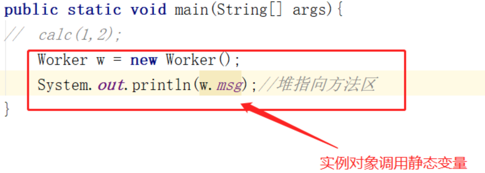

## 解答

**运行时数据区：**
1.线程共享区：堆，方法区

堆：存放一切new出来的东西（java对象实例和数组）。

方法区：存放被虚拟机加载的类信息、常量、静态变量、即时编译器编译后的代码等数据。

2.线程独占区：栈、本地方法栈、程序计数器

栈：java线程的运行状态存储在栈中；每一个被执行的方法为栈中的栈帧。每个栈帧包括：局部变量表（方法中定义的变量及方法中的参数）、操作数栈（以压栈和出栈的方式存储操作数）、动态链接（每个栈帧中都包含一个指向运行时常量池中该栈帧所属方法的引用）、方法返回地址（当一个方法开始执行后只有两种方式可以退出，一遇到方法返回的字节码指令，二遇到异常且这个异常没有在方法中得到处理）。

程序计数器：记录线程执行到的位置。

本地方法栈：当线程执行的方法是native类型的，该方法就会在本地方法栈中执行。

1.栈指向堆：Object obj=new Object()；因为new出来的一切都存放在堆中，而obj则是存放在栈中。

2.方法区指向堆：private static Object obj=new Object();因为方法区中存放常量、静态变量、虚拟机加载后的类信息等，所有obj是存放在方法区中，而new出来的一切都存放在堆中。

3.堆指向方法区：

