## 解答

SPI（Service Provider Interface）是JDK内置的一种服务提供发现机制。本质是将接口实现类的全限定名配置在文件中，并由服务加载器读取配置文件，加载实现类。这样可以在运行时，动态为接口替换实现类。

在Java中SPI是被用来设计给服务提供商做插件使用的。基于策略模式来实现动态加载的机制。我们在程序只定义一个接口，具体的实现交个不同的服务提供者；在程序启动的时候，读取配置文件，由配置确定要调用哪一个实现。有很多组件的实现，如日志、数据库访问等都是采用这样的方式，最常用的就是 JDBC 驱动。

### 1、Java SPI
核心类：java.util.ServiceLoader
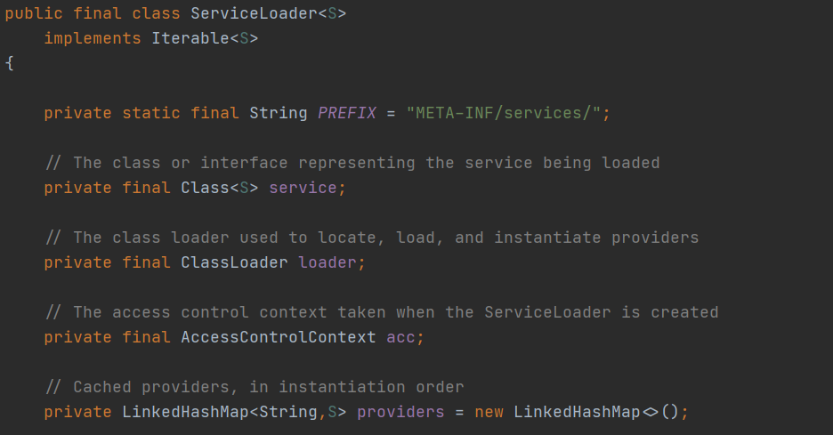

服务是一组众所周知的接口和(通常是抽象的)类。服务提供者是服务的特定实现。提供者中的类通常实现接口，并子类化服务本身中定义的类。服务提供者可以以扩展的形式安装在Java平台的实现中，即放置在任何常见扩展目录中的jar文件。提供程序也可以通过将它们添加到应用程序的类路径或其他特定于平台的方法来提供。

通过在资源目录META-INF/services中放置一个提供程序配置文件来识别服务提供程序。文件名是服务类型的完全限定二进制名称。该文件包含具体提供程序类的完全限定二进制名的列表，每行一个。每个名称周围的空格和制表符以及空白行将被忽略。注释字符是'#'；在每一行中，第一个注释字符之后的所有字符都将被忽略。文件必须用UTF-8编码。

按照上面的方法，我们来写个例子试一下

首先，定义一个接口Car

    package org.example;
    
    public interface Car {
        void run();
    }

两个实现类

ToyotaCar.java

    package org.example;
    
    public class ToyotaCar implements Car {
        @Override
        public void run() {
            System.out.println("Toyota");
        }
    }

HondaCar.java

    package org.example;
    
    public class HondaCar implements Car {
        @Override
        public void run() {
            System.out.println("Honda");
        }
    }

在META-INF/services下创建一个名为org.example.Car的文本文件

    org.example.ToyotaCar
    org.example.HondaCar

最后，写个测试类运行看一下效果

    package org.example;
    
    import java.util.ServiceLoader;
    
    public class App
    {
        public static void main( String[] args )
        {
            ServiceLoader<Car> serviceLoader = ServiceLoader.load(Car.class);
            serviceLoader.forEach(x->x.run());
        }
    }

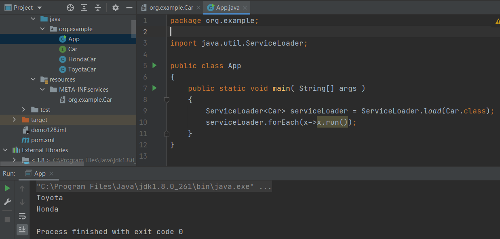

跟一下ServiceLoader的代码，看看是怎么找到服务实现的

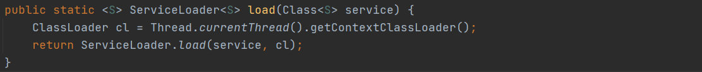

用当前线程的类加载器加载

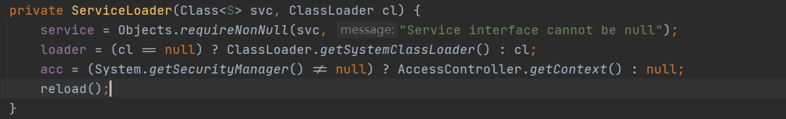

接口和类加载器都有了，万事俱备只欠东风

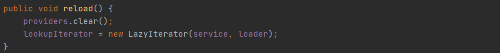

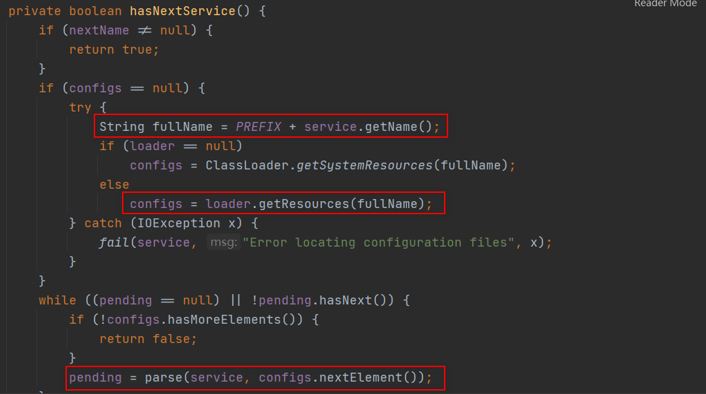

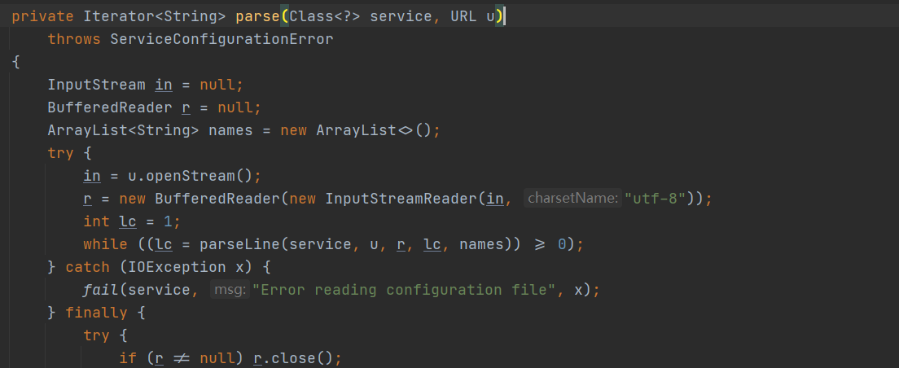

Java SPI 不足之处：

- 不能按需加载。Java SPI在加载扩展点的时候，会一次性加载所有可用的扩展点，很多是不需要的，会浪费系统资源
- 获取某个实现类的方式不够灵活，只能通过 Iterator 形式获取，不能根据某个参数来获取对应的实现类
- 不支持AOP与IOC
- 如果扩展点加载失败，会导致调用方报错，导致追踪问题很困难

### 2、Dubbo SPI
Dubbo重新实现了一套功能更强的SPI机制, 支持了AOP与依赖注入，并且利用缓存提高加载实现类的性能，同时支持实现类的灵活获取。

    <dependency>
          <groupId>org.apache.dubbo</groupId>
          <artifactId>dubbo</artifactId>
          <version>2.7.8</version>
    </dependency>

核心类：org.apache.dubbo.common.extension.ExtensionLoader

先来了解一下@SPI注解，@SPI是用来标记接口是一个可扩展的接口

改造一下前面的例子，在Car接口上加上@SPI注解

    package org.example;
    
    import org.apache.dubbo.common.extension.SPI;
    
    @SPI
    public interface Car {
        void run();
    }

两个实现类不变

在META-INF/dubbo目录下创建名为org.example.Car的文本文件，内容如下（键值对形式）：

    toyota=org.example.ToyotaCar
    honda=org.example.HondaCar

编写测试类：

    package org.example;
    
    import org.apache.dubbo.common.extension.ExtensionLoader;
    
    import java.util.ServiceLoader;
    
    public class App
    {
        public static void main( String[] args )
        {
            //  Java SPI
            ServiceLoader<Car> serviceLoader = ServiceLoader.load(Car.class);
            serviceLoader.forEach(x->x.run());
    
            //  Dubbo SPI
            ExtensionLoader<Car> extensionLoader = ExtensionLoader.getExtensionLoader(Car.class);
            Car car = extensionLoader.getExtension("honda");
            car.run();
        }
    }

下面跟一下代码

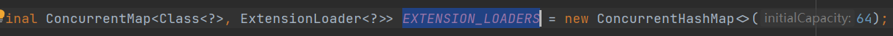

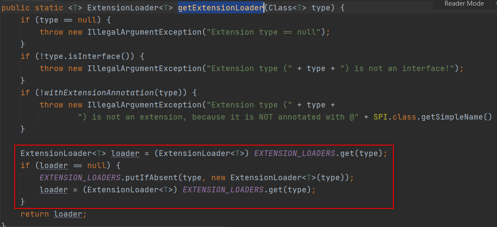

如果缓存Map中有，直接返回，没有则加载完以后放进去

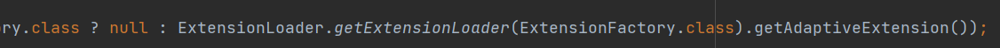
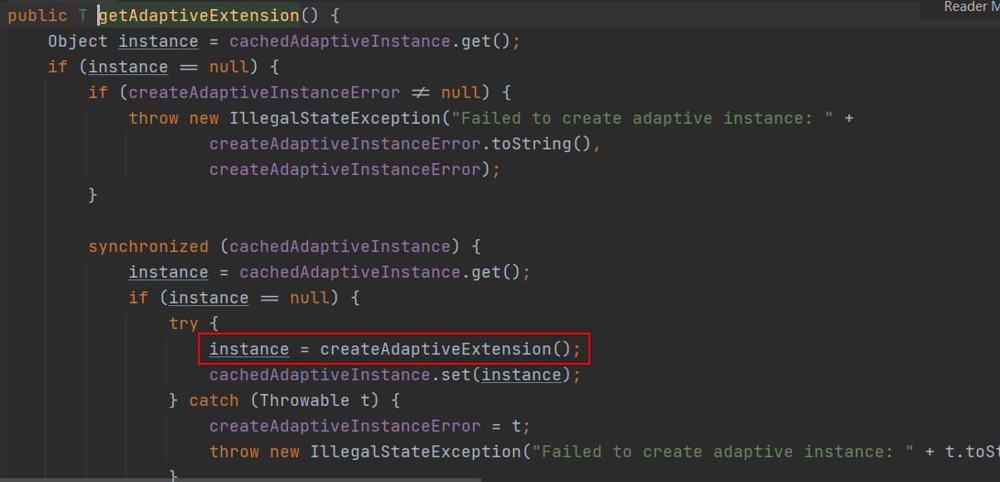
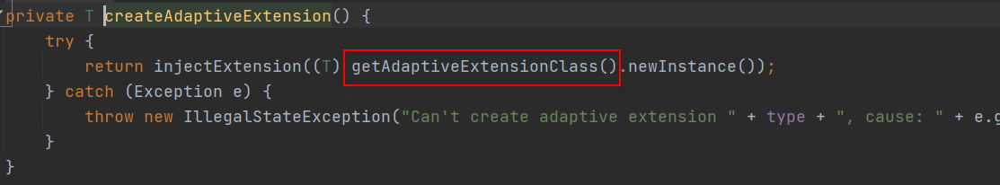
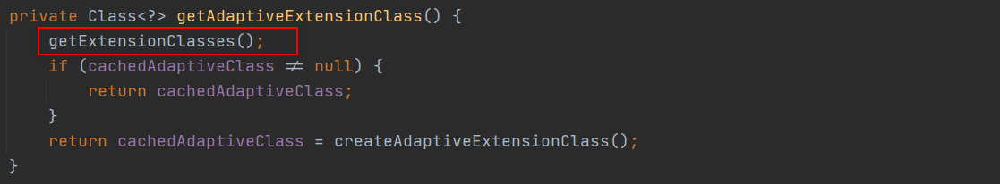
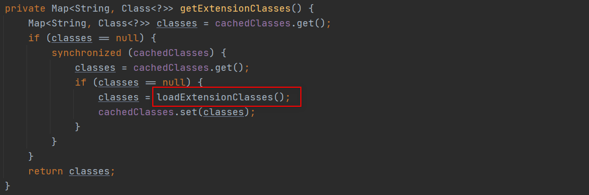

加载策略到底是怎样的呢？

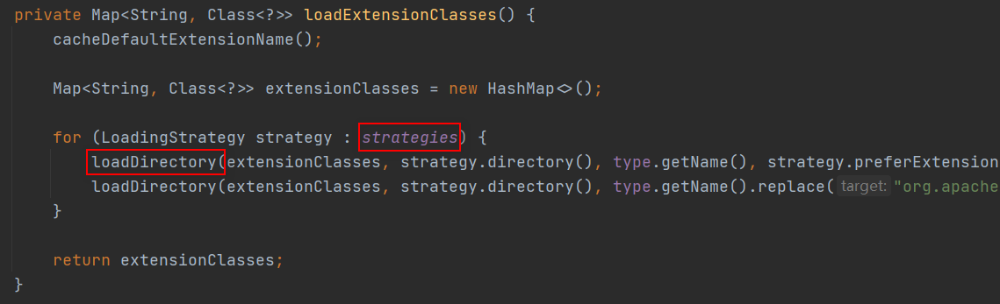

到这里就有点明白了，又看到了熟悉的ServiceLoad.load()，这不是刚才讲的Java SPI嘛

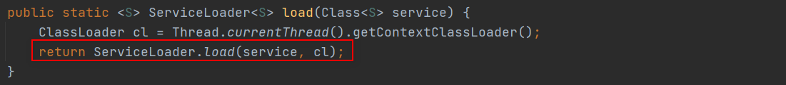
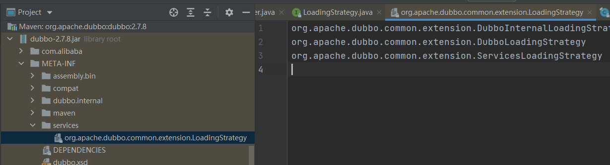
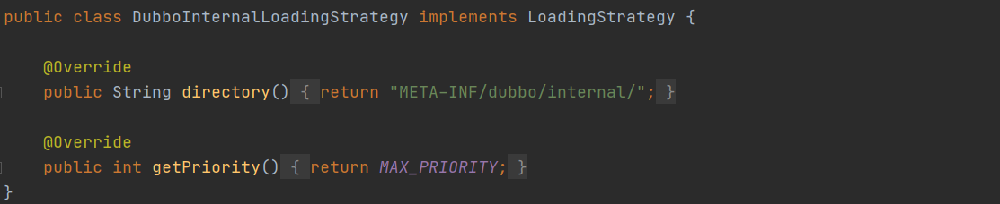

回到之前策略那个地方，将策略按顺序排列，依次遍历所有的策略来加载。就是在那三个目录下查找指定的文件，并读取其中的内容

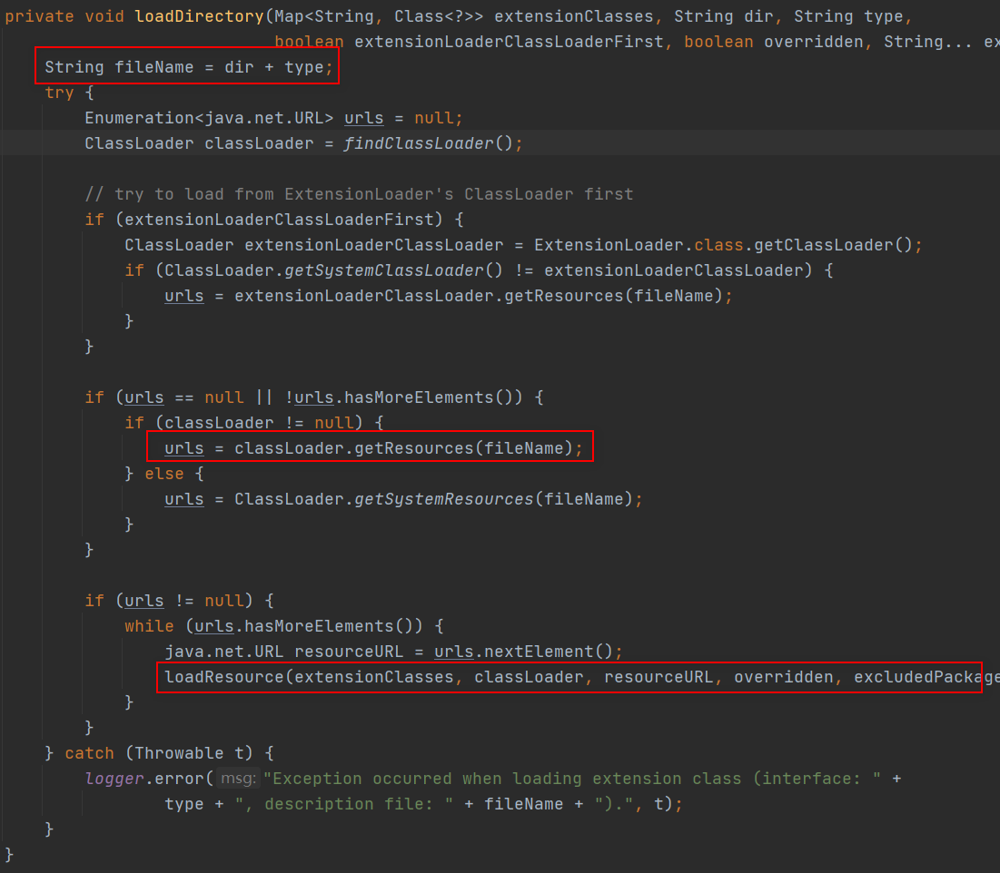

跟之前的ServiceLoader如出一辙

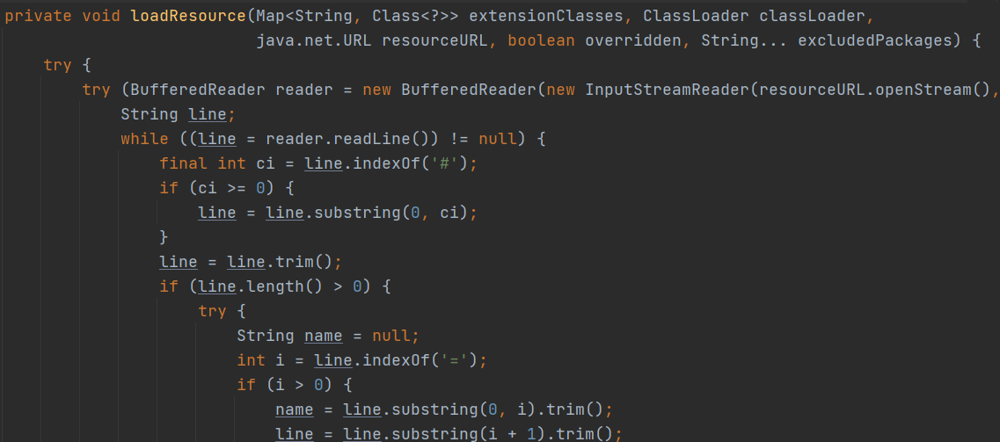

遇到@Adaptive标注的就缓存起来

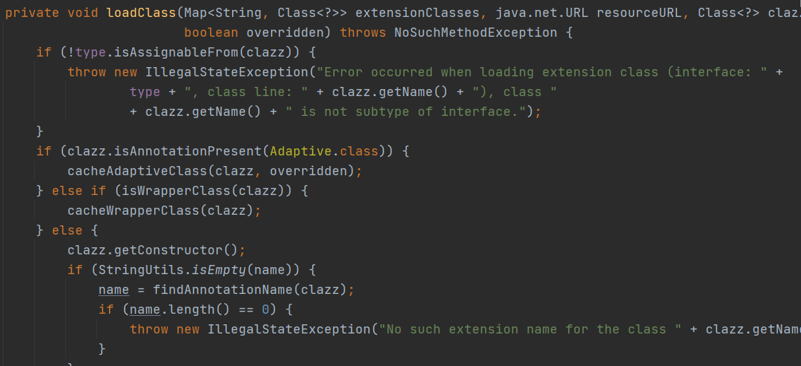

