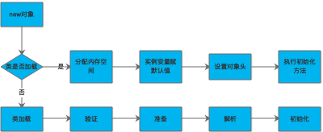

## 解答

由new关键字调用构造方法，返回类实例，达到创建对象目的。`先实例化对象，再把对象初始化`。

例如 : `Person person = new Person();`

这句话到底做了什么事情呢？其实就是讲对象的初始化过程。

    1、new 用到了Person.class，所以会先找到Person.class文件，并加载到内存中(用到类中的内容类就会被加载)。
    2、执行该对象的static代码块(静态初始块)。(如果有的话，给Person.class类进行初始化)
    3、在堆内存中分配空间，分配内存地址（指针碰撞和空闲列表）
    4、在堆内存中建立对象特有属性，并进行默认初始化
    5、对属性进行显示初始化(声明成员属性并赋值)
    6、执行普通初始块
    7、执行构造函数
    8、将内存地址赋值给栈内存中的person变量

在JVM创建一个对象的时候，首先判断当前类是否已经加载，如果类没有加载，需要先执行类加载机制，当加载完成后再为对象分配空间、初始化等等。

类加载过程如下：

加载：读取某个类的class文件到方法区内，并在堆中为这个类创建对应的Class对象，在加载时候可以通过类文件、jar、war包的形式读取；

验证：验证class文件是否符合当前虚拟机的规范；

准备：为类的静态变量（无final修饰）和常量（final修饰）赋默认初始值，放入到方法区中，值得注意的是，常量直接赋予初始值，设置为多少就赋予多少，比如：private static final int a = 10，那么赋值的时候就是10，而类静态变量在准备阶段要赋值为0，比如private static int a = 10，在准备阶段是把a赋值为0的，在初始化阶段才把a赋值为10；

解析：将类文件中的符号引用替换为直接引用，比如类、方法的信息、文本字符串、声明为final的常量值等等；

初始化：通过类的构造器进行初始化，自动收集静态块的操作和对类静态变量赋予正确的值，比如private static int a= 10，在准备阶段赋值a=0，而在初始化阶段把a改成10。

类加载完成后，就开始创建对象了。

指针碰撞： 假设Java堆中内存是绝对规整的，所有被使用过的内存都被放在一边，空闲的内存被放在另一边，中间放着一个指针作为分界点的指示器，那所分配内存就仅仅是把那个指针向空闲空间方向挪动一段与对象大小相等的距离，这种分配方式称为指针碰撞。

空闲列表： 如果Java堆中的内存并不是规整的，已被使用的内存和空闲的内存相互交错在一起，那就没有办法简单地进行指针碰撞了，虚拟机就必须维护一个列表，记录上哪些内存块是可用的，在分配的时候从列表中找到一块足够大的空间划分给对象实例，并更新列表上的记录，这种分配方式称为空闲列表。

