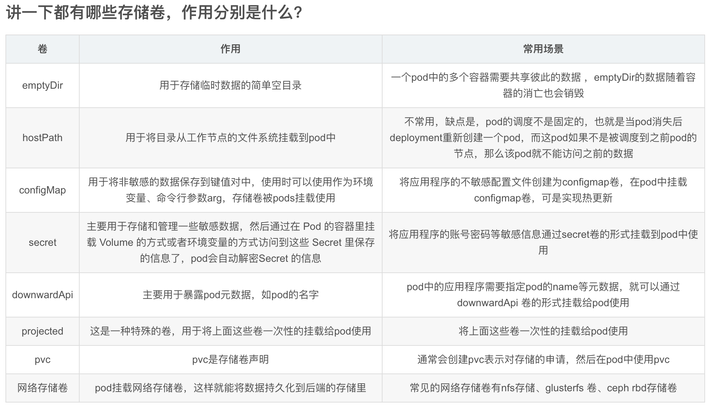

## 解答

## 前言
本篇模拟面试官提问的各种docker，k8s问题，意在提高面试通过率，欢迎在评论区探讨，同步进步。

## docker的工作原理是什么，讲一下
docker是一个Client-Server结构的系统，docker守护进程运行在宿主机上，守护进程从客户端接受命令并管理运行在主机上的容器，容器是一个运行时环境，这就是我们说的集装箱。

## docker的组成包含哪几大部分
一个完整的docker有以下几个部分组成：

1、docker client，客户端，为用户提供一系列可执行命令，用户用这些命令实现跟 docker daemon 交互；

2、docker daemon，守护进程，一般在宿主主机后台运行，等待接收来自客户端的请求消息；

3、docker image，镜像，镜像run之后就生成为docker容器；

4、docker container，容器，一个系统级别的服务，拥有自己的ip和系统目录结构；运行容器前需要本地存在对应的镜像，如果本地不存在该镜像则就去镜像仓库下载。

docker 使用客户端-服务器 (C/S) 架构模式，使用远程api来管理和创建docker容器。docker 容器通过 docker 镜像来创建。容器与镜像的关系类似于面向对象编程中的对象与类。

## docker与传统虚拟机的区别什么？
1、传统虚拟机是需要安装整个操作系统的，然后再在上面安装业务应用，启动应用，通常需要几分钟去启动应用，而docker是直接使用镜像来运行业务容器的，其容器启动属于秒级别；

2、Docker需要的资源更少，Docker在操作系统级别进行虚拟化，Docker容器和内核交互，几乎没有性能损耗，而虚拟机运行着整个操作系统，占用物理机的资源就比较多;

3、Docker更轻量，Docker的架构可以共用一个内核与共享应用程序库，所占内存极小;同样的硬件环境，Docker运行的镜像数远多于虚拟机数量，对系统的利用率非常高;

4、与虚拟机相比，Docker隔离性更弱，Docker属于进程之间的隔离，虚拟机可实现系统级别隔离;

5、Docker的安全性也更弱，Docker的租户root和宿主机root相同，一旦容器内的用户从普通用户权限提升为root权限，它就直接具备了宿主机的root权限，进而可进行无限制的操作。虚拟机租户root权限和宿主机的root虚拟机权限是分离的，并且虚拟机利用如Intel的VT-d和VT-x的ring-1硬件隔离技术，这种技术可以防止虚拟机突破和彼此交互，而容器至今还没有任何形式的硬件隔离;

6、Docker的集中化管理工具还不算成熟，各种虚拟化技术都有成熟的管理工具，比如：VMware vCenter提供完备的虚拟机管理能力;

7、Docker对业务的高可用支持是通过快速重新部署实现的，虚拟化具备负载均衡，高可用、容错、迁移和数据保护等经过生产实践检验的成熟保障机制，Vmware可承诺虚拟机99.999%高可用，保证业务连续性;

8、虚拟化创建是分钟级别的，Docker容器创建是秒级别的，Docker的快速迭代性，决定了无论是开发、测试、部署都可以节省大量时间;

9、虚拟机可以通过镜像实现环境交付的一致性，但镜像分发无法体系化，Docker在Dockerfile中记录了容器构建过程，可在集群中实现快速分发和快速部署。

## docker技术的三大核心概念是什么？
镜像：镜像是一种轻量级、可执行的独立软件包，它包含运行某个软件所需的所有内容，我们把应用程序和配置依赖打包好形成一个可交付的运行环境(包括代码、运行时需要的库、环境变量和配置文件等)，这个打包好的运行环境就是image镜像文件。

容器：容器是基于镜像创建的，是镜像运行起来之后的一个实例，容器才是真正运行业务程序的地方。如果把镜像比作程序里面的类，那么容器就是对象。

镜像仓库：存放镜像的地方，研发工程师打包好镜像之后需要把镜像上传到镜像仓库中去，然后就可以运行有仓库权限的人拉取镜像来运行容器了。

## centos镜像几个G，但是docker centos镜像才几百兆，这是为什么？
一个完整的Linux操作系统包含Linux内核和rootfs根文件系统，即我们熟悉的/dev、/proc/、/bin等目录。我们平时看到的centOS除了rootfs，还会选装很多软件，服务，图形桌面等，所以centOS镜像有好几个G也不足为奇。

而对于容器镜像而言，所有容器都是共享宿主机的Linux 内核的，而对于docker镜像而言，docker镜像只需要提供一个很小的rootfs即可，只需要包含最基本的命令，工具，程序库即可，所有docker镜像才会这么小。

## 讲一下镜像的分层结构以及为什么要使用镜像的分层结构？
一个新的镜像其实是从 base 镜像一层一层叠加生成的。每安装一个软件，dockerfile中使用RUM命令，就会在现有镜像的基础上增加一层，这样一层一层的叠加最后构成整个镜像。所以我们docker pull拉取一个镜像的时候会看到docker是一层层拉去的。

分层机构最大的一个好处就是 ： 共享资源。比如：有多个镜像都从相同的 base 镜像构建而来，那么 Docker Host 只需在磁盘上保存一份 base 镜像；同时内存中也只需加载一份 base 镜像，就可以为所有容器服务了。而且镜像的每一层都可以被共享。

## 讲一下容器的copy-on-write特性，修改容器里面的内容会修改镜像吗？
我们知道，镜像是分层的，镜像的每一层都可以被共享，同时，镜像是只读的。当一个容器启动时，一个新的可写层被加载到镜像的顶部，这一层通常被称作“容器层”，“容器层”之下的都叫“镜像层”。

所有对容器的改动 - 无论添加、删除、还是修改文件，都只会发生在容器层中，因为只有容器层是可写的，容器层下面的所有镜像层都是只读的。镜像层数量可能会很多，所有镜像层会联合在一起组成一个统一的文件系统。如果不同层中有一个相同路径的文件，比如 /a，上层的 /a 会覆盖下层的 /a，也就是说用户只能访问到上层中的文件 /a。在容器层中，用户看到的是一个叠加之后的文件系统。

添加文件时：在容器中创建文件时，新文件被添加到容器层中。

读取文件：在容器中读取某个文件时，Docker 会从上往下依次在各镜像层中查找此文件。一旦找到，立即将其复制到容器层，然后打开并读入内存。

修改文件：在容器中修改已存在的文件时，Docker 会从上往下依次在各镜像层中查找此文件。一旦找到，立即将其复制到容器层，然后修改之。

删除文件：在容器中删除文件时，Docker 也是从上往下依次在镜像层中查找此文件。找到后，会在容器层中记录下此删除操作。

只有当需要修改时才复制一份数据，这种特性被称作 Copy-on-Write。可见，容器层保存的是镜像变化的部分，不会对镜像本身进行任何修改。

## 简单描述一下Dockerfile的整个构建镜像过程

1、首先，创建一个目录用于存放应用程序以及构建过程中使用到的各个文件等；

2、然后，在这个目录下创建一个Dockerfile文件，一般建议Dockerfile的文件名就是Dockerfile；

3、编写Dockerfile文件，编写指令，如，使用FORM指令指定基础镜像，COPY指令复制文件，RUN指令指定要运行的命令，ENV设置环境变量，EXPOSE指定容器要暴露的端口，WORKDIR设置当前工作目录，CMD容器启动时运行命令，等等指令构建镜像；

4、Dockerfile编写完成就可以构建镜像了，使用docker build -t 镜像名:tag .

命令来构建镜像，最后一个点是表示当前目录，docker会默认寻找当前目录下的Dockerfile文件来构建镜像，如果不使用默认，可以使用-f参数来指定dockerfile文件，如：docker

build -t 镜像名:tag -f /xx/xxx/Dockerfile ； 5、使用docker

build命令构建之后，docker就会将当前目录下所有的文件发送给docker

daemon，顺序执行Dockerfile文件里的指令，在这过程中会生成临时容器，在临时容器里面安装RUN指定的命令，安装成功后，docker底层会使用类似于docker

commit命令来将容器保存为镜像，然后删除临时容器，以此类推，一层层的构建镜像，运行临时容器安装软件，直到最后的镜像构建成功。

## Dockerfile构建镜像出现异常，如何排查？
首先，Dockerfile是一层一层的构建镜像，期间会产生一个或多个临时容器，构建过程中其实就是在临时容器里面安装应用，如果因为临时容器安装应用出现异常导致镜像构建失败，这时容器虽然被清理掉了，但是期间构建的中间镜像还在，那么我们可以根据异常时上一层已经构建好的临时镜像，将临时镜像运行为容器，然后在容器里面运行安装命令来定位具体的异常。

## Dockerfile的基本指令有哪些？

- FROM 指定基础镜像（必须为第一个指令，因为需要指定使用哪个基础镜像来构建镜像）；
- MAINTAINER 设置镜像作者相关信息，如作者名字，日期，邮件，联系方式等；
- COPY 复制文件到镜像；
- ADD 复制文件到镜像（ADD与COPY的区别在于，ADD会自动解压tar、zip、tgz、xz等归档文件，而COPY不会，同时ADD指令还可以接一个url下载文件地址，一般建议使用COPY复制文件即可，文件在宿主机上是什么样子复制到镜像里面就是什么样子这样比较好）；
- ENV 设置环境变量；
- EXPOSE 暴露容器进程的端口，仅仅是提示别人容器使用的哪个端口，没有过多作用；
- VOLUME 数据卷持久化，挂载一个目录；
- WORKDIR 设置工作目录，如果目录不在，则会自动创建目录；
- RUN 在容器中运行命令，RUN指令会创建新的镜像层，RUN指令经常被用于安装软件包；
- CMD 指定容器启动时默认运行哪些命令，如果有多个CMD，则只有最后一个生效，另外，CMD指令可以被docker run之后的参数替换；
- ENTRYOINT 指定容器启动时运行哪些命令，如果有多个ENTRYOINT，则只有最后一个生效，另外，如果Dockerfile中同时存在CMD和ENTRYOINT，那么CMD或docker run之后的参数将被当做参数传递给ENTRYOINT；

## 如何进入容器？使用哪个命令
进入容器有两种方法：docker attach、docker exec；

docker attach命令是attach到容器启动命令的终端，

docker exec 是另外在容器里面启动一个TTY终端。

    docker run -d centos /bin/bash -c "while true;do sleep 2;echo I_am_a_container;done"
    3274412d88ca4f1d1292f6d28d46f39c14c733da5a4085c11c6a854d30d1cde0
    docker attach 3274412d88ca4f						#attach进入容器
    
Ctrl + c  退出，Ctrl + c会直接关闭容器终端，这样容器没有进程一直在前台运行就会死掉了
Ctrl + pq 退出（不会关闭容器终端停止容器，仅退出）

    docker exec -it 3274412d88ca /bin/bash				#exec进入容器	
    [root@3274412d88ca /]# ps -ef						#进入到容器了开启了一个bash进程
    UID         PID   PPID  C STIME TTY          TIME CMD
    root          1      0  0 05:31 ?        00:00:01 /bin/bash -c while true;do sleep 2;echo I_am_a_container;done
    root        306      0  1 05:41 pts/0    00:00:00 /bin/bash
    root        322      1  0 05:41 ?        00:00:00 /usr/bin/coreutils --coreutils-prog-shebang=sleep /usr/bin/sleep 2
    root        323    306  0 05:41 pts/0    00:00:00 ps -ef
    [root@3274412d88ca /]#exit							#退出容器，仅退出我们自己的bash窗口

小结：attach是直接进入容器启动命令的终端，不会启动新的进程；exec则是在容器里面打开新的终端，会启动新的进程；一般建议已经exec进入容器。

## 什么是k8s？说出你的理解
K8s是kubernetes的简称，其本质是一个开源的容器编排系统，主要用于管理容器化的应用，其目标是让部署容器化的应用简单并且高效（powerful）,Kubernetes提供了应用部署，规划，更新，维护的一种机制。

说简单点：k8s就是一个编排容器的系统，一个可以管理容器应用全生命周期的工具，从创建应用，应用的部署，应用提供服务，扩容缩容应用，应用更新，都非常的方便，而且还可以做到故障自愈，所以，k8s是一个非常强大的容器编排系统。

## k8s的组件有哪些，作用分别是什么？
k8s主要由master节点和node节点构成。master节点负责管理集群，node节点是容器应用真正运行的地方。

master节点包含的组件有：kube-api-server、kube-controller-manager、kube-scheduler、etcd。

node节点包含的组件有：kubelet、kube-proxy、container-runtime。

kube-api-server：以下简称api-server，api-server是k8s最重要的核心组件之一，它是k8s集群管理的统一访问入口，提供了RESTful API接口, 实现了认证、授权和准入控制等安全功能；api-server还是其他组件之间的数据交互和通信的枢纽，其他组件彼此之间并不会直接通信，其他组件对资源对象的增、删、改、查和监听操作都是交由api-server处理后，api-server再提交给etcd数据库做持久化存储，只有api-server才能直接操作etcd数据库，其他组件都不能直接操作etcd数据库，其他组件都是通过api-server间接的读取，写入数据到etcd。

kube-controller-manager：以下简称controller-manager，controller-manager是k8s中各种控制器的的管理者，是k8s集群内部的管理控制中心，也是k8s自动化功能的核心；controller-manager内部包含replication controller、node controller、deployment controller、endpoint controller等各种资源对象的控制器，每种控制器都负责一种特定资源的控制流程，而controller-manager正是这些controller的核心管理者。

kube-scheduler：以下简称scheduler，scheduler负责集群资源调度，其作用是将待调度的pod通过一系列复杂的调度算法计算出最合适的node节点，然后将pod绑定到目标节点上。shceduler会根据pod的信息，全部节点信息列表，过滤掉不符合要求的节点，过滤出一批候选节点，然后给候选节点打分，选分最高的就是最佳节点，scheduler就会把目标pod安置到该节点。

Etcd：etcd是一个分布式的键值对存储数据库，主要是用于保存k8s集群状态数据，比如，pod，service等资源对象的信息；etcd可以是单个也可以有多个，多个就是etcd数据库集群，etcd通常部署奇数个实例，在大规模集群中，etcd有5个或7个节点就足够了；另外说明一点，etcd本质上可以不与master节点部署在一起，只要master节点能通过网络连接etcd数据库即可。

kubelet：每个node节点上都有一个kubelet服务进程，kubelet作为连接master和各node之间的桥梁，负责维护pod和容器的生命周期，当监听到master下发到本节点的任务时，比如创建、更新、终止pod等任务，kubelet 即通过控制docker来创建、更新、销毁容器；
每个kubelet进程都会在api-server上注册本节点自身的信息，用于定期向master汇报本节点资源的使用情况。

kube-proxy：kube-proxy运行在node节点上，在Node节点上实现Pod网络代理，维护网络规则和四层负载均衡工作，kube-proxy会监听api-server中从而获取service和endpoint的变化情况，创建并维护路由规则以提供服务IP和负载均衡功能。简单理解此进程是Service的透明代理兼负载均衡器，其核心功能是将到某个Service的访问请求转发到后端的多个Pod实例上。

container-runtime：容器运行时环境，即运行容器所需要的一系列程序，目前k8s支持的容器运行时有很多，如docker、rkt或其他，比较受欢迎的是docker，但是新版的k8s已经宣布弃用docker。

## kube-api-server的端口是多少？各个pod是如何访问kube-api-server的？
kube-api-server的端口是8080和6443，前者是http的端口，后者是https的端口，以我本机使用kubeadm安装的k8s为例：

在命名空间的kube-system命名空间里，有一个名称为kube-api-master的pod，这个pod就是运行着kube-api-server进程，它绑定了master主机的ip地址和6443端口，但是在default命名空间下，存在一个叫kubernetes的服务，该服务对外暴露端口为443，目标端口6443，这个服务的ip地址是clusterip地址池里面的第一个地址，同时这个服务的yaml定义里面并没有指定标签选择器，也就是说这个kubernetes服务所对应的endpoint是手动创建的，该endpoint也是名称叫做kubernetes，该endpoint的yaml定义里面代理到master节点的6443端口，也就是kube-api-server的IP和端口。这样一来，其他pod访问kube-api-server的整个流程就是：pod创建后嵌入了环境变量，pod获取到了kubernetes这个服务的ip和443端口，请求到kubernetes这个服务其实就是转发到了master节点上的6443端口的kube-api-server这个pod里面。

## k8s中命名空间的作用是什么？
amespace是kubernetes系统中的一种非常重要的资源，namespace的主要作用是用来实现多套环境的资源隔离，或者说是多租户的资源隔离。

k8s通过将集群内部的资源分配到不同的namespace中，可以形成逻辑上的隔离，以方便不同的资源进行隔离使用和管理。不同的命名空间可以存在同名的资源，命名空间为资源提供了一个作用域。

可以通过k8s的授权机制，将不同的namespace交给不同的租户进行管理，这样就实现了多租户的资源隔离，还可以结合k8s的资源配额机制，限定不同的租户能占用的资源，例如CPU使用量、内存使用量等等来实现租户可用资源的管理。

## k8s提供了大量的REST接口，其中有一个是Kubernetes Proxy API接口，简述一下这个Proxy接口的作用，已经怎么使用。

好的。kubernetes proxy api接口，从名称中可以得知，proxy是代理的意思，其作用就是代理rest请求；Kubernets API server 将接收到的rest请求转发到某个node上的kubelet守护进程的rest接口，由该kubelet进程负责响应。我们可以使用这种Proxy接口来直接访问某个pod，这对于逐一排查pod异常问题很有帮助。
下面是一些简单的例子：

- http://<kube-api-server>:<api-sever-port>/api/v1/nodes/node名称/proxy/pods  	#查看指定node的所有pod信息
- http://<kube-api-server>:<api-sever-port>/api/v1/nodes/node名称/proxy/stats  	#查看指定node的物理资源统计信息
- http://<kube-api-server>:<api-sever-port>/api/v1/nodes/node名称/proxy/spec  	#查看指定node的概要信息

- http://<kube-api-server>:<api-sever-port>/api/v1/namespace/命名名称/pods/pod名称/pod服务的url/  	#访问指定pod的程序页面
- http://<kube-api-server>:<api-sever-port>/api/v1/namespace/命名名称/servers/svc名称/url/  	#访问指定server的url程序页面

## pod是什么？
在kubernetes的世界中，k8s并不直接处理容器，而是使用多个容器共存的理念，这组容器就叫做pod。pod是k8s中可以创建和管理的最小单元，是资源对象模型中由用户创建或部署的最小资源对象模型，其他的资源对象都是用来支撑pod对象功能的，比如，pod控制器就是用来管理pod对象的，service或者imgress资源对象是用来暴露pod引用对象的，persistentvolume资源是用来为pod提供存储等等，简而言之，k8s不会直接处理容器，而是pod，pod才是k8s中可以创建和管理的最小单元，也是基本单元。

## pod的原理是什么？
在微服务的概念里，一般的，一个容器会被设计为运行一个进程，除非进程本身产生子进程，这样，由于不能将多个进程聚集在同一个单独的容器中，所以需要一种更高级的结构将容器绑定在一起，并将它们作为一个单元进行管理，这就是k8s中pod的背后原理。

## pod有什么特点？
1、每个pod就像一个独立的逻辑机器，k8s会为每个pod分配一个集群内部唯一的IP地址，所以每个pod都拥有自己的IP地址、主机名、进程等；

2、一个pod可以包含1个或多个容器，1个容器一般被设计成只运行1个进程，1个pod只可能运行在单个节点上，即不可能1个pod跨节点运行，pod的生命周期是短暂，也就是说pod可能随时被消亡（如节点异常，pod异常等情况）；

2、每一个pod都有一个特殊的被称为"根容器"的pause容器，也称info容器，pause容器对应的镜像属于k8s平台的一部分，除了pause容器，每个pod还包含一个或多个跑业务相关组件的应用容器；

3、一个pod中的容器共享network命名空间；

4、一个pod里的多个容器共享pod IP，这就意味着1个pod里面的多个容器的进程所占用的端口不能相同，否则在这个pod里面就会产生端口冲突；既然每个pod都有自己的IP和端口空间，那么对不同的两个pod来说就不可能存在端口冲突；

5、应该将应用程序组织到多个pod中，而每个pod只包含紧密相关的组件或进程；

6、pod是k8s中扩容、缩容的基本单位，也就是说k8s中扩容缩容是针对pod而言而非容器。

## pause容器作用是什么？
每个pod里运行着一个特殊的被称之为pause的容器，也称根容器，而其他容器则称为业务容器；创建pause容器主要是为了为业务容器提供 Linux命名空间，共享基础：包括 pid、icp、net 等，以及启动 init 进程，并收割僵尸进程；这些业务容器共享pause容器的网络命名空间和volume挂载卷，当pod被创建时，pod首先会创建pause容器，从而把其他业务容器加入pause容器，从而让所有业务容器都在同一个命名空间中，这样可以就可以实现网络共享。pod还可以共享存储，在pod级别引入数据卷volume，业务容器都可以挂载这个数据卷从而实现持久化存储。

## pod的重启策略有哪些？
pod重启容器策略是指针对pod内所有容器的重启策略，不是重启pod，其可以通过restartPolicy字段配置pod重启容器的策略，如下：

Always: 当容器终止退出后，总是重启容器，默认策略就是Always。

OnFailure: 当容器异常退出，退出状态码非0时，才重启容器。

Never: 当容器终止退出，不管退出状态码是什么，从不重启容器。

## pod的镜像拉取策略有哪几种？
pod镜像拉取策略可以通过imagePullPolicy字段配置镜像拉取策略，主要有3中镜像拉取策略，如下：

IfNotPresent: 默认值，镜像在node节点宿主机上不存在时才拉取。

Always: 总是重新拉取，即每次创建pod都会重新从镜像仓库拉取一次镜像。

Never: 永远不会主动拉取镜像，仅使用本地镜像，需要你手动拉取镜像到node节点，如果node节点不存在镜像则pod启动失败。

## pod的存活探针有哪几种？
kubernetes可以通过存活探针检查容器是否还在运行，可以为pod中的每个容器单独定义存活探针，kubernetes将定期执行探针，如果探测失败，将杀死容器，并根据restartPolicy策略来决定是否重启容器，kubernetes提供了3种探测容器的存活探针，如下：

httpGet：通过容器的IP、端口、路径发送http 请求，返回200-400范围内的状态码表示成功。

exec：在容器内执行shell命令，根据命令退出状态码是否为0进行判断，0表示健康，非0表示不健康。

TCPSocket：与容器的端口建立TCP Socket链接。

## 存活探针的属性参数有哪几个？
存活探针的附加属性参数有以下几个：

- initialDelaySeconds：表示在容器启动后延时多久秒才开始探测；
- periodSeconds：表示执行探测的频率，即间隔多少秒探测一次，默认间隔周期是10秒，最小1秒；
- timeoutSeconds：表示探测超时时间，默认1秒，最小1秒，表示容器必须在超时时间范围内做出响应，否则视为本次探测失败；
- successThreshold：表示最少连续探测成功多少次才被认定为成功，默认是1，对于liveness必须是1，最小值是1；
- failureThreshold：表示连续探测失败多少次才被认定为失败，默认是3，连续3次失败，k8s 将根据pod重启策略对容器做出决定；

注意：定义存活探针时，一定要设置initialDelaySeconds属性，该属性为初始延时，如果不设置，默认容器启动时探针就开始探测了，这样可能会存在
应用程序还未启动就绪，就会导致探针检测失败，k8s就会根据pod重启策略杀掉容器然后再重新创建容器的莫名其妙的问题。
在生产环境中，一定要定义一个存活探针。

## pod的就绪探针有哪几种？
我们知道，当一个pod启动后，就会立即加入service的endpoint ip列表中，并开始接收到客户端的链接请求，假若此时pod中的容器的业务进程还没有初始化完毕，那么这些客户端链接请求就会失败，为了解决这个问题，kubernetes提供了就绪探针来解决这个问题的。

在pod中的容器定义一个就绪探针，就绪探针周期性检查容器，如果就绪探针检查失败了，说明该pod还未准备就绪，不能接受客户端链接，则该pod将从endpoint列表中移除，被剔除了service就不会把请求分发给该pod，然后就绪探针继续检查，如果随后容器就绪，则再重新把pod加回endpoint列表。k8s提供了3种就绪探针，如下：

- exec：在容器中执行命令并检查命令退出的状态码，如果状态码为0，则说明容器已经准备就绪；
- httpGet：向容器发送http get请求，通过响应的http状态码判断容器是否准备就绪；
- tcpSocke：打开一个tcp连接到容器的指定端口，如果连接已建立，则认为容器已经准备就绪。

## 就绪探针的属性参数有哪些
就绪探针的附加属性参数有以下几个：

- initialDelaySeconds：延时秒数，即容器启动多少秒后才开始探测，不写默认容器启动就探测；
- periodSeconds ：执行探测的频率（秒），默认为10秒，最低值为1；
- timeoutSeconds ：超时时间，表示探测时在超时时间内必须得到响应，负责视为本次探测失败，默认为1秒，最小值为1；
- failureThreshold ：连续探测失败的次数，视为本次探测失败，默认为3次，最小值为1次；
- successThreshold ：连续探测成功的次数，视为本次探测成功，默认为1次，最小值为1次；

## 就绪探针与存活探针区别是什么？
两者作用不一样，存活探针是将检查失败的容器杀死，创建新的启动容器来保持pod正常工作；

就绪探针是，当就绪探针检查失败，并不重启容器，而是将pod移出endpoint，就绪探针确保了service中的pod都是可用的，确保客户端只与正常的pod交互并且客户端永远不会知道系统存在问题。

## 简单讲一下 pod创建过程
1、用户通过kubectl或其他api客户端工具提交需要创建的pod信息给apiserver；

2、apiserver验证客户端的用户权限信息，验证通过开始处理创建请求生成pod对象信息，并将信息存入etcd，然后返回确认信息给客户端；

3、apiserver开始反馈etcd中pod对象的变化，其他组件使用watch机制跟踪apiserver上的变动；

4、scheduler发现有新的pod对象要创建，开始调用内部算法机制为pod分配最佳的主机，并将结果信息更新至apiserver；

5、node节点上的kubelet通过watch机制跟踪apiserver发现有pod调度到本节点，尝试调用docker启动容器，并将结果反馈apiserver；

6、apiserver将收到的pod状态信息存入etcd中。
至此，整个pod调度完成，创建完毕。

## 简单描述一下pod的终止过程
1、用户向apiserver发送删除pod对象的命令；

2、apiserver中的pod对象信息会随着时间的推移而更新，在宽限期内（默认30s），pod被视为dead；

3、将pod标记为terminating状态；

4、kubectl在监控到pod对象为terminating状态了就会启动pod关闭过程；

5、endpoint控制器监控到pod对象的关闭行为时将其从所有匹配到此endpoint的server资源endpoint列表中删除；

6、如果当前pod对象定义了preStop钩子处理器，则在其被标记为terminating后会意同步的方式启动执行；

7、pod对象中的容器进程收到停止信息；

8、宽限期结束后，若pod中还存在运行的进程，那么pod对象会收到立即终止的信息；

9、kubelet请求apiserver将此pod资源的宽限期设置为0从而完成删除操作，此时pod对用户已不可见。

## pod的生命周期有哪几种？
pod生命周期有的5种状态（也称5种相位），如下：

Pending（挂起）：API server已经创建pod，但是该pod还有一个或多个容器的镜像没有创建，包括正在下载镜像的过程；

Running（运行中）：Pod内所有的容器已经创建，且至少有一个容器处于运行状态、正在启动括正在重启状态；

Succeed（成功）：Pod内所有容器均已退出，且不会再重启；

Failed（失败）：Pod内所有容器均已退出，且至少有一个容器为退出失败状态

Unknown（未知）：某于某种原因apiserver无法获取该pod的状态，可能由于网络通行问题导致；

## pod的钩子函数有哪几种，作用是什么？
## pod的初始化容器是干什么的？
init container，初始化容器用于在启动应用容器之前完成应用容器所需要的前置条件，初始化容器本质上和应用容器是一样的，但是初始化容器是仅允许一次就结束的任务，初始化容器具有两大特征：

1、初始化容器必须运行完成直至结束，若某初始化容器运行失败，那么kubernetes需要重启它直到成功完成；

2、初始化容器必须按照定义的顺序执行，当且仅当前一个初始化容器成功之后，后面的一个初始化容器才能运行；

## pod的资源请求、限制如何定义？
pod的资源请求、资源限制可以直接在pod中定义，主要包括两块内容，limits，限制pod能使用的最大cpu和内存，requests，pod启动时申请的cpu和内存。

     resources:					#资源配额
          limits:					#限制最大资源，上限
            cpu: 2					#CPU限制，单位是code数
            memory: 2G				#内存最大限制
          requests:					#请求资源（最小，下限）
            cpu: 1					#CPU请求，单位是code数
            memory: 500G			#内存最小请求

## pod的定义中有个command和args参数，这两个参数不会和docker镜像的entrypointc冲突吗？
不会。

在pod中定义的command参数用于指定容器的启动命令列表，如果不指定，则默认使用Dockerfile打包时的启动命令，args参数用于容器的启动命令需要的参数列表；

特别说明：

kubernetes中的command、args其实是实现覆盖dockerfile中的ENTRYPOINT的功能的。当

- 1、如果command和args均没有写，那么使用Dockerfile的配置；
- 2、如果command写了但args没写，那么Dockerfile默认的配置会被忽略，执行指定的command；
- 3、如果command没写但args写了，那么Dockerfile中的ENTRYPOINT的会被执行，使用当前args的参数；
- 4、如果command和args都写了，那么Dockerfile会被忽略，执行输入的command和args。

## 标签及标签选择器是什么，如何使用？
标签是键值对类型，标签可以附加到任何资源对象上，主要用于管理对象，查询和筛选。标签常被用于标签选择器的匹配度检查，从而完成资源筛选；一个资源可以定义一个或多个标签在其上面。

标签选择器，标签要与标签选择器结合在一起，标签选择器允许我们选择标记有特定标签的资源对象子集，如pod，并对这些特定标签的pod进行查询，删除等操作。

标签和标签选择器最重要的使用之一在于，在deployment中，在pod模板中定义pod的标签，然后在deployment定义标签选择器，这样就通过标签选择器来选择哪些pod是受其控制的，service也是通过标签选择器来关联哪些pod最后其服务后端pod。

## service是如何与pod关联的？
答案是通过标签选择器，每一个由deployment创建的pod都带有标签，这样，service就可以定义标签选择器来关联哪些pod是作为其后端了，就是这样，service就与pod管联在一起了。

## service的域名解析格式、pod的域名解析格式
service的DNS域名表示格式为<servicename>.<namespace>.svc.<clusterdomain>，servicename是service的名称，namespace是service所处的命名空间，clusterdomain是k8s集群设置的域名后缀，一般默认为 cluster.local

pod的DNS域名格式为：<pod-ip>.<namespace>.pod.<clusterdomain> ，其中，pod-ip需要使用-将ip直接的点替换掉，namespace为pod所在的命名空间，clusterdomain是k8s集群设置的域名后缀，一般默认为 cluster.local ，演示如下：10-244-1-223.default.pod.cluster.local
对应deployment等创建的pod，还可以

未完

## service的类型有哪几种
service的类型一般有4中，分别是：

- ClusterIP：表示service仅供集群内部使用，默认值就是ClusterIP类型
- NodePort：表示service可以对外访问应用，会在每个节点上暴露一个端口，这样外部浏览器访问地址为：任意节点的IP：NodePort就能连上service了
- LoadBalancer：表示service对外访问应用，这种类型的service是公有云环境下的service，此模式需要外部云厂商的支持，需要有一个公网IP地址
- ExternalName：这种类型的service会把集群外部的服务引入集群内部，这样集群内直接访问service就可以间接的使用集群外部服务了

一般情况下，service都是ClusterIP类型的，通过ingress接入的外部流量。

## 一个应用pod是如何发现service的，或者说，pod里面的容器用于是如何连接service的？
答：有两种方式，一种是通过环境变量，另一种是通过service的dns域名方式。

1、环境变量：当pod被创建之后，k8s系统会自动为容器注入集群内有效的service名称和端口号等信息为环境变量的形式，这样容器应用直接通过取环境变量值就能访问service了，如curl http://${WEBAPP_SERVICE_HOST}:{WEBAPP_SERVICE_PORT}

2、DNS方式：使用dns域名解析的前提是k8s集群内有DNS域名解析服务器，默认k8s中会有一个CoreDNS作为k8s集群的默认DNS服务器提供域名解析服务器；service的DNS域名表示格式为<servicename>.<namespace>.svc.<clusterdomain>，servicename是service的名称，namespace是service所处的命名空间，clusterdomain是k8s集群设置的域名后缀，一般默认为 cluster.local ，这样容器应用直接通过service域名就能访问service了，如wget http://svc-deployment-nginx.default.svc.cluster.local:80，另外，service的port端口如果定义了名称，那么port也可以通过DNS进行解析，格式为：_<portname>._<protocol>.<servicename>.<namespace>.svc.<clusterdomain>

## 如何创建一个service代理外部的服务，或者换句话来说，在k8s集群内的应用如何访问外部的服务，如数据库服务，缓存服务等?
答：可以通过创建一个没有标签选择器的service来代理集群外部的服务。

1、创建service时不指定selector标签选择器，但需要指定service的port端口、端口的name、端口协议等，这样创建出来的service因为没有指定标签选择器就不会自动创建endpoint；

2、手动创建一个与service同名的endpoint，endpoint中定义外部服务的IP和端口，endpoint的名称一定要与service的名称一样，端口协议也要一样，端口的name也要与service的端口的name一样，不然endpoint不能与service进行关联。
完成以上两步，k8s会自动将service和同名的endpoint进行关联，这样，k8s集群内的应用服务直接访问这个service就可以相当于访问外部的服务了。

## service、endpoint、kube-proxys三种的关系是什么？

service：在kubernetes中，service是一种为一组功能相同的pod提供单一不变的接入点的资源。当service被建立时，service的IP和端口不会改变，这样外部的客户端（也可以是集群内部的客户端）通过service的IP和端口来建立链接，这些链接会被路由到提供该服务的任意一个pod上。通过这样的方式，客户端不需要知道每个单独提供服务的pod地址，这样pod就可以在集群中随时被创建或销毁。

endpoint：service维护一个叫endpoint的资源列表，endpoint资源对象保存着service关联的pod的ip和端口。从表面上看，当pod消失，service会在endpoint列表中剔除pod，当有新的pod加入，service就会将pod ip加入endpoint列表；但是正在底层的逻辑是，endpoint的这种自动剔除、添加、更新pod的地址其实底层是由endpoint controller控制的，endpoint controller负责监听service和对应的pod副本的变化，如果监听到service被删除，则删除和该service同名的endpoint对象，如果监听到新的service被创建或者修改，则根据该service信息获取得相关pod列表，然后创建或更新service对应的endpoint对象，如果监听到pod事件，则更新它所对应的service的endpoint对象。

kube-proxy：kube-proxy运行在node节点上，在Node节点上实现Pod网络代理，维护网络规则和四层负载均衡工作，kube-proxy会监听api-server中从而获取service和endpoint的变化情况，创建并维护路由规则以提供服务IP和负载均衡功能。简单理解此进程是Service的透明代理兼负载均衡器，其核心功能是将到某个Service的访问请求转发到后端的多个Pod实例上。

## 无头service和普通的service有什么区别，无头service使用场景是什么？

答：无头service没有cluster ip，在定义service时将 service.spec.clusterIP：None，就表示创建的是无头service。

普通的service是用于为一组后端pod提供请求连接的负载均衡，让客户端能通过固定的service ip地址来访问pod，这类的pod是没有状态的，同时service还具有负载均衡和服务发现的功能。普通service跟我们平时使用的nginx反向代理很相识。

但是，试想这样一种情况，有6个redis pod ,它们相互之间要通信并要组成一个redis集群，不在需要所谓的service负载均衡，这时无头service就是派上用场了，无头service由于没有cluster ip，kube-proxy就不会处理它也就不会对它生成规则负载均衡，无头service直接绑定的是pod 的ip。无头service仍会有标签选择器，有标签选择器就会有endpoint资源。

使用场景：无头service一般用于有状态的应用场景，如Kaka集群、Redis集群等，这类pod之间需要相互通信相互组成集群，不在需要所谓的service负载均衡。

## deployment怎么扩容或缩容？
答：直接修改pod副本数即可，可以通过下面的方式来修改pod副本数：

1、直接修改yaml文件的replicas字段数值，然后kubectl apply -f xxx.yaml来实现更新；

2、使用kubectl edit deployment xxx 修改replicas来实现在线更新；

3、使用kubectl scale --replicas=5 deployment/deployment-nginx命令来扩容缩容。

## deployment的更新升级策略有哪些？
答：deployment的升级策略主要有两种。

1、Recreate 重建更新：这种更新策略会杀掉所有正在运行的pod，然后再重新创建的pod；

2、rollingUpdate 滚动更新：这种更新策略，deployment会以滚动更新的方式来逐个更新pod，同时通过设置滚动更新的两个参数maxUnavailable、maxSurge来控制更新的过程。

## deployment的滚动更新策略有两个特别主要的参数，解释一下它们是什么意思？
答：deployment的滚动更新策略，rollingUpdate 策略，主要有两个参数，maxUnavailable、maxSurge。

- maxUnavailable：最大不可用数，maxUnavailable用于指定deployment在更新的过程中不可用状态的pod的最大数量，maxUnavailable的值可以是一个整数值，也可以是pod期望副本的百分比，如25%，计算时向下取整。
- maxSurge：最大激增数，maxSurge指定deployment在更新的过程中pod的总数量最大能超过pod副本数多少个，maxUnavailable的值可以是一个整数值，也可以是pod期望副本的百分比，如25%，计算时向上取整。

## deployment更新的命令有哪些？
答：可以通过三种方式来实现更新deployment。

1、直接修改yaml文件的镜像版本，然后kubectl apply -f xxx.yaml来实现更新；

2、使用kubectl edit deployment xxx 实现在线更新；

3、使用kubectl set image deployment/nginx busybox=busybox nginx=nginx:1.9.1 命令来更新。

## 简述一下deployment的更新过程?
deployment是通过控制replicaset来实现，由replicaset真正创建pod副本，每更新一次deployment，都会创建新的replicaset，下面来举例deployment的更新过程：

假设要升级一个nginx-deployment的版本镜像为nginx:1.9，deployment的定义滚动更新参数如下：

    replicas: 3
    deployment.spec.strategy.type: RollingUpdate
    maxUnavailable：25%
    maxSurge：25%

通过计算我们得出，3*25%=0.75，maxUnavailable是向下取整，则maxUnavailable=0，maxSurge是向上取整，则maxSurge=1，所以我们得出在整个deployment升级镜像过程中，不管旧的pod和新的pod是如何创建消亡的，pod总数最大不能超过3+maxSurge=4个，最大pod不可用数3-maxUnavailable=3个。

现在具体讲一下deployment的更新升级过程：

使用kubectl set image deployment/nginx nginx=nginx:1.9 --record 命令来更新；

1、deployment创建一个新的replaceset，先新增1个新版本pod，此时pod总数为4个，不能再新增了，再新增就超过pod总数4个了；旧=3，新=1，总=4；

2、减少一个旧版本的pod，此时pod总数为3个，这时不能再减少了，再减少就不满足最大pod不可用数3个了；旧=2，新=1，总=3；

3、再新增一个新版本的pod，此时pod总数为4个，不能再新增了；旧=2，新=2，总=4；

4、减少一个旧版本的pod，此时pod总数为3个，这时不能再减少了；旧=1，新=2，总=3；

5、再新增一个新版本的pod，此时pod总数为4个，不能再新增了；旧=1，新=3，总=4；

6、减少一个旧版本的pod，此时pod总数为3个，更新完成，pod都是新版本了；旧=0，新=3，总=3；

## deployment的回滚使用什么命令
在升级deployment时kubectl set image 命令加上 --record 参数可以记录具体的升级历史信息，使用kubectl rollout history deployment/deployment-nginx 命令来查看指定的deployment升级历史记录，如果需要回滚到某个指定的版本，可以使用kubectl rollout undo deployment/deployment-nginx --to-revision=2 命令来实现。

## 讲一下都有哪些存储卷，作用分别是什么?

## pv的访问模式有哪几种
pv的访问模式有3种，如下：

ReadWriteOnce，简写：RWO	表示，只仅允许单个节点以读写方式挂载；

ReadOnlyMany，简写：ROX	表示，可以被许多节点以只读方式挂载；

ReadWriteMany，简写：RWX	表示，可以被多个节点以读写方式挂载；

## pv的回收策略有哪几种
主要有2中回收策略：retain 保留、delete 删除。

- Retain：保留，该策略允许手动回收资源，当删除PVC时，PV仍然存在，PV被视为已释放，管理员可以手动回收卷。
- Delete：删除，如果Volume插件支持，删除PVC时会同时删除PV，动态卷默认为Delete，目前支持Delete的存储后端包括AWS EBS，GCE PD，Azure Disk，OpenStack Cinder等。
- Recycle：回收，如果Volume插件支持，Recycle策略会对卷执行rm -rf清理该PV，并使其可用于下一个新的PVC，但是本策略将来会被弃用，目前只有NFS和HostPath支持该策略。（这种策略已经被废弃，不用记）

## 在pv的生命周期中，一般有几种状态
pv一共有4中状态，分别是：
创建pv后，pv的的状态有以下4种：Available（可用）、Bound（已绑定）、Released（已释放）、Failed（失败）

- Available，表示pv已经创建正常，处于可用状态；
- Bound，表示pv已经被某个pvc绑定，注意，一个pv一旦被某个pvc绑定，那么该pvc就独占该pv，其他pvc不能再与该pv绑定；
- Released，表示pvc被删除了，pv状态就会变成已释放；
- Failed，表示pv的自动回收失败；

## 存储类的资源回收策略
主要有2中回收策略，delete 删除，默认就是delete策略、retain 保留。

- Retain：保留，该策略允许手动回收资源，当删除PVC时，PV仍然存在，PV被视为已释放，管理员可以手动回收卷。
- Delete：删除，如果Volume插件支持，删除PVC时会同时删除PV，动态卷默认为Delete，目前支持Delete的存储后端包括AWS EBS，GCE PD，Azure Disk，OpenStack Cinder等。

注意：使用存储类动态创建的pv默认继承存储类的回收策略，当然当pv创建后你也可以手动修改pv的回收策略。

## 怎么使一个node脱离集群调度，比如要停机维护单又不能影响业务应用
crodon背后的原理其实就是打污点

## pv存储空间不足怎么扩容?
一般的，我们会使用动态分配存储资源，在创建storageclass时指定参数 allowVolumeExpansion：true，表示允许用户通过修改pvc申请的存储空间自动完成pv的扩容，当增大pvc的存储空间时，不会重新创建一个pv，而是扩容其绑定的后端pv。这样就能完成扩容了。但是allowVolumeExpansion这个特性只支持扩容空间不支持减少空间。

