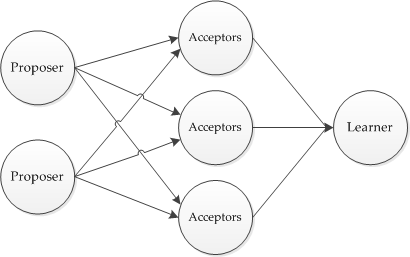
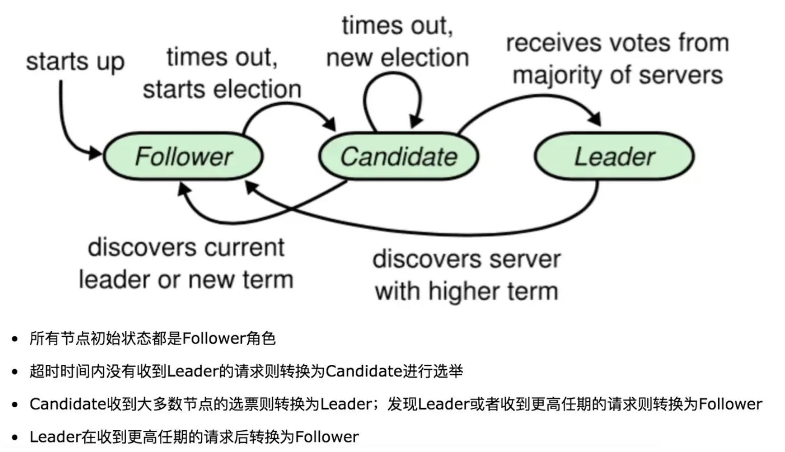
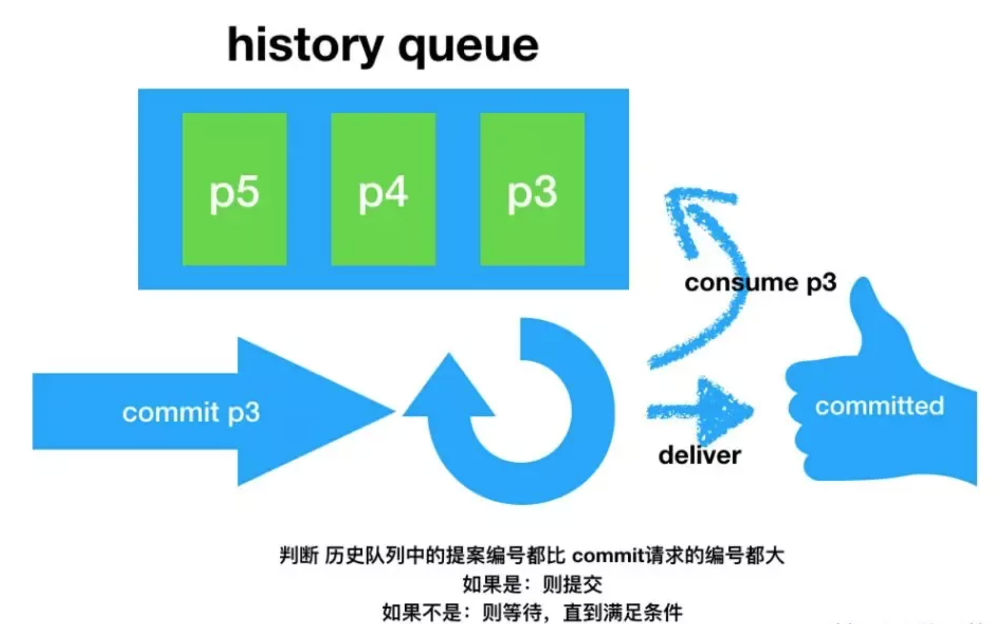

## 解答

**Paxos算法**

Paxos算法是Leslie Lamport在1990年提出的一种基于消息传递的一致性算法。基于Paxos协议的数据同步与传统主备方式最大的区别在于：Paxos只需超过半数的副本在线且相互通信正常，就可以保证服务的持续可用，且数据不丢失。

Paxos将系统中的角色分为提议者 (Proposer)，决策者 (Acceptor)，和最终决策学习者 (Learner):

- Proposer: 提出提案 (Proposal)。Proposal信息包括提案编号 (Proposal ID) 和提议的值 (Value)。
- Acceptor：参与决策，回应Proposers的提案。收到Proposal后可以接受提案，若Proposal获得多数Acceptors的接受，则称该Proposal被批准。
- Learner：不参与决策，从Proposers/Acceptors学习最新达成一致的提案（Value）。

在多副本状态机中，每个副本同时具有Proposer、Acceptor、Learner三种角色。

Paxos算法通过一个决议分为两个阶段（Learn阶段之前决议已经形成）：

- 第一阶段：Prepare阶段。Proposer向Acceptors发出Prepare请求，Acceptors针对收到的Prepare请求进行Promise承诺。
- 第二阶段：Accept阶段。Proposer收到多数Acceptors承诺的Promise后，向Acceptors发出Propose请求，Acceptors针对收到的Propose请求进行Accept处理。
- 第三阶段：Learn阶段。Proposer在收到多数Acceptors的Accept之后，标志着本次Accept成功，决议形成，将形成的决议发送给所有Learners。

**Basic-Paxos**

Basic-Paxos解决的问题：在一个分布式系统中，如何就一个提案达成一致。

**Mulit-Paxos**

Mulit-Paxos解决的问题：在一个分布式系统中，如何就一批提案达成一致。

**Raft算法**

**Raft角色**

Raft算法是Paxos算法的一种简化实现。包括三种角色：leader，candidate和follower。

- follow:所有节点都以follower的状态开始，如果没有收到leader消息则会变成candidate状态。
- candidate：会向其他节点拉选票，如果得到大部分的票则成为leader，这个过程是Leader选举。
- leader：所有对系统的修改都会先经过leader。

**Raft算法过程**

Raft有两个基本过程：

- Leader选举： 每个candidate随机经过一定时间都会提出选举方案，最近阶段中的票最多者被选为leader。
- 同步log： leader会找到系统中log（各种事件的发生记录）最新的记录，并强制所有的follow来刷新到这个记录。

**Raft和Multi-Paxos的区别**

Raft是基于对Multi-Paxos的两个限制形成的：

发送的请求的是连续的, 也就是说Raft的append 操作必须是连续的， 而Paxos可以并发 (这里并发只是append log的并发, 应用到状态机还是有序的)。

Raft选主有限制,必须包含最新、最全日志的节点才能被选为leader. 而Multi-Paxos没有这个限制，日志不完备的节点也能成为leader。

Raft可以看成是简化版的Multi-Paxos。

Multi-Paxos允许并发的写log,当leader节点故障后，剩余节点有可能都有日志空洞。所以选出新leader后, 需要将新leader里没有的log补全,在依次应用到状态机里。

**ZAB算法**

在做分布式系统时，我们常常需要维护管理集群的配置信息、服务的注册发现、共享锁等功能，而ZooKeeper正是解决这些问题的一把好手。ZAB(ZooKeeper Atomic Broadcast)则是为ZooKeeper设计的一种支持崩溃恢复的原子广播协议。

很多人会误以为ZAB协议是Paxos的一种特殊实现，事实上他们是两种不同的协议。ZAB和Paxos最大的不同是，ZAB主要是为分布式主备系统设计的，而Paxos的实现是一致性状态机(state machine replication)

尽管ZAB不是Paxos的实现，但是ZAB也参考了一些Paxos的一些设计思想，比如：

leader向follows提出提案(proposal)

leader 需要在达到法定数量(半数以上)的follows确认之后才会进行commit

每一个proposal都有一个纪元(epoch)号，类似于Paxos中的选票(ballot)

**ZAB特性**

- 一致性保证

    - 可靠提交(Reliable delivery) -如果一个事务 A 被一个server提交(committed)了，那么它最终一定会被所有的server提交
    
    - 全局有序(Total order) - 假设有A、B两个事务，有一台server先执行A再执行B，那么可以保证所有server上A始终都被在B之前执行
    
    - 因果有序(Causal order) - 如果发送者在事务A提交之后再发送B,那么B必将在A之前执行

- 只要大多数（法定数量）节点启动，系统就行正常运行

- 当节点下线后重启，它必须保证能恢复到当前正在执行的事务

**ZAB的具体实现**

- ZooKeeper由client、server两部分构成

- client可以在任何一个server节点上进行读操作

- client可以在任何一个server节点上发起写请求，非leader节点会把此次写请求转发到leader节点上。由leader节点执行

- ZooKeeper使用改编的两阶段提交协议来保证server节点的事务一致性

**ZXID**

ZooKeeper会为每一个事务生成一个唯一且递增长度为64位的ZXID,ZXID由两部分组成：低32位表示计数器(counter)和高32位的纪元号(epoch)。epoch为当前leader在成为leader的时候生成的，且保证会比前一个leader的epoch大

实际上当新的leader选举成功后，会拿到当前集群中最大的一个ZXID，并去除这个ZXID的epoch,并将此epoch进行加1操作，作为自己的epoch

**历史队列(history queue)**

每一个follower节点都会有一个先进先出（FIFO)的队列用来存放收到的事务请求，保证执行事务的顺序

可靠提交由ZAB的事务一致性协议保证 全局有序由TCP协议保证 因果有序由follower的历史队列(history queue)保证

**ZAB工作模式**

- 广播(broadcast)模式
- 恢复(recovery)模式

**广播(broadcast)模式**

- leader从客户端收到一个写请求

- leader生成一个新的事务并为这个事务生成一个唯一的ZXID，

- leader将这个事务发送给所有的follows节点

- follower节点将收到的事务请求加入到历史队列(history queue)中,并发送ack给ack给leader

- 当leader收到大多数follower（超过法定数量）的ack消息，leader会发送commit请求

- 当follower收到commit请求时，会判断该事务的ZXID是不是比历史队列中的任何事务的ZXID都小，如果是则提交，如果不是则等待比它更小的事务的commit

**恢复模式**

恢复模式大致可以分为四个阶段

- 选举
- 发现
- 同步
- 广播

恢复过程的步骤大致可分为

- 当leader崩溃后，集群进入选举阶段，开始选举出潜在的新leader(一般为集群中拥有最大ZXID的节点)
- 进入发现阶段，follower与潜在的新leader进行沟通，如果发现超过法定人数的follower同意，则潜在的新leader将epoch加1，进入新的纪元。新的leader产生
- 集群间进行数据同步，保证集群中各个节点的事务一致
- 集群恢复到广播模式，开始接受客户端的写请求

当 leader在commit之后但在发出commit消息之前宕机，即只有老leader自己commit了，而其它follower都没有收到commit消息 新的leader也必须保证这个proposal被提交.(新的leader会重新发送该proprosal的commit消息)

当 leader产生某个proprosal之后但在发出消息之前宕机，即只有老leader自己有这个proproal，当老的leader重启后(此时左右follower),新的leader必须保证老的leader必须丢弃这个proprosal.(新的leader会通知上线后的老leader截断其epoch对应的最后一个commit的位置)

