## 解答

## 一、Redis模式
**Redis有三种模式：分别是主从同步/复制、哨兵模式、Cluster**

- 主从复制：主从复制是高可用Redis的基础，哨兵和群集都是在主从复制基础上实现高可用的。主从复制主要实现了数据的多机备份，以及对于读操作的负载均衡和简单故障恢复。
- 缺陷：故障恢复无法自动化，写操作无法负载均衡，存储能力受到单机的限制。
- 哨兵：在主从复制的基础上，哨兵实现了自动化的故障恢复。
- 缺陷：写操作无法负载均衡，存储能力受到单机的限制，哨兵无法对从节点进行自动故障转移；在读写分离场景下，从节点故障会导致读服务不可用，需要对从节点做额外的监控、切换操作。
- 集群：通过集群，Redis解决了写操作无法负载均衡，以及存储能力受到单机限制的问题，实现了较为完善的高可用方案。
## 二、Redis主从复制
**2.1 主从复制概述**

- 主从复制，是指将一台 Redis 服务器的数据，复制到其他的 Redis 服务器。前者称为主节点(Master)，后者称为从节点(Slave)；数据的复制是单向的，只能由主节点到从节点。
- 默认情况下，每台 Redis 服务器都是主节点；且一个主节点可以有多个从节点 (或没有从节点)，但一个从节点只能有一个主节点。

**2.2 主从复制**

- 数据冗余：主从复制实现了数据的热备份，是持久化之外的一种数据冗余方式。
- 故障恢复：当主节点出现问题时，可以由从节点提供服务，实现快速的故障恢复；实际上是一种服务的冗余。
- 负载均衡：在主从复制的基础上，配合读写分离，可以由主节点提供写服务，由从节点提供读服务 (即写 Redis 数据时应用连接主节点，读 Redis 数据时应用连接从节点)，分担服务器负载；尤其是在写少读多的场景下，通过多个从节点分担读负载，可以大大提高Redis服务器的并发量。
- 高可用基石：除了上述作用以外，主从复制还是哨兵和集群能够实施的基础，因此说主从复制是Redis高可用的基础。

**2.3 Redis主从复制流程**

- 若启动一个Slave机器进程，则它会向Master机器发送一个“sync command" 命令，请求同步连接。
- 无论是第一次连接还是重新连接，Master机器 都会启动一个后台进程，将数据快照保存到数据文件中(执行rdb操作) ，同时 Master 还会记录修改数据的所有命令并缓存在数据文件中。
- 后台进程完成缓存操作之后，Master 机器就会向 Slave 机器发送数据文件，Slave 端机器将数据文件保存到硬盘上，然后将其加载到内存中，接着 Master 机器就会将修改数据的所有操作一并发送给 Slave 端机器。若 Slave 出现故障导致宕机，则恢复正常后会自动重新连接。
- Master机器收到 Slave 端机器的连接后，将其完整的数据文件发送给 Slave 端机器，如果 Mater 同时收到多个 Slave 发来的同步请求，则 Master 会在后台启动一个进程以保存数据文件，然后将其发送给所有的 Slave 端机器，确保所有的 Slave 端机器都正常。

2.4 搭建Redis主从复制

    主机	        系统	        IP地址	        安装包
    Master节点	CentOS 7	192.168.152.11	redis-5.0.7.tar. gz
    Slave1节点	CentOS 7	192.168.152.16	redis-5.0.7.tar. gz
    Slave2节点	CentOS 7	192.168.152.17  redis-5.0.7.tar. gz	

    #三台主机都关闭防火墙和SELINUX
    systemctl stop firewalld
    systemctl disable firewalld
    setenforce 0

**2.4.1 安装Redis**

在三台服务器上均需部署Redis

    1）# 关闭防火墙和SElinux 
    systemctl stop firewalld
    systemctl disable firewalld
    setenforce 0
     
    2）#安装gcc gcc-c++ 编译器
    yum install -y gcc gcc-c++ make
     
    3）#切换至/opt目录，把下载好的安装包上传进来并解压
    cd /opt/
    tar zxvf redis-5.0.7.tar.gz 
     
    4）#进入目录然后编译安装
    cd /opt/redis-5.0.7/
    make
    make PREFIX=/usr/local/redis install
     
    #由于Redis源码包中直接提供了Makefile 文件，所以在解压完软件包后，不用先执行./configure 进行配置，可直接执行make与make install命令进行安装
     
    5）#执行install_server.sh脚本
    cd /opt/redis-5.0.7/utils 
    ./install_server.sh  #一路回车，指导让你输入路径这一步
    #路径需要手动输入
    Please select the redis executable path [] /usr/local/redis/bin/ redis-server
     
    Selected config:
    Port               : 6379                               #默认侦听端口为6379
    Config file        : /etc/redis/6379.conf               #配置文件路径
    Log file           : /var/log/redis_6379.log            #日志文件路径
    Data dir           : /var/lib/ redis/6379               #数据文件路径
    Executable         : /usr/local/redis/bin/redis-server  #可执行文件路径
    Cli Executable     : /usr/local/redis/bin/redis-cli     #客户端命令工具
     
    6)#优化路径并查端口是否打开
    #把redis的可执行程序文件放入路径环境变量的目录中便于系统识别
    ln -s /usr/local/redis/bin/* /usr/local/bin/
     
    #当install_server.sh 脚本运行完毕，Redis 服务就已经启动，默认侦听端口为6379
    netstat -natp | grep redis
     
    7)#修改配置文件
    vim /etc/redis/6379.conf
    bind 127.0.0.1 192.168.152.11/16/17                #70行，添加监听的主机地址
    port 6379                                  #93行，Redis默认的监听端口
    daemonize yes                               #137行，启用守护进程
    pidfile /var/run/redis_6379.pid            #159行，指定PID文件
    loglevel notice                             #167行，日志级别
    logfile /var/log/redis_6379.log            #172行，指定日志文
     
    8) #重启redis查看监听的地址
    /etc/init.d/redis_6379 restart    #重启
    ss -antp|grep redis
     
    9)##Redis服务控制
    /etc/init.d/redis_6379 stop       #停止
    /etc/init.d/redis_6379 start      #启动
    /etc/init.d/redis_6379 restart    #重启
    /etc/init.d/redis_6379 status     #状态

**2.4.2 修改Master节点配置文件（192.168.152.11）**

    （1）#修改master主配置文件
    vim /etc/redis/6379.conf
    bind 0.0.0.0                        #70行，注释掉bind项，或修改为0.0.0.0,默认监听所有网卡
    daemonize yes                        #137行，开启守护进程
    logfile /var/log/redis_6379.log    #172行，指定日志文件目录
    dir /var/lib/redis/6379            #264行，指定工作目录
    appendonly yes                      #700行，开启AOF持久化功能
    
    （2）#重启redis
    /etc/init.d/redis_6379 restart

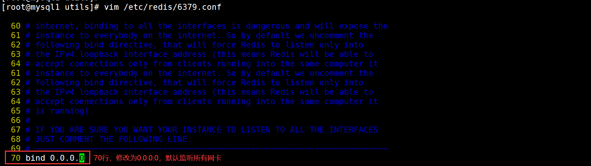

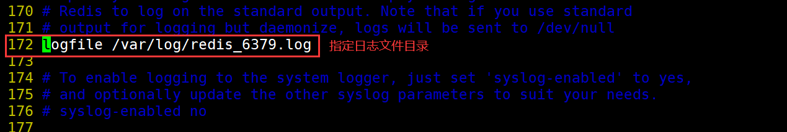
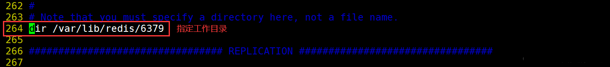

**2.4.3 修改slave节点配置文件（192.168.152.16、192.168.152.17）**

     （1）#修改slave1节点、slave2节点配置文件，slave1和slave2修改步骤相同
    vim /etc/redis/6379.conf
    bind 0.0.0.0                         #70行，修改监听地址为0.0.0.0
    daemonize yes                        #137行，开启守护进程
    logfile /var/log/redis_6379.log      #172行，指定日志文件目录
    dir /var/lib/redis/6379              #264行，指定工作目录
    replicaof 192.168.152.11 6379         #287行，取消注释并指定要同步的Master节点IP和端口
    appendonly yes                        #700行，开启AOF持久化功能
    
    （2）#重启slave1节点和slave2节点redis服务
    /etc/init.d/redis_6379 restart

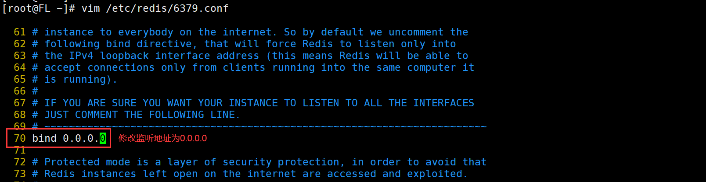

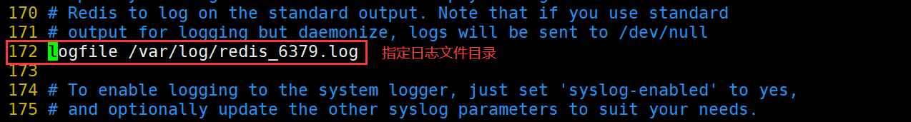

**2.4.4 验证主从同步**
 
    #在Master节点上看日志:
    tail -f /var/log/redis_6379.log
    
    #在Master节点上验证从节点:
    redis-cli
    127.0.0.1:6379> info replication
    
    #创建数据验证
    ##在master创建数据
    set name yr
    
    ##在从节点上查看
    get name

在Master节点上看日志

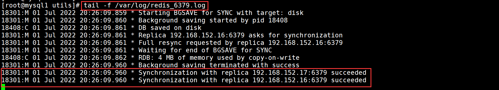

在Master节点上验证从节点

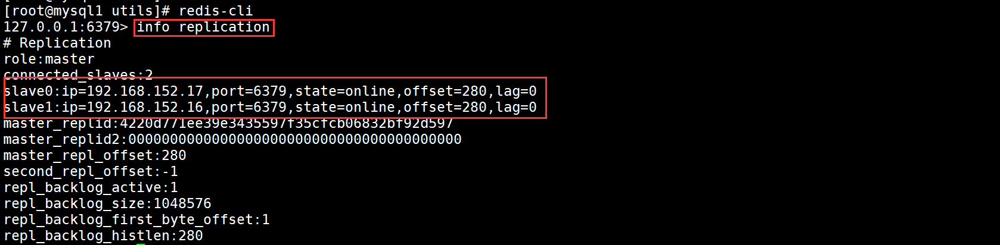

在master创建数据

|在两台slave上查看

## 三、Redis哨兵模式
主从切换技术的方法是：当服务器宕机后，需要手动一台从机切换为主机，这需要人工干预，不仅费时费力，而且还会造成一段时间内服务不可用。为了解决主从复制的缺点，就有了哨兵模式。

**哨兵的核心功能**：在主从复制的基础上，哨兵引入了主节点的自动故障转移。

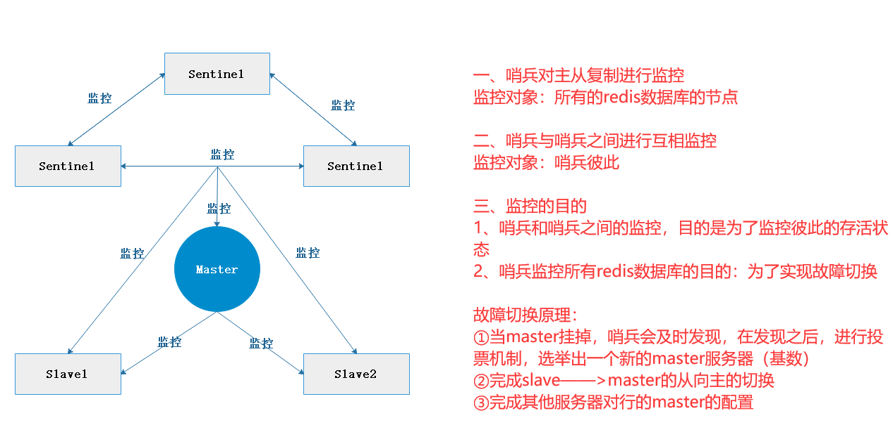

a主观下线：如果有一台哨兵认为master挂了，那么判断master为down，下一步就会执行故障切换。

**3.1 哨兵模式的原理**

哨兵(sentinel)：是一个​分布式系统​，用于对主从结构中的每台服务器进行监控，当出现故障时​通过投票机制​选择新的 Master 并将所有 Slave 连接到新的 Master。所以整个运行哨兵的集群的数量​不得少于3个节点​。

**3.2 哨兵模式的作用**

- ​​监控：哨兵会不断地检查主节点和从节点是否运作正常。​​
- ​​自动故障转移：当主节点不能正常工作时，哨兵会开始自动故障转移操作，它会将失效主节点的其中一个从节点升级为新的主节点，并让其他从节点改为复制新的主节点。​​
- ​​通知（提醒）：哨兵可以将故障转移的结果发送给客户端。

**3.3 哨兵模式的结构**

哨兵结构由两部分组成，哨兵节点​和​数据节点：

- ​​哨兵节点：哨兵系统由一个或多个哨兵节点组成，哨兵节点是​特殊的redis节点，不存储数据​。​​
- 数据节点：主节点和从节点都是数据节点。

哨兵的启动依赖于主从模式，所以须把主从模式安装好的情况下再去做哨兵模式，所有节点上都需要部署哨兵模式，哨兵模式会监控所有的Redis 工作节点是否正常，当Master 出现问题的时候，因为其他节点与主节点失去联系，因此会投票，投票过半就认为这个 Master 的确出现问题，然后会通知哨兵间，然后从Slaves中选取一个作为新的 Master。

**3.4 故障转移机制**

1、由哨兵节点定期监控发现主节点是否出现了故障

每个哨兵节点每隔1秒会向主节点、从节点及其它哨兵节点发送一次ping命令做一次心跳检测。如果主节点在一定时间范围内不回复或者是回复一个错误消息，那么这个哨兵就会认为这个主节点主观下线了(单方面的）。当超过半数哨兵节点认为该主节点主观下线了，这样就客观下线了

2.当主节点出现故障，此时哨兵节点会通过Raft算法（选举算法）实现选举机制共同选举出一个哨兵节点为leader，来负责处理主节点的故障转移和通知。所以整个运行哨兵的集群的数量不得少于3个节点。

3.由leader哨兵节点执行故障转移，过程如下:

- 将某一个从节点升级为新的主节点，让其它从节点指向新的主节点;
- 若原主节点恢复也变成从节点，并指向新的主节点;
- 通知客户端主节点己经更换。

需要特别注意的是：客观下线是主节点才有的概念；如果从节点和哨兵节点发生故障，被哨兵主观下线后，不会再有后续的客观下线和故障转移操作。

**3.5 主节点的选举**

- 过滤掉不健康的（已下线的），没有回复哨兵 ping 响应的从节点。
- 选择配置文件中从节点优先级配置最高的。(replica-priority，默认值为100)
- 选择复制偏移量最大，也就是复制最完整的从节点。

哨兵的启动依赖于主从模式，所以需把主从模式安装好的情况下再去做哨兵模式。

## 四、哨兵模式的搭建

    Master：192.168.152.11
    Slave1：192.168.152.16
    Slave2：192.168.152.17

    关闭所有服务器的防火墙和增强机制
    systemctl stop firewalld
    setenforce 0

**4.1 修改Redis哨兵模式的配置文件（所有节点操作）**

    vim /opt/redis-5.0.7/sentinel.conf
    #17行，关闭保护模式
    protected-mode no
    #21行，Redis哨兵默认的监听端口
    port 26379
    #26行，指定sentinel为后台启动
    daemonize yes
    #36行，指定日志存放路径
    logfile "/var/log/sentinel.log"
    #65行，指定数据库存放路径
    dir "/var/lib/redis/6379"
    #84行，修改 指定该哨兵节点监控192.168.152.11:6379这个主节点，该主节点的名称是mymaster，最后的2的含义与主节点的故障判定有关：至少需要2个哨兵节点同意，才能判定主节点故障并进行故障转移
    sentinel monitor mymaster 192.168.152.11 6379 2
    #113行，判定服务器down掉的时间周期，默认30000毫秒（30秒）
    sentinel down-after-milliseconds mymaster 30000
    #146行，故障节点的最大超时时间为180000（180秒）
    sentinel failover-timeout mymaster 180000

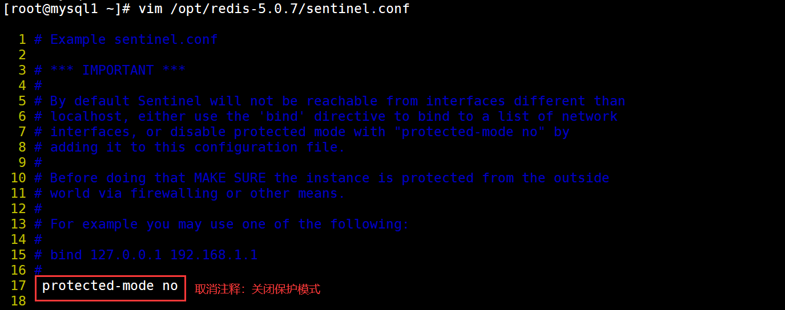
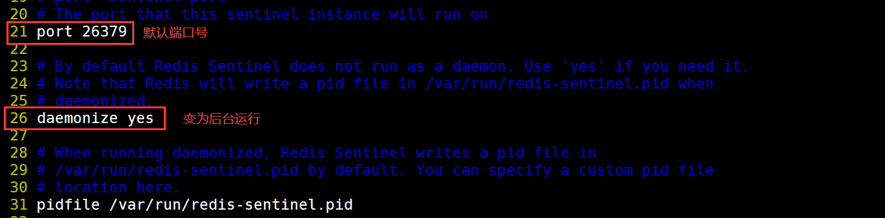

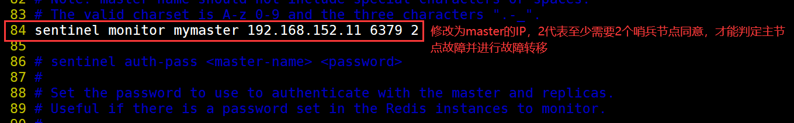

**4.2 启动哨兵模式 **

    ​​​先启master，再启slave
    cd /opt/redis-5.0.7/
    redis-sentinel sentinel.conf &

先启动主节点

再启动从节点

**4.3 查看哨兵模式信息**

    Master：192.168.152.11

    redis-cli -p 26379 info Sentinel

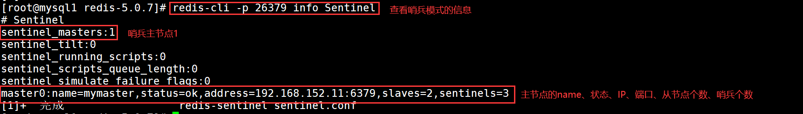

**4.4 故障模拟** 

Master：192.168.152.11

    #查看redis-server进程号
    ps aux | grep redisroot       8978  0.1  0.2 162596  9888 ?        Ssl  17:05   0:15 /usr/local/redis/bin/redis-server 0.0.0.0:6379
    root      12722  0.2  0.1 153892  7704 ?        Ssl  21:08   0:01 redis-sentinel *:26379 [sentinel]
    root      12799  0.0  0.0 112728   984 pts/1    S+   21:16   0:00 grep --color=auto redis

    #杀死 Master 节点上redis-server的进程号，模拟故障
    kill -9 8978      #Master节点上redis-server的进程号

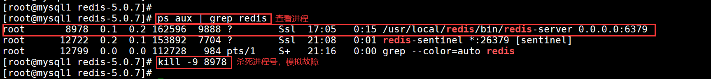

**4.5 验证结果** 
Master：192.168.152.11

    tail -f /var/log/sentinel.log
    redis-cli -p 26379 INFO Sentinel

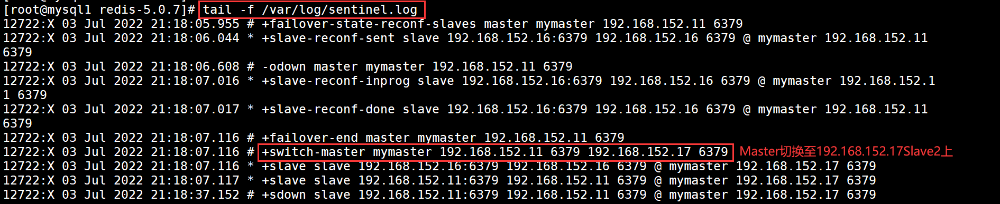
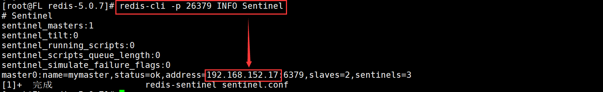

## 五、Redis集群模式

- 集群，即 Redis Cluster， 是Redis 3. 0开始引入的分布式存储方案。
- 集群由多个节点(Node) 组成，Redis 的数据分布在这些节点中。
- 集群中的节点分为主节点和从节点；只有主节点负责读写请求和集群信息的维护；从节点只进行主节点数据和状态信息的复制。

**5.1 集群的作用**

1.数据分区：数据分区(或称数据分片) 是集群最核心的功能。

- 集群将数据分散到多个节点，一方面突破了 Redis 单机内存大小的限制，存储容量大大增加；另一方面每个主节点都可以对外提供读服务和写服务，大大提高了集群的响应能力。
- Redis 单机内存大小受限问题，在介绍持久化和主从复制时都有提及；例如，如果单机内存太大，bgsave 和 bgrewriteaof的 fork 操作可能导致主进程阻塞，主从环境下主机切换时可能导致从节点长时间无法提供服务，全量复制阶段主节点的复制缓冲区可能溢出。

2.高可用：集群支持主从复制和主节点的自动故障转移(与哨兵类似) ；当任一节点发生故障时，集群仍然可以对外提供服务。

**5.2 集群模式的数据分片**

- Redis集群引入了哈希槽的概念
- Redis集群有 16384 个哈希槽( 编号0-16383)
- 集群的每个节点负责一部分哈希槽
- 每个Key 通过 CRC16 校验后对16384取余来决定放置哪个哈希槽，通过这个值，去找到对应的插槽所对应的节点，然后直接自动跳转到这个对应的节点上进行存取操作

​​​以3个节点组成的集群为例​​​

    ​​​节点A包含0到5461号哈希槽​​​
    ​​​节点B包含5462到10922号哈希槽​​​
    ​​​节点C包含10923到16383号哈希槽

**5.3 集群模式的主从复制模型**

- 集群中具有A、B、C三个节点，如果节点B失败了，整个集群就会因缺少5461-10922这个范围的槽而不可以用。
- 为每个节点添加一个从节点A1、B1、C1整个集群便有三个Master节点和三个slave节点组成，在节点B失败后，集群选举B1位为主节点继续服务。当B和B1都失败后，集群将不可用。

## 六、Redis集群部署
**6.1 环境准备**

- redis的集群一般需要**6个节点，3主3从
- 三个主节点端口号：6001,6002,6003
- 对应的从节点端口号：6004,6005,6006

**6.2 创建多个Redis服务集群和集群节点目录**

    cd /etc/redis
    mkdir -p redis-cluster/redis600{1..6}
    
    for i in {1..6}
    do
    cp /opt/redis-5.0.7/redis.conf /etc/redis/redis-cluster/redis600$i
    cp /opt/redis-5.0.7/src/redis-cli /opt/redis-5.0.7/src/redis-server /etc/redis/redis-cluster/redis600$i
    done

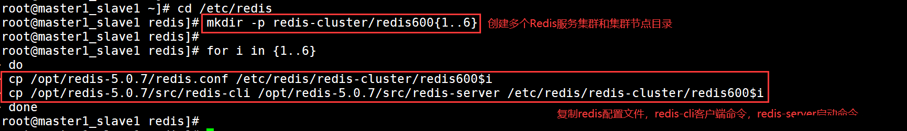

**6.3 开启集群功能**
 
其他5个文件夹的配置文件以此类推修改，注意6个端口要不一样

    cd /etc/redis/redis-cluster/redis6001
    
    vim redis.conf
    #bind 127.0.0.1                      #69行，注释掉bind项,默认监听所有网卡
    protected-mode no                      #88行，修改，关闭保护模式
    port 6001                              #92行，修改，redis监听端口，
    daemonize yes                          #136行,开启守护进程,以独立进程启动
    
    appendonly yes                        #699行，修改开启AOF持久化
    cluster-enabled yes                    #832行，取消注释，开启群集功能
    cluster-config-file nodes-6001.conf    #840行，取消注释，群集名称文件设置
    cluster-node-timeout 15000             #846行，取消注释群集超时时间设置

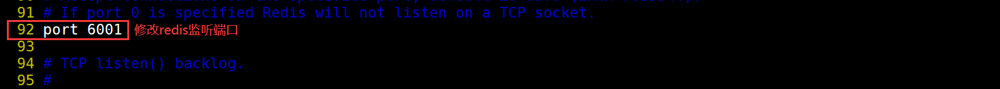

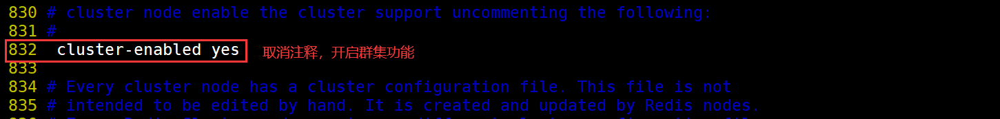

**6.4 启动Redis节点** 

    分别进入那六个文件夹，执行命令: redis-server redis.conf ，来启动redis节点
    cd /etc/redis/redis-cluster/redis6001
    redis-server redis.conf
    
    for i in {1..6}
    do
    cd /etc/redis/redis-cluster/redis600$i
    redis-server redis.conf
    done
    
    ps -ef | grep redis

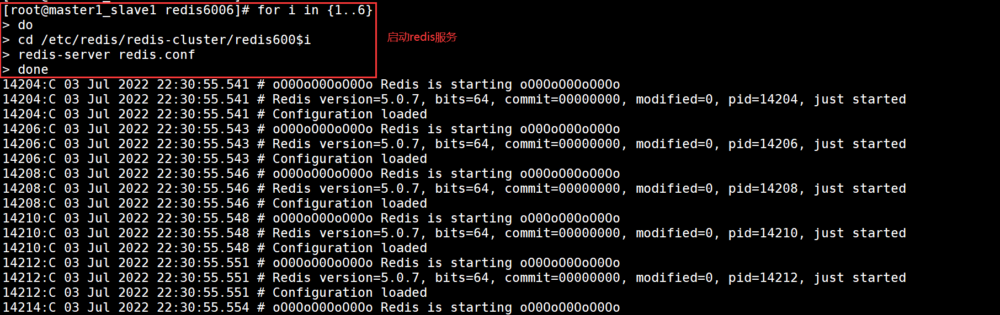

**6.5 启动集群**
 
    redis-cli --cluster create 127.0.0.1:6001 127.0.0.1:6002 127.0.0.1:6003 127.0.0.1:6004 127.0.0.1:6005 127.0.0.1:6006 --cluster-replicas 1

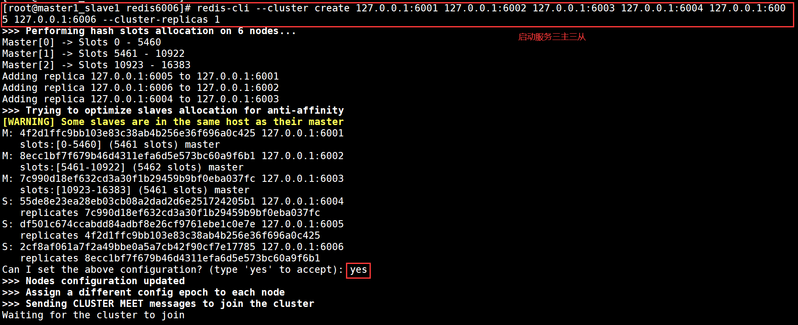

**6.6 测试集群**
 
    redis-cli -p 6001 -c   #加-c参数，节点之间就可以互相跳转 
    cluster slots     #查看节点的哈希槽编号范围

    set name yr    #再6001上设置一个键
    cluster keyslot name  #查看name键的槽编号

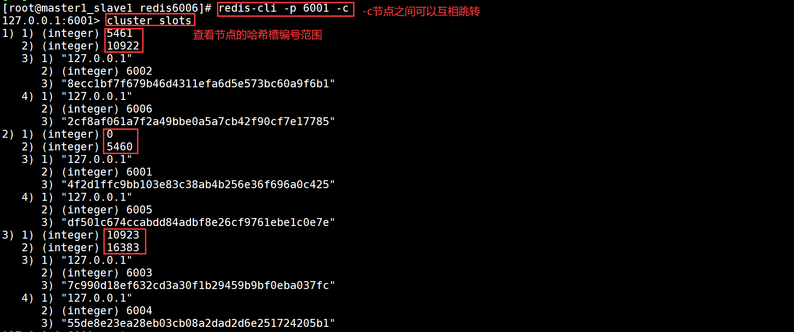
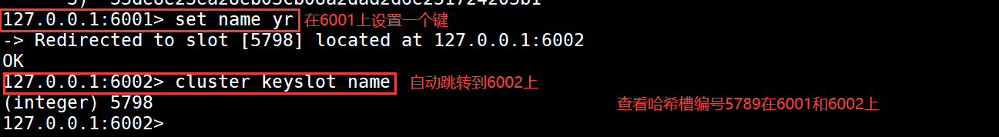

## 七、本章总结
redis群集有三种模式，分别是主从同步/复制、哨兵模式、Cluster群集

**7.1 主从复制**

- 主从复制是高可用Redis的基础，哨兵和集群都是在主从复制基础上实现高可用的。主从复制主要实现了数据的多机备份，以及对于读操作的负载均衡和简单的故障恢复。

**缺陷**

- 故障恢复无法自动化；
- 写操作无法负载均衡；
- 存储能力受到单机的限制

**7.2 哨兵**

在主从复制的基础上，哨兵实现了自动化的故障恢复。

**缺陷**

写操作无法负载均衡:存储能力受到单机的限制。

**7.3 集群**

通过集群，Redis解决了写操作无法负载均衡，以及存储能力受到单机限制的问题，实现了较为完善的高可用方案。
